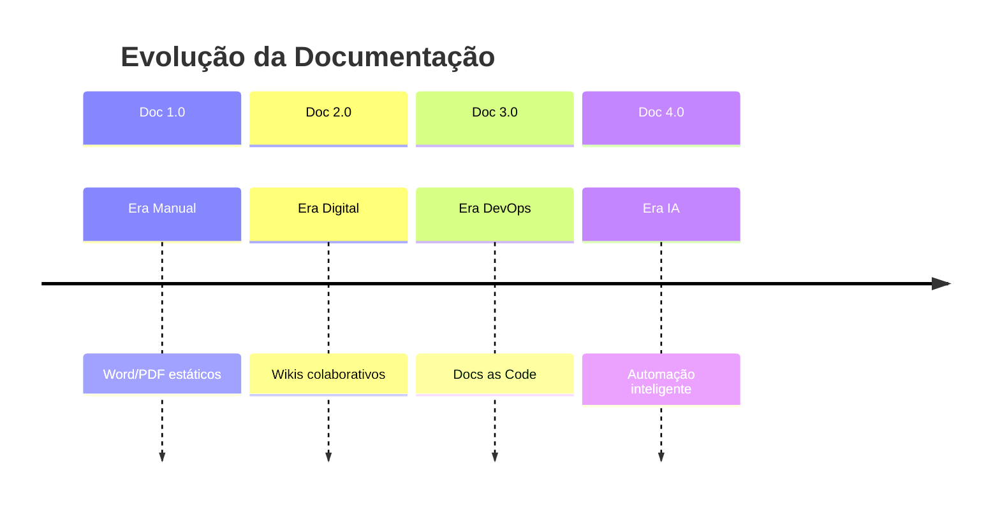

# 📋 Visão Geral da Apresentação

> **Documentação 4.0 na Era IA - Inteligência Artificial Aplicada à Documentação**
> 
> **Apresentado por:**
> - **Áulus Carvalho Diniz** - Engenheiro de Software (UnB), Pesquisador em IA aplicada ao ensino
> - **Lucas Dórea Cardoso** - AI Developer, Especialista em MCP servers e automação

---

## 🎯 Resumo Executivo

Esta apresentação explora como a **Inteligência Artificial** está revolucionando a documentação técnica, transformando processos manuais em sistemas inteligentes e automatizados que entregam **qualidade superior com velocidade excepcional**.

### 💡 Proposta de Valor
- **ROI comprovado**: 300% no primeiro ano
- **Qualidade automatizada**: 95% de precisão
- **Velocidade**: 90% redução no tempo de geração
- **Escalabilidade**: Sistema que evolui com o produto

---

## 🏗️ Estrutura da Apresentação

### 🎬 Abertura (5 min)
- **Apresentadores**: 
  - **Áulus Carvalho Diniz** - Engenheiro de Software (UnB), especialista em IA aplicada ao ensino
  - **Lucas Dórea Cardoso** - AI Developer, GitHub: https://github.com/Lucasdoreac
- **Objetivo**: Transformar documentação em asset estratégico
- **Roadmap**: O que veremos nos próximos 45 minutos

### 📈 Parte I: Evolução (10 min)


### 🏗️ Parte II: Arquiteturas Técnicas (15 min)
- **RAG System**: Como funciona na prática
- **Agentes IA**: Automação multi-agente
- **Pipeline de Qualidade**: Processo end-to-end
- **Stack Tecnológico**: Ferramentas modernas

### 💻 Parte III: Implementação (10 min)
- **Código Python**: Exemplos funcionais
- **CI/CD Pipeline**: GitHub Actions real
- **Testes Automatizados**: Vale, Playwright, Jest
- **Roadmap**: 4 fases de implementação

### 📊 Parte IV: Cases e ROI (10 min)
- **Case API Docs**: 200+ endpoints automatizados
- **Case Knowledge Base**: 15 ferramentas unificadas
- **Métricas reais**: KPIs mensuráveis
- **ROI calculado**: $200K economia anual

### 🚀 Encerramento (5 min)
- **Takeaways**: 4 pontos principais
- **Call to Action**: Como começar hoje
- **Q&A**: Perguntas técnicas

---

## 🎯 Público-Alvo

### 👥 Audiência Principal
- **Desenvolvedores** (40%)
- **DevOps Engineers** (25%)
- **QAs e Analistas** (20%)
- **Tech Leads** (15%)

### 🧠 Nível Técnico
- **Intermediário a Avançado**
- Familiaridade com CI/CD
- Conhecimento básico de IA/ML
- Experiência com documentação técnica

### 🎯 Objetivos de Aprendizado
1. **Compreender** o potencial da IA na documentação
2. **Implementar** pipeline de qualidade automatizado
3. **Calcular** ROI de iniciativas Doc 4.0
4. **Planejar** roadmap de implementação

---

## 🛠️ Recursos Técnicos

### 💻 Código ao Vivo
```python
# Exemplo RAG Implementation
class DocumentationRAG:
    def __init__(self):
        self.vectorstore = VectorStore.from_documents(docs)
        self.llm = OpenAI(model="gpt-4")
    
    def query(self, question: str):
        context = self.vectorstore.similarity_search(question)
        return self.llm.generate(context + question)
```

### 📊 Demonstrações
- **RAG em ação**: Query → Context → Response
- **Pipeline CI/CD**: Push → Validate → Generate → Deploy
- **Métricas dashboard**: Tempo real via Grafana

### 🎨 Recursos Visuais
- **8 diagramas Mermaid** interativos
- **Screenshots** de ferramentas reais
- **Antes/Depois** de implementações

---

## 🔧 Ferramentas Demonstradas

### 🤖 IA/ML
- **OpenAI GPT-4**: Geração de conteúdo
- **LangChain**: Framework RAG
- **Pinecone**: Vector database
- **Embeddings**: Busca semântica

### 🛠️ DevOps
- **GitHub Actions**: CI/CD automatizado
- **Vale**: Linting de documentação
- **Playwright**: Testes end-to-end
- **Docker**: Containerização

### 📊 Qualidade
- **Métricas**: Coverage, Freshness, Quality Score
- **Monitoring**: Grafana + Prometheus
- **Testing**: Automated link checking
- **Validation**: Content consistency

---

## 📈 Mensagens Chave

### 1️⃣ **Mudança de Paradigma**
> "Documentação deixou de ser custo para se tornar **investimento estratégico**"

### 2️⃣ **Qualidade + Velocidade**
> "IA permite ter **qualidade premium** com **velocidade excepcional**"

### 3️⃣ **ROI Comprovado**
> "**300% ROI** no primeiro ano não é promessa, é realidade mensurável"

### 4️⃣ **Futuro é Agora**
> "Tecnologias estão **maduras e acessíveis** para implementação imediata"

---

## 🎤 Roteiro de Apresentação

### ⏰ Timeline Detalhado

| Tempo | Seção | Conteúdo | Recursos |
|-------|-------|----------|----------|
| 0-5 min | Abertura | Introdução + Objetivos | Slide título |
| 5-15 min | Evolução | Doc 1.0 → 4.0 | Timeline Mermaid |
| 15-30 min | Arquiteturas | RAG + Agentes + Pipeline | 4 diagramas |
| 30-40 min | Implementação | Código + CI/CD | Live demo |
| 40-50 min | Cases/ROI | Estudos de caso | Métricas reais |
| 50-55 min | Encerramento | Takeaways + CTA | Call to action |
| 55-60 min | Q&A | Perguntas técnicas | Interação |

### 🎯 Pontos de Interação
- **Pergunta retórica** (min 10): "Quem já perdeu horas procurando documentação desatualizada?"
- **Poll ao vivo** (min 25): "Quantos usam IA no dia a dia?"
- **Demo interativa** (min 35): RAG query em tempo real
- **Case discussion** (min 45): "Como aplicar no seu contexto?"

---

## 📱 Recursos Interativos

### 🔗 QR Codes nos Slides
- **Slide 5**: Link para repositório de exemplos
- **Slide 15**: Board Miro interativo
- **Slide 25**: Calculadora ROI online
- **Slide 35**: Templates de implementação
- **Slide 45**: Newsletter técnica

### 📊 Board Miro Colaborativo
- **URL**: [miro.com/board/doc40-campus-party]
- **Seções**: 6 áreas interativas
- **Workshop**: Exercícios práticos pós-palestra

---

## 📚 Material de Apoio

### 📖 Para Distribuição
- [ ] **Slides PDF** - Versão para download
- [ ] **Código GitHub** - Repositório com exemplos
- [ ] **Calculadora ROI** - Planilha personalizada
- [ ] **Checklist** - Implementação passo a passo

### 🔗 Links de Referência
- [Documentação Pandoc](https://pandoc.org)
- [LangChain Docs](https://langchain.com)
- [Vale Linter](https://vale.sh)
- [OpenAI API](https://openai.com/api)

---

## ✅ Checklist Pré-Apresentação

### 🎤 Técnico
- [ ] Slides testados (HTML + PDF + PowerPoint)
- [ ] Código Python validado
- [ ] Demos funcionando
- [ ] Backup dos slides
- [ ] Links QR testados

### 📊 Conteúdo
- [ ] Timing ensaiado (45 min)
- [ ] Transições suaves
- [ ] Exemplos atualizados
- [ ] Métricas verificadas
- [ ] Cases validados

### 🎯 Logística
- [ ] Equipamentos testados
- [ ] Internet backup
- [ ] Material impresso
- [ ] Contatos de emergência
- [ ] Plan B preparado

---

*Preparado para entregar uma apresentação técnica de **alto impacto** na Campus Party 2025!* 🚀

#campus-party #apresentacao #documentacao-40 #ia #preparacao
