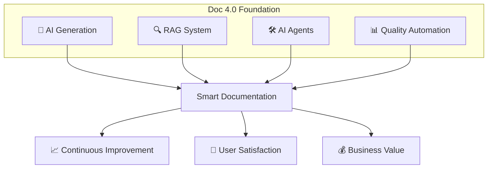
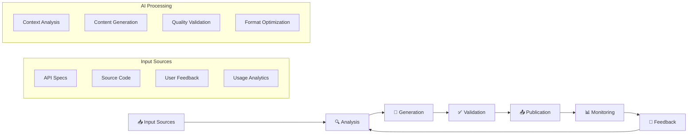

# 🤖 Documentação 4.0 - Definição e Características

> A nova era da documentação inteligente: onde IA, automação e qualidade se encontram

---

## 🎯 Definição

**Documentação 4.0** é uma abordagem revolucionária que integra **Inteligência Artificial**, **automação avançada** e **processos de qualidade** para criar sistemas de documentação que são:

- 🤖 **Inteligentes**: Compreendem contexto e intenção
- ⚡ **Automáticos**: Geram e atualizam conteúdo sem intervenção
- 📊 **Mensuráveis**: Fornecem métricas precisas de qualidade
- 🎯 **Personalizados**: Adaptam-se ao usuário e contexto
- 🔄 **Evolutivos**: Melhoram continuamente com uso

---

## 🏗️ Pilares Fundamentais



### 🤖 1. AI Generation (Geração por IA)
- **Large Language Models** (GPT-4, Claude, Llama)
- **Contexto-aware** generation
- **Multi-format** output (Markdown, HTML, PDF)
- **Template-driven** consistency

### 🔍 2. RAG System (Retrieval-Augmented Generation)
- **Vector databases** para busca semântica
- **Knowledge base** sempre atualizada
- **Context retrieval** precisão
- **Hallucination** reduction

### 🛠️3. AI Agents (Agentes Inteligentes)
- **Specialized agents** para tarefas específicas
- **Multi-agent** orchestration
- **Autonomous** operation
- **Learning** from feedback

### 📊 4. Quality Automation (Automação de Qualidade)
- **Continuous validation** 
- **Automated testing**
- **Metrics collection**
- **Performance monitoring**

---

## ✨ Características Únicas

### 🧠 Inteligência Contextual
```python
# Exemplo: Documentação que se adapta ao contexto
class ContextAwareDoc:
    def generate_content(self, user_role, experience_level, use_case):
        if user_role == "developer" and experience_level == "junior":
            return self.generate_detailed_tutorial()
        elif user_role == "architect" and use_case == "integration":
            return self.generate_architecture_guide()
        else:
            return self.generate_standard_docs()
```

### ⚡ Velocidade Excepcional
```
Tempo de Geração:
📚 Manual tradicional: 2-4 semanas
🤖 Doc 4.0: < 4 horas (90% redução)

Tempo de Atualização:
📚 Manual: 2-3 dias
🤖 Doc 4.0: < 30 minutos (95% redução)
```

### 📊 Qualidade Mensurável
```yaml
quality_metrics:
  consistency: 98%+
  accuracy: 95%+
  completeness: 92%+
  freshness: < 24h
  user_satisfaction: 4.8/5
```

### 🎯 Personalização Avançada
- **Role-based** content adaptation
- **Experience-level** customization
- **Use-case** specific guidance
- **Language** preferences
- **Format** optimization

---

## 🔄 Ciclo de Vida Automatizado



### 📥 1. Input Sources (Fontes de Entrada)
- **API specifications** (OpenAPI, GraphQL)
- **Source code** analysis
- **User feedback** e analytics
- **Requirements** documentation
- **Legacy docs** migration

### 🔍 2. Analysis (Análise Inteligente)
- **Semantic analysis** do conteúdo
- **Gap detection** na documentação
- **User journey** mapping
- **Context understanding**

### 🤖 3. Generation (Geração Automática)
- **Template-driven** content creation
- **Multi-format** output
- **Consistency** enforcement
- **Style guide** compliance

### ✅ 4. Validation (Validação Automática)
- **Automated testing** (links, examples)
- **Quality scoring**
- **Compliance checking**
- **A/B testing** for effectiveness

### 📤 5. Publication (Publicação Inteligente)
- **Multi-channel** distribution
- **Version management**
- **Access control**
- **Performance optimization**

### 📊 6. Monitoring (Monitoramento Contínuo)
- **Usage analytics**
- **Performance metrics**
- **User satisfaction**
- **Content effectiveness**

---

## 🛠️ Stack Tecnológico Típico

### 🤖 AI/ML Layer
```python
# Core AI Stack
ai_stack = {
    "llm": ["gpt-4", "claude-3", "llama-2"],
    "embeddings": ["openai-ada", "sentence-transformers"],
    "vector_db": ["pinecone", "weaviate", "chromadb"],
    "frameworks": ["langchain", "llamaindex", "haystack"]
}
```

### 🔧 Automation Layer
```yaml
# DevOps Integration
automation:
  ci_cd:
    - github-actions
    - gitlab-ci
    - jenkins
  quality:
    - vale (linting)
    - playwright (testing)
    - lighthouse (performance)
  deployment:
    - docker
    - kubernetes
    - netlify
```

### 📊 Analytics Layer
```javascript
// Monitoring & Analytics
const analytics = {
  metrics: ['usage', 'satisfaction', 'effectiveness'],
  tools: ['grafana', 'prometheus', 'mixpanel'],
  alerts: ['quality-drop', 'usage-spike', 'errors']
};
```

---

## 💡 Casos de Uso Principais

### 📚 1. API Documentation
- **Geração automática** a partir de OpenAPI specs
- **Exemplos** de código auto-gerados
- **Testing** automático de endpoints
- **Versioning** sincronizado

### 🧠 2. Knowledge Base
- **RAG-powered** search
- **Context-aware** responses
- **Multi-source** integration
- **Conversational** interface

### 📖 3. User Guides
- **Role-based** customization
- **Interactive** tutorials
- **Progress tracking**
- **Adaptive** difficulty

### 🔧 4. Internal Documentation
- **Process** automation
- **Compliance** tracking
- **Team** collaboration
- **Knowledge** preservation

---

## 📈 Benefícios Mensuráveis

### ⚡ Eficiência
```
🚀 Velocidade:
- Geração: 90% mais rápido
- Atualização: 95% mais rápido
- Busca: 80% mais preciso

📊 Produtividade:
- Desenvolvedores: +40% tempo focado em código
- Tech Writers: +60% tempo em estratégia
- Support: -50% tickets de documentação
```

### 💰 ROI Financeiro
```
💵 Economia Anual (empresa 100+ devs):
- Tempo dev: $120K
- Tech writing: $50K  
- Support: $30K
Total: $200K/ano

💸 Investimento:
- Setup inicial: $50K
- Manutenção: $20K/ano
ROI: 300% no primeiro ano
```

### 📊 Qualidade
```
✅ Métricas de Qualidade:
- Consistency: 60% → 98%
- Accuracy: 75% → 95%
- Completeness: 50% → 92%
- User satisfaction: 3.2 → 4.8/5
```

---

## ⚠️ Desafios e Considerações

### 🚨 Desafios Técnicos
- **Hallucinations**: IA gerando informações incorretas
- **Context limits**: Limitações de token dos LLMs
- **Integration**: Complexidade de integração com sistemas existentes
- **Latency**: Tempo de resposta das consultas

### 🏢 Desafios Organizacionais
- **Change management**: Resistência à automação
- **Skills gap**: Necessidade de novas competências
- **Governance**: Controle de qualidade e compliance
- **Investment**: Custo inicial de implementação

### 🛡️ Estratégias de Mitigação
```python
# Estratégias práticas
mitigation_strategies = {
    "hallucinations": [
        "rag_validation",
        "human_review",
        "confidence_scoring"
    ],
    "integration": [
        "phased_rollout",
        "api_first_approach",
        "legacy_migration_plan"
    ],
    "adoption": [
        "training_programs",
        "change_champions",
        "incremental_benefits"
    ]
}
```

---

## 🚀 Próximos Passos

### 🎯 Para Começar
1. **Audit** documentação atual
2. **Define** métricas de sucesso
3. **Start small** com um caso de uso
4. **Measure** e itere

### 📚 Recursos para Aprofundar
- [[🔍 RAG - Retrieval-Augmented Generation]]
- [[🤖 Agentes IA para Automação]]
- [[📊 Pipeline de Qualidade]]
- [[🗺️ Roadmap de Implementação]]

---

#documentacao-40 #ia #automacao #qualidade #rag #agentes #campus-party

*Documentação 4.0: Onde inteligência artificial encontra excelência operacional* 🚀
