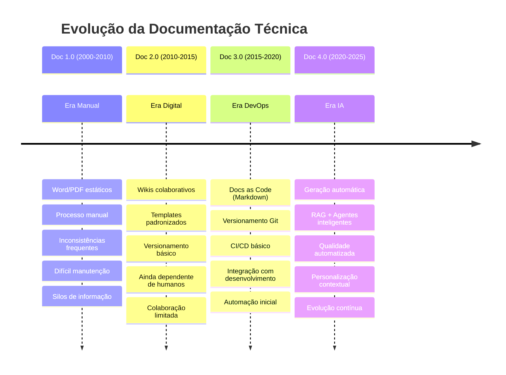

# 📈 Evolução da Documentação (1.0 → 4.0)

> Da era manual aos sistemas inteligentes: como chegamos até aqui e para onde vamos

---

## 🕰️ Timeline da Evolução



---

## 📊 Comparativo Detalhado

### 🔴 Documentação 1.0 - Era Manual

#### 🏗️ Características
- **Formato**: Word, PDF, documentos estáticos
- **Processo**: 100% manual
- **Atualização**: Complexa e demorada
- **Consistência**: Baixa (dependente do autor)
- **Descoberta**: Difícil (busca manual)

#### ⚠️ Problemas Principais
```
❌ Documentos desatualizados
❌ Inconsistências de formato
❌ Informação dispersa
❌ Processo lento
❌ Manutenção custosa
❌ Barreira para contribuição
```

#### 📈 Métricas Típicas
- **Tempo de criação**: 2-4 semanas
- **Taxa de atualização**: < 30%
- **Satisfação usuário**: 2.5/5
- **Custo**: $15K+ por projeto

---

### 🟡 Documentação 2.0 - Era Digital

#### 🏗️ Características
- **Formato**: Wikis (Confluence, MediaWiki)
- **Processo**: Colaborativo básico
- **Atualização**: Mais ágil, ainda manual
- **Consistência**: Melhor com templates
- **Descoberta**: Busca interna

#### ✅ Avanços
```
✅ Colaboração em tempo real
✅ Templates padronizados
✅ Versionamento básico
✅ Busca interna
✅ Linking entre páginas
✅ Comentários e feedback
```

#### 📈 Métricas Típicas
- **Tempo de criação**: 1-2 semanas
- **Taxa de atualização**: 50-60%
- **Satisfação usuário**: 3.2/5
- **Custo**: $8K+ por projeto

---

### 🟠 Documentação 3.0 - Era DevOps

#### 🏗️ Características
- **Formato**: Markdown + Git
- **Processo**: Docs as Code
- **Atualização**: Integrada ao desenvolvimento
- **Consistência**: Enforçada por linting
- **Descoberta**: Sites estáticos (Docusaurus, GitBook)

#### ✅ Avanços Significativos
```
✅ Versionamento robusto (Git)
✅ CI/CD para documentação
✅ Automação básica (build, deploy)
✅ Integração com código
✅ Review process
✅ Sites estáticos performantes
```

#### 🛠️ Stack Tecnológico
```yaml
# Exemplo pipeline Doc 3.0
docs_pipeline:
  source: markdown/
  linting: 
    - vale
    - markdownlint
  build: 
    - docusaurus
    - hugo
  deploy:
    - netlify
    - github-pages
```

#### 📈 Métricas Típicas
- **Tempo de criação**: 3-5 dias
- **Taxa de atualização**: 75-85%
- **Satisfação usuário**: 4.0/5
- **Custo**: $3K+ por projeto

---

### 🟢 Documentação 4.0 - Era IA

#### 🏗️ Características Revolucionárias
- **Formato**: Multi-formato inteligente
- **Processo**: Automação com IA
- **Atualização**: Tempo real e proativa
- **Consistência**: 95%+ automatizada
- **Descoberta**: Conversacional + Semântica

#### 🤖 Tecnologias Core
```python
# Stack Doc 4.0
class Documentation40:
    def __init__(self):
        self.rag_system = RAGSystem()
        self.agents = [
            ContentGeneratorAgent(),
            QualityValidatorAgent(),
            UpdateManagerAgent()
        ]
        self.llm = OpenAI(model="gpt-4")
        self.vector_db = Pinecone()
```

#### ✨ Capacidades Únicas
```
🤖 Geração automática de conteúdo
🔍 RAG para consultas precisas
🛠️ Agentes especializados
📊 Métricas em tempo real
🎯 Personalização por contexto
⚡ Atualização proativa
🧪 Validação automatizada
📈 Evolução contínua
```

#### 📈 Métricas Atuais
- **Tempo de criação**: < 1 dia
- **Taxa de atualização**: 95%+
- **Satisfação usuário**: 4.8/5
- **Custo**: ROI 300% no primeiro ano

---

## 🔄 Principais Diferenciadores

### 🎯 Velocidade
```
Doc 1.0: 2-4 semanas
Doc 2.0: 1-2 semanas  
Doc 3.0: 3-5 dias
Doc 4.0: < 1 dia     ⚡ 10-20x mais rápido
```

### ✅ Qualidade
```
Doc 1.0: Manual, inconsistente
Doc 2.0: Templates básicos
Doc 3.0: Linting automatizado
Doc 4.0: IA + Validação contínua  📈 95% precisão
```

### 🔍 Descoberta
```
Doc 1.0: Busca manual
Doc 2.0: Busca por palavras-chave
Doc 3.0: Busca full-text
Doc 4.0: Busca semântica + Chat  🧠 Contextual
```

### 💰 Custo
```
Doc 1.0: $15K+ / projeto
Doc 2.0: $8K+ / projeto
Doc 3.0: $3K+ / projeto
Doc 4.0: ROI 300%+       💎 Investimento → Asset
```

---

## 🚀 Gatilhos da Evolução

### 📱 Doc 1.0 → 2.0: Web e Colaboração
- Surgimento da internet
- Ferramentas colaborativas
- Necessidade de acesso remoto

### ⚙️ Doc 2.0 → 3.0: DevOps e Automação
- Movimento DevOps
- Git como padrão
- Integração contínua

### 🤖 Doc 3.0 → 4.0: IA e Machine Learning
- Democratização da IA
- LLMs (GPT, Claude)
- RAG e agentes inteligentes

---

## 🔮 O Que Vem Depois: Doc 5.0?

### 🧠 Possibilidades Emergentes
- **Documentação Proativa**: Antecipa necessidades
- **Realidade Aumentada**: Docs sobrepostos ao produto
- **Multi-modal**: Text + Voice + Video integrados
- **Adaptive Learning**: Evolui com padrões de uso

### 🎯 Indicadores de Transição
- [ ] IA Generativa ubíqua
- [ ] Interfaces neurais
- [ ] Computação quântica
- [ ] AGI (Artificial General Intelligence)

---

## 💡 Insights para Implementação

### 🎯 Não Pule Etapas
```
❌ Errado: Doc 1.0 → Doc 4.0 diretamente
✅ Correto: Evolução gradual com bases sólidas
```

### 🏗️ Construa Fundações
1. **Estruture dados** (Doc as Code)
2. **Automatize básico** (CI/CD)
3. **Adicione IA** gradualmente
4. **Meça resultados** continuamente

### 📊 Métricas de Transição
```yaml
evolution_metrics:
  doc_1_to_2:
    - collaboration_increase
    - update_frequency
  doc_2_to_3:
    - automation_level
    - dev_integration
  doc_3_to_4:
    - ai_adoption
    - quality_score
    - user_satisfaction
```

---

## 🔗 Relacionado

- [[🤖 Documentação 4.0 - Definição e Características]]
- [[🔍 RAG - Retrieval-Augmented Generation]]
- [[📊 ROI e Métricas de Sucesso]]
- [[🗺️ Roadmap de Implementação]]

---

#documentacao #evolucao #ia #devops #automacao #campus-party

*A evolução nunca para - prepare-se para o próximo salto!* 🚀
