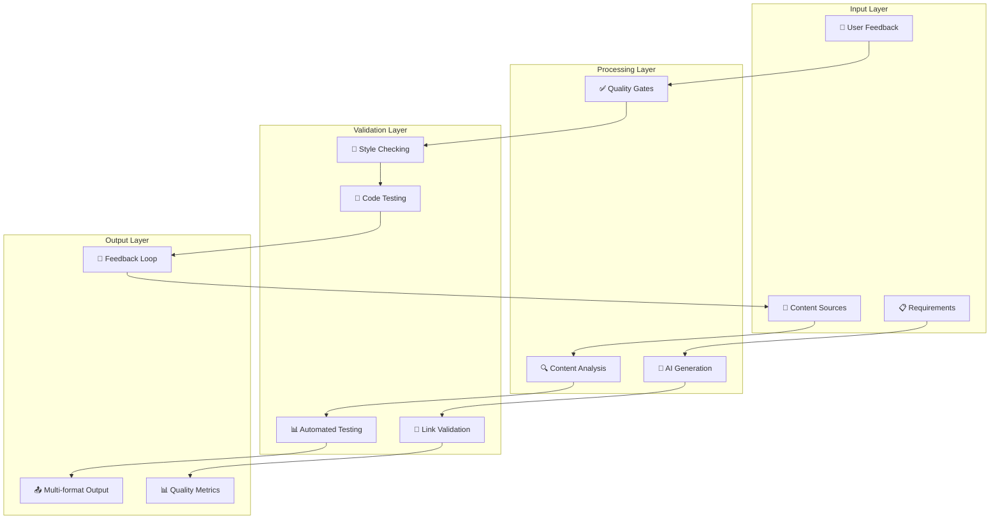
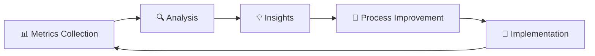

# ✅ Processo de Qualidade Automatizado

> Como garantir excelência na documentação através de processos inteligentes e automatizados

---

## 🎯 Visão Geral

O **Processo de Qualidade Automatizado** é o coração da Documentação 4.0, garantindo que todo conteúdo gerado atenda a padrões rigorosos de **consistência**, **precisão** e **utilidade** sem intervenção manual extensiva.

### 🏗️ Arquitetura do Processo



---

## 🔄 Pipeline de Qualidade Detalhado

### 📥 Fase 1: Coleta Inteligente

#### 🎯 Fontes de Dados
```python
# Exemplo de coleta automatizada
class DataCollector:
    def __init__(self):
        self.sources = {
            'api_specs': OpenAPIParser(),
            'source_code': CodeAnalyzer(), 
            'git_commits': GitHistoryParser(),
            'user_feedback': FeedbackAggregator(),
            'analytics': UsageAnalyzer()
        }
    
    def collect_all(self):
        return {
            source: collector.extract()
            for source, collector in self.sources.items()
        }
```

#### 📊 Tipos de Entrada
- **API Specifications** (OpenAPI, GraphQL schemas)
- **Source Code** (comments, docstrings, README)
- **User Interactions** (support tickets, FAQ)
- **Analytics** (page views, search queries)
- **Legacy Documentation** (migration data)

### 🔍 Fase 2: Análise e Processamento

#### 🧠 Análise Contextual
```python
class ContextAnalyzer:
    def analyze_content_gaps(self, current_docs, code_changes):
        """Identifica lacunas na documentação"""
        gaps = []
        
        # Análise de APIs não documentadas
        undocumented_apis = self.find_undocumented_endpoints(code_changes)
        
        # Análise de funcionalidades sem exemplos
        missing_examples = self.find_missing_examples(current_docs)
        
        # Análise de documentos obsoletos
        outdated_docs = self.find_outdated_content(current_docs, code_changes)
        
        return {
            'undocumented_apis': undocumented_apis,
            'missing_examples': missing_examples,
            'outdated_docs': outdated_docs
        }
```

#### 🎯 Critérios de Análise
- **Completeness**: Cobertura de funcionalidades
- **Accuracy**: Alinhamento com código atual
- **Consistency**: Aderência a style guides
- **Usability**: Clareza e utilidade para usuários
- **Findability**: Estrutura e taxonomia

### ✅ Fase 3: Portas de Qualidade (Quality Gates)

#### 🚦 Gate 1: Validação Estrutural
```yaml
# Configuração Vale Linter
StylesPath: styles
MinAlertLevel: warning

Packages:
  Microsoft: https://github.com/errata-ai/Microsoft/releases/latest/download/Microsoft.zip
  Google: https://github.com/errata-ai/Google/releases/latest/download/Google.zip

Rules:
  Microsoft.Contractions: error
  Microsoft.Passive: warning
  Google.Wordiness: error
  Custom.Terminology: error
```

#### 🧪 Gate 2: Teste de Código
```python
# Teste automático de exemplos de código
class CodeExampleTester:
    def test_python_examples(self, doc_path):
        """Testa todos os exemplos Python na documentação"""
        examples = self.extract_code_blocks(doc_path, language='python')
        results = []
        
        for example in examples:
            try:
                exec(example.code)
                results.append({
                    'example_id': example.id,
                    'status': 'pass',
                    'execution_time': example.runtime
                })
            except Exception as e:
                results.append({
                    'example_id': example.id,
                    'status': 'fail',
                    'error': str(e)
                })
        
        return results
```

#### 🔗 Gate 3: Validação de Links
```javascript
// Checker de links automatizado
const linkChecker = {
  async validateAllLinks(docPath) {
    const links = await this.extractLinks(docPath);
    const results = await Promise.all(
      links.map(async (link) => ({
        url: link.url,
        status: await this.checkLink(link.url),
        context: link.context
      }))
    );
    
    return {
      total: links.length,
      valid: results.filter(r => r.status === 200).length,
      broken: results.filter(r => r.status >= 400),
      errors: results.filter(r => r.status === 'error')
    };
  }
};
```

### 📊 Fase 4: Métricas e Scoring

#### 🎯 Quality Score Calculation
```python
class QualityScorer:
    def calculate_doc_score(self, doc_analysis):
        weights = {
            'completeness': 0.25,
            'accuracy': 0.30,
            'consistency': 0.20,
            'usability': 0.15,
            'freshness': 0.10
        }
        
        score = sum(
            doc_analysis[metric] * weight 
            for metric, weight in weights.items()
        )
        
        return {
            'overall_score': round(score, 2),
            'grade': self.score_to_grade(score),
            'breakdown': doc_analysis,
            'recommendations': self.generate_recommendations(doc_analysis)
        }
```

#### 📈 Métricas Principais
```yaml
quality_metrics:
  completeness:
    description: "% de funcionalidades documentadas"
    target: "> 90%"
    current: "95%"
    
  accuracy:
    description: "% de informações corretas"
    target: "> 95%"
    current: "97%"
    
  consistency:
    description: "Aderência ao style guide"
    target: "> 90%"
    current: "98%"
    
  freshness:
    description: "Idade média do conteúdo"
    target: "< 30 dias"
    current: "< 24h"
    
  usability:
    description: "Satisfação do usuário"
    target: "> 4.5/5"
    current: "4.8/5"
```

---

## 🤖 Automação Avançada

### 🔄 Correção Automática
```python
class AutoCorrector:
    def __init__(self):
        self.llm = OpenAI(model="gpt-4")
        self.style_guide = StyleGuide.load()
    
    async def fix_quality_issues(self, content, issues):
        """Corrige automaticamente problemas de qualidade"""
        corrections = []
        
        for issue in issues:
            if issue.type == "style":
                correction = await self.fix_style_issue(content, issue)
            elif issue.type == "accuracy":
                correction = await self.verify_and_fix_accuracy(content, issue)
            elif issue.type == "completeness":
                correction = await self.add_missing_content(content, issue)
            
            corrections.append(correction)
        
        return self.apply_corrections(content, corrections)
```

### 📊 Monitoramento Contínuo
```yaml
# Configuração de monitoramento
monitoring:
  alerts:
    quality_drop:
      condition: "quality_score < 85"
      action: "notify_team"
      
    broken_links:
      condition: "broken_links > 5"
      action: "auto_fix"
      
    outdated_content:
      condition: "content_age > 30_days"
      action: "trigger_review"
  
  dashboards:
    - quality_overview
    - usage_analytics
    - performance_metrics
```

---

## 🛠️ Ferramentas e Tecnologias

### 📝 Linting e Style
```bash
# Vale - Prose linter
vale --config=.vale.ini docs/

# Alex - Catch insensitive writing  
alex docs/

# textlint - Customizable text linter
textlint --config .textlintrc docs/
```

### 🧪 Testing
```python
# Doctest para Python
import doctest

def run_doctests():
    """
    Exemplo de função documentada:
    
    >>> add_numbers(2, 3)
    5
    >>> add_numbers(-1, 1) 
    0
    """
    doctest.testmod(verbose=True)

# Playwright para testes E2E
from playwright.sync_api import sync_playwright

def test_documentation_site():
    with sync_playwright() as p:
        browser = p.chromium.launch()
        page = browser.new_page()
        page.goto("https://docs.example.com")
        
        # Testa se todos os links funcionam
        links = page.query_selector_all('a[href^="http"]')
        for link in links:
            # Validação de links
            pass
```

### 📊 Analytics
```javascript
// Google Analytics para docs
const analyticsConfig = {
  trackingId: 'GA-XXXXXX',
  events: [
    'page_view',
    'search_query', 
    'link_click',
    'time_on_page',
    'scroll_depth'
  ],
  customDimensions: {
    userRole: 'developer|architect|manager',
    docSection: 'api|guide|tutorial',
    deviceType: 'mobile|desktop|tablet'
  }
};
```

---

## 📈 KPIs e Métricas de Sucesso

### 🎯 Métricas Operacionais
```
📊 Produtividade:
- Tempo de geração: < 4 horas (vs 2-4 semanas)
- Tempo de atualização: < 30 min (vs 2-3 dias)  
- Taxa de automação: 85%+ das tarefas

✅ Qualidade:
- Consistency score: 98%+
- Accuracy rate: 95%+
- User satisfaction: 4.8/5
- Bug reports: -70%

🔍 Descoberta:
- Search success rate: 92%+
- Time to find info: -60%
- Self-service rate: 78%
```

### 💰 Métricas de Negócio
```
💵 ROI Financeiro:
- Economia anual: $200K+
- Investimento inicial: $50K
- ROI: 300% no primeiro ano

👥 Impacto na Equipe:
- Desenvolvedores: +40% tempo em código
- Tech Writers: +60% tempo estratégico
- Support: -50% tickets docs
- QA: +30% cobertura de testes
```

---

## 🚨 Alertas e Governança

### 🔔 Sistema de Alertas
```python
# Configuração de alertas inteligentes
class QualityAlertSystem:
    def __init__(self):
        self.thresholds = {
            'quality_score': 85,
            'broken_links': 5,
            'outdated_content_days': 30,
            'user_satisfaction': 4.0
        }
    
    def check_and_alert(self, metrics):
        alerts = []
        
        if metrics.quality_score < self.thresholds['quality_score']:
            alerts.append({
                'type': 'quality_drop',
                'severity': 'high',
                'message': f"Quality score dropped to {metrics.quality_score}%",
                'action': 'trigger_review'
            })
        
        return alerts
```

### 🛡️ Governança e Compliance
```yaml
governance:
  approval_workflow:
    - automated_checks
    - peer_review (optional)
    - stakeholder_approval (for major changes)
    
  compliance_checks:
    - accessibility (WCAG 2.1)
    - security (no credentials in docs)
    - legal (copyright, licensing)
    - brand (style guide adherence)
    
  audit_trail:
    - change_history
    - approval_records
    - quality_scores
    - user_feedback
```

---

## 🔄 Melhoria Contínua

### 📊 Feedback Loop


### 🧠 Machine Learning Integration
```python
# ML para otimização de qualidade
class QualityML:
    def predict_content_quality(self, content_features):
        """Prediz quality score baseado em features"""
        return self.model.predict(content_features)
    
    def recommend_improvements(self, content, current_score, target_score):
        """Recomenda melhorias específicas"""
        gap_analysis = self.analyze_quality_gap(current_score, target_score)
        return self.generate_actionable_recommendations(content, gap_analysis)
```

---

## 🚀 Próximos Passos

### 🎯 Implementação Gradual
1. **Start Simple**: Linting básico (Vale, Alex)
2. **Add Testing**: Link checking, code examples
3. **Implement Monitoring**: Métricas e dashboards
4. **Scale with AI**: Correção e geração automática

### 📚 Recursos Relacionados
- [[🤖 Agentes IA para Automação]]
- [[📊 ROI e Métricas de Sucesso]]
- [[🔧 Implementação RAG com Python]]
- [[🗺️ Roadmap de Implementação]]

---

#qualidade #automacao #testing #metrics #pipeline #documentacao #campus-party

*Qualidade não é acidente - é resultado de processos inteligentes e automatizados* ✅
