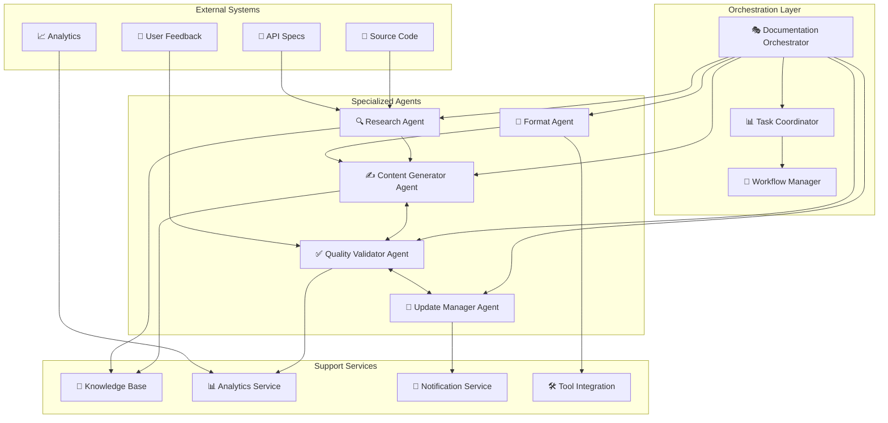
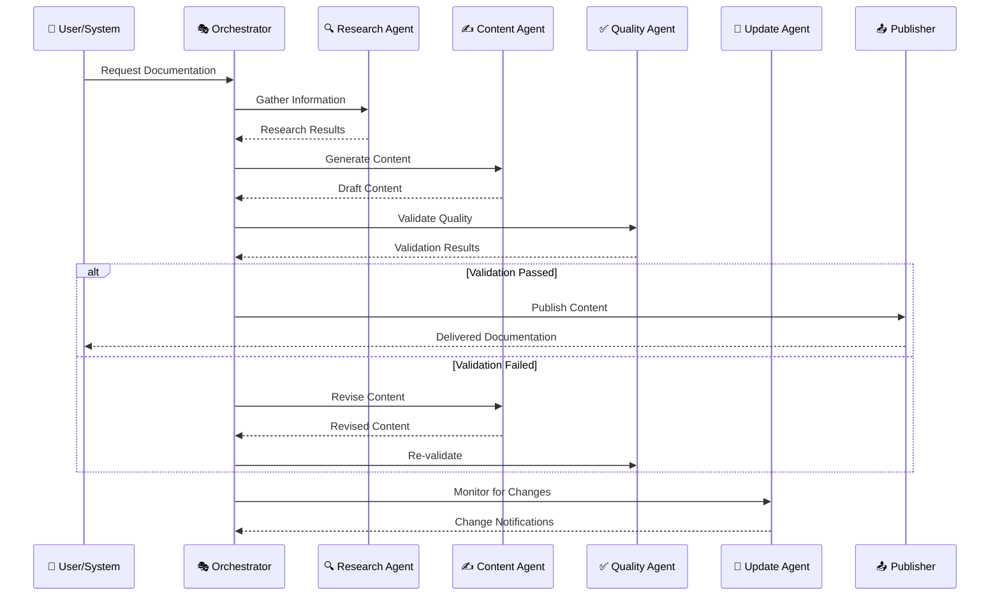
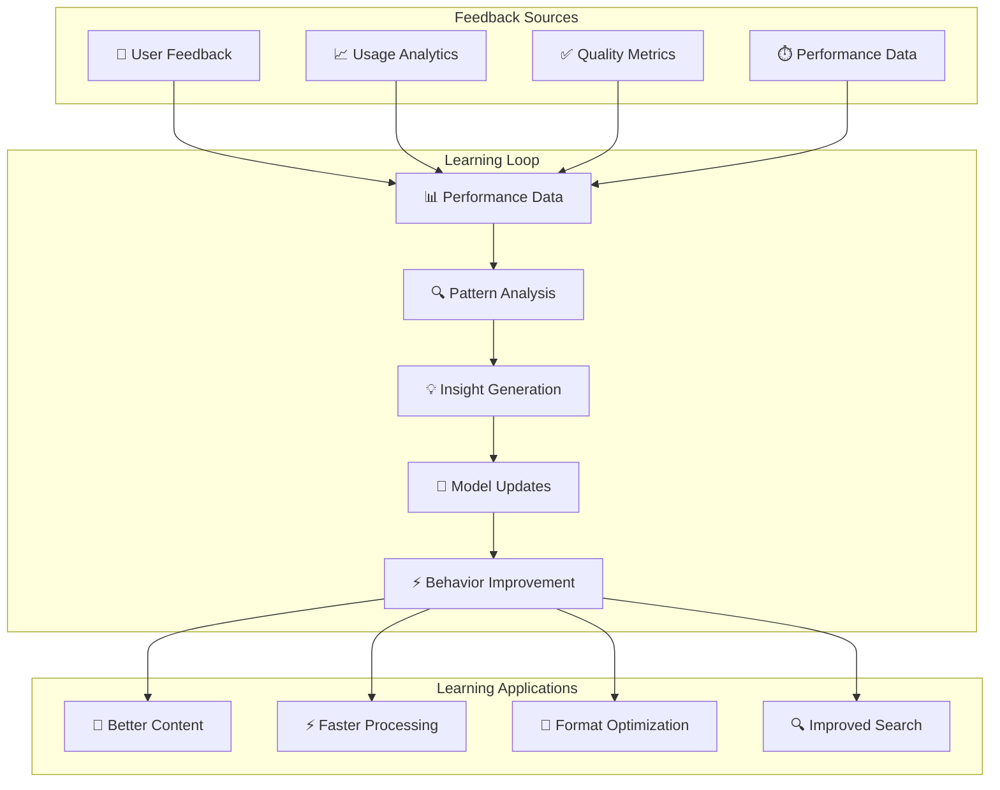
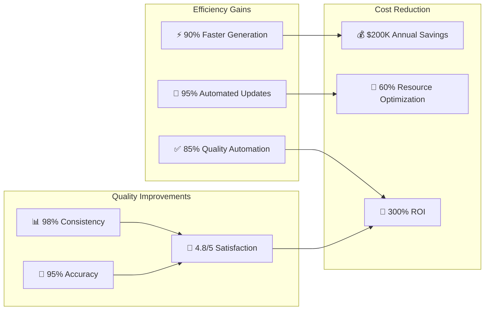

# 🤖 Agentes IA para Automação

> Sistemas multi-agente especializados para automação completa de processos de documentação

---

## 🎯 Visão Geral

**Agentes IA** são sistemas autônomos especializados que executam tarefas específicas de documentação com **mínima supervisão humana**. Eles trabalham de forma coordenada para automatizar todo o ciclo de vida da documentação.

### 🏗️ Arquitetura Multi-Agente



---

## 🤖 Agentes Especializados

### ✍️ Content Generator Agent

#### 🎯 Responsabilidades
- **Geração automática** de documentação
- **Multi-format output** (Markdown, HTML, PDF)
- **Template-driven** consistency
- **Context-aware** content creation

#### 🔧 Implementação
```python
class ContentGeneratorAgent:
    def __init__(self):
        self.llm = OpenAI(model="gpt-4")
        self.templates = TemplateManager()
        self.context_analyzer = ContextAnalyzer()
        
    async def generate_api_documentation(self, api_spec):
        """Gera documentação automaticamente para APIs"""
        
        # Analisa especificação da API
        analysis = await self.context_analyzer.analyze_api_spec(api_spec)
        
        # Seleciona template apropriado
        template = self.templates.get_api_template(analysis.complexity)
        
        # Gera documentação estruturada
        documentation = await self.llm.generate(
            template=template,
            context=analysis,
            parameters={
                "style": "technical",
                "audience": "developers",
                "include_examples": True
            }
        )
        
        return self.format_output(documentation)
    
    async def generate_user_guide(self, feature_spec, user_persona):
        """Gera guias de usuário personalizados"""
        
        context = {
            "feature": feature_spec,
            "persona": user_persona,
            "complexity": self.assess_complexity(feature_spec),
            "use_cases": self.extract_use_cases(feature_spec)
        }
        
        template = self.templates.get_user_guide_template(user_persona.level)
        
        guide = await self.llm.generate(
            template=template,
            context=context,
            parameters={
                "tone": user_persona.preferred_tone,
                "detail_level": user_persona.detail_preference,
                "include_screenshots": True
            }
        )
        
        return guide
```

#### 📊 Capacidades Avançadas
```yaml
content_generation_capabilities:
  types:
    - api_documentation
    - user_guides
    - tutorials
    - faq_entries
    - code_examples
    - troubleshooting_guides
  
  formats:
    - markdown
    - html
    - pdf
    - confluence
    - notion
    - docx
  
  personalization:
    - user_role_adaptation
    - experience_level_adjustment
    - language_preferences
    - format_preferences
```

### ✅ Quality Validator Agent

#### 🎯 Responsabilidades
- **Automated testing** de documentação
- **Quality scoring** e métricas
- **Consistency checking**
- **Compliance validation**

#### 🔧 Implementação
```python
class QualityValidatorAgent:
    def __init__(self):
        self.linters = {
            'prose': Vale(),
            'links': LinkChecker(),
            'code': CodeValidator(),
            'accessibility': AccessibilityChecker()
        }
        self.ml_scorer = QualityMLModel()
        
    async def validate_document(self, document):
        """Executa validação completa do documento"""
        
        validation_results = {}
        
        # Validação estrutural
        validation_results['structure'] = await self.validate_structure(document)
        
        # Validação de conteúdo
        validation_results['content'] = await self.validate_content(document)
        
        # Validação de links
        validation_results['links'] = await self.validate_links(document)
        
        # Validação de código
        validation_results['code'] = await self.validate_code_examples(document)
        
        # Score ML de qualidade
        validation_results['ml_score'] = await self.ml_scorer.score(document)
        
        return self.compile_report(validation_results)
    
    async def validate_code_examples(self, document):
        """Testa todos os exemplos de código"""
        
        code_blocks = self.extract_code_blocks(document)
        results = []
        
        for block in code_blocks:
            if block.language in ['python', 'javascript', 'bash']:
                test_result = await self.execute_code_test(block)
                results.append({
                    'block_id': block.id,
                    'language': block.language,
                    'status': test_result.status,
                    'output': test_result.output,
                    'errors': test_result.errors
                })
        
        return {
            'total_blocks': len(code_blocks),
            'passed': len([r for r in results if r['status'] == 'pass']),
            'failed': len([r for r in results if r['status'] == 'fail']),
            'details': results
        }
```

#### 📊 Métricas de Qualidade
```yaml
quality_metrics:
  structure:
    - heading_hierarchy: "correct nesting"
    - table_of_contents: "present and accurate"
    - cross_references: "valid and working"
    
  content:
    - clarity_score: "0-100 scale"
    - completeness: "coverage percentage"
    - accuracy: "fact-checking score"
    
  technical:
    - code_validity: "syntax and execution"
    - link_health: "all links working"
    - image_optimization: "size and format"
    
  compliance:
    - style_guide: "adherence percentage"
    - accessibility: "WCAG compliance"
    - security: "no credentials exposed"
```

### 🔄 Update Manager Agent

#### 🎯 Responsabilidades
- **Change detection** em fontes
- **Impact analysis** automática
- **Selective updates** de conteúdo
- **Version management**

#### 🔧 Implementação
```python
class UpdateManagerAgent:
    def __init__(self):
        self.change_detector = ChangeDetector()
        self.impact_analyzer = ImpactAnalyzer()
        self.version_manager = VersionManager()
        
    async def monitor_sources(self):
        """Monitora mudanças em todas as fontes"""
        
        sources = [
            {'type': 'git', 'repo': 'main-repository'},
            {'type': 'api', 'spec': 'openapi-spec.yaml'},
            {'type': 'database', 'schema': 'prod-schema'},
            {'type': 'feedback', 'platform': 'support-tickets'}
        ]
        
        changes = []
        for source in sources:
            detected_changes = await self.change_detector.detect(source)
            if detected_changes:
                changes.extend(detected_changes)
        
        if changes:
            await self.process_changes(changes)
    
    async def process_changes(self, changes):
        """Processa mudanças detectadas"""
        
        for change in changes:
            # Analisa impacto da mudança
            impact = await self.impact_analyzer.analyze(change)
            
            if impact.requires_update:
                # Determina documentos afetados
                affected_docs = impact.affected_documents
                
                # Cria plano de atualização
                update_plan = await self.create_update_plan(change, affected_docs)
                
                # Executa atualizações
                await self.execute_updates(update_plan)
                
    async def execute_updates(self, update_plan):
        """Executa plano de atualização"""
        
        for update in update_plan.updates:
            try:
                # Cria nova versão do documento
                new_version = await self.content_generator.update_document(
                    document=update.document,
                    changes=update.changes,
                    strategy=update.strategy
                )
                
                # Valida nova versão
                validation = await self.validator.validate(new_version)
                
                if validation.passed:
                    # Publica atualização
                    await self.publish_update(new_version)
                    
                    # Notifica stakeholders
                    await self.notify_update(update.document, new_version)
                
            except Exception as e:
                await self.handle_update_error(update, e)
```

### 🔍 Research Agent

#### 🎯 Responsabilidades
- **Information gathering** de múltiplas fontes
- **Content research** para lacunas
- **Trend analysis** e insights
- **Competitive intelligence**

#### 🔧 Implementação
```python
class ResearchAgent:
    def __init__(self):
        self.web_scraper = WebScraper()
        self.api_clients = {
            'github': GitHubClient(),
            'stackoverflow': StackOverflowAPI(),
            'documentation': DocSearchAPI()
        }
        self.nlp_analyzer = NLPAnalyzer()
        
    async def research_topic(self, topic, depth="comprehensive"):
        """Pesquisa abrangente sobre um tópico"""
        
        research_results = {
            'web_sources': [],
            'code_examples': [],
            'community_insights': [],
            'best_practices': [],
            'trends': []
        }
        
        # Pesquisa web geral
        web_results = await self.web_scraper.search(
            query=topic,
            sources=['official_docs', 'tutorials', 'blogs'],
            limit=20
        )
        research_results['web_sources'] = web_results
        
        # Busca exemplos de código
        code_examples = await self.api_clients['github'].search_code(
            query=topic,
            language='python',
            sort='stars'
        )
        research_results['code_examples'] = code_examples
        
        # Análise de discussões da comunidade
        discussions = await self.api_clients['stackoverflow'].search(
            tag=topic,
            sort='votes',
            limit=10
        )
        research_results['community_insights'] = discussions
        
        # Extrai insights e tendências
        insights = await self.nlp_analyzer.extract_insights(research_results)
        research_results['insights'] = insights
        
        return research_results
```

---

## 🔄 Coordenação e Workflow

### 🎭 Documentation Orchestrator



### 🔄 Workflow Automation

```python
class DocumentationWorkflow:
    def __init__(self):
        self.agents = {
            'research': ResearchAgent(),
            'generator': ContentGeneratorAgent(),
            'validator': QualityValidatorAgent(),
            'updater': UpdateManagerAgent()
        }
        
    async def execute_documentation_workflow(self, request):
        """Executa workflow completo de documentação"""
        
        workflow_id = self.generate_workflow_id()
        
        try:
            # Fase 1: Research
            research_data = await self.agents['research'].research_topic(
                topic=request.topic,
                depth=request.depth
            )
            
            # Fase 2: Generation
            content = await self.agents['generator'].generate_content(
                topic=request.topic,
                research_data=research_data,
                format=request.format,
                audience=request.audience
            )
            
            # Fase 3: Validation
            validation = await self.agents['validator'].validate_document(content)
            
            if not validation.passed:
                # Retry com correções
                content = await self.agents['generator'].fix_issues(
                    content=content,
                    issues=validation.issues
                )
                validation = await self.agents['validator'].validate_document(content)
            
            # Fase 4: Publication
            if validation.passed:
                result = await self.publish_content(content, request.destination)
                
                # Setup monitoring
                await self.agents['updater'].setup_monitoring(
                    content=content,
                    sources=research_data.sources
                )
                
                return {
                    'workflow_id': workflow_id,
                    'status': 'completed',
                    'content': result,
                    'quality_score': validation.score
                }
            
        except Exception as e:
            return {
                'workflow_id': workflow_id,
                'status': 'failed',
                'error': str(e)
            }
```

---

## 🧠 Inteligência e Aprendizado

### 📊 Agent Learning System



### 🤖 Agent Communication Protocol

```python
class AgentCommunicationProtocol:
    def __init__(self):
        self.message_queue = MessageQueue()
        self.agent_registry = AgentRegistry()
        
    async def send_message(self, from_agent, to_agent, message_type, payload):
        """Protocolo de comunicação entre agentes"""
        
        message = {
            'id': self.generate_message_id(),
            'timestamp': datetime.now(),
            'from': from_agent,
            'to': to_agent,
            'type': message_type,
            'payload': payload,
            'priority': self.calculate_priority(message_type)
        }
        
        await self.message_queue.push(message)
        
    async def handle_message(self, agent, message):
        """Manipula mensagens recebidas por um agente"""
        
        handler = self.get_message_handler(agent, message.type)
        
        if handler:
            try:
                response = await handler(message.payload)
                
                if message.expects_response:
                    await self.send_response(agent, message.from, response)
                    
            except Exception as e:
                await self.send_error_response(agent, message.from, e)
```

---

## 📊 Métricas e Performance

### 🎯 Agent Performance Metrics

```yaml
agent_metrics:
  content_generator:
    throughput: "50+ docs/hour"
    quality_score: "4.7/5.0"
    error_rate: "< 2%"
    
  quality_validator:
    validation_speed: "< 30 seconds"
    accuracy: "96%"
    false_positive_rate: "< 5%"
    
  update_manager:
    detection_latency: "< 5 minutes"
    update_success_rate: "98%"
    automated_fixes: "85%"
    
  research_agent:
    source_coverage: "20+ sources"
    relevance_score: "4.5/5.0"
    research_time: "< 10 minutes"
```

### 📈 Business Impact



---

## 🛠️ Implementação Prática

### 🚀 Setup Básico de Agentes

```python
# Configuração inicial do sistema de agentes
def setup_agent_system():
    """Configura sistema básico de agentes"""
    
    # Inicializa agentes
    agents = {
        'orchestrator': DocumentationOrchestrator(),
        'content_generator': ContentGeneratorAgent(),
        'quality_validator': QualityValidatorAgent(),
        'update_manager': UpdateManagerAgent(),
        'research_agent': ResearchAgent()
    }
    
    # Configura comunicação
    communication = AgentCommunicationProtocol()
    
    # Registra agentes
    for name, agent in agents.items():
        communication.register_agent(name, agent)
    
    # Configura workflows
    workflows = {
        'generate_api_docs': APIDocumentationWorkflow(),
        'update_user_guides': UserGuideUpdateWorkflow(),
        'research_best_practices': ResearchWorkflow()
    }
    
    return {
        'agents': agents,
        'communication': communication,
        'workflows': workflows
    }
```

### 📊 Monitoramento e Observabilidade

```yaml
# Configuração de monitoramento
monitoring:
  metrics:
    - agent_performance
    - workflow_success_rate
    - quality_scores
    - user_satisfaction
    
  alerts:
    - agent_failure
    - quality_degradation
    - workflow_bottlenecks
    - resource_exhaustion
    
  dashboards:
    - agent_overview
    - workflow_status
    - quality_trends
    - business_metrics
```

---

## 🚀 Próximos Passos

### 🎯 Implementação Gradual
1. **Single Agent POC** - Comece com Content Generator
2. **Add Validation** - Integre Quality Validator
3. **Orchestration** - Implemente coordenação
4. **Full Automation** - Sistema completo

### 📈 Evolução Avançada
1. **Multi-tenant Agents**
2. **Cross-domain Learning**
3. **Predictive Automation**
4. **Self-healing Systems**

---

## 🔗 Relacionado

- [[🏗️ Componentes Doc 4.0]]
- [[🔍 RAG - Retrieval-Augmented Generation]]
- [[📊 Pipeline de Qualidade]]
- [[🔧 Implementação RAG com Python]]

---

#agentes #ia #automacao #multi-agent #orquestracao #qualidade #documentacao #campus-party

*Agentes IA: Onde automação encontra inteligência especializada* 🤖
