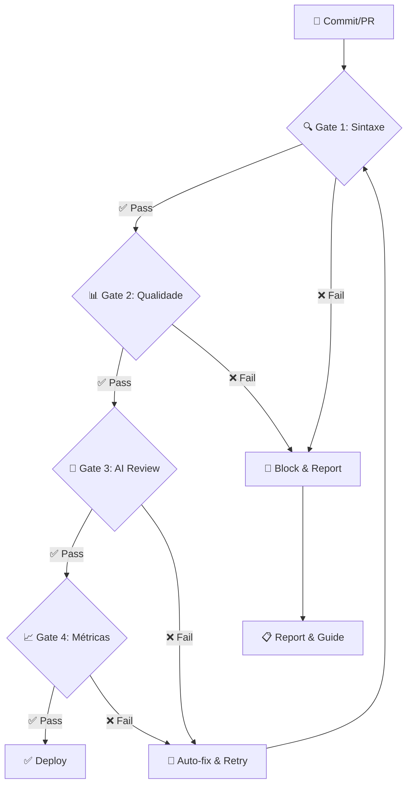
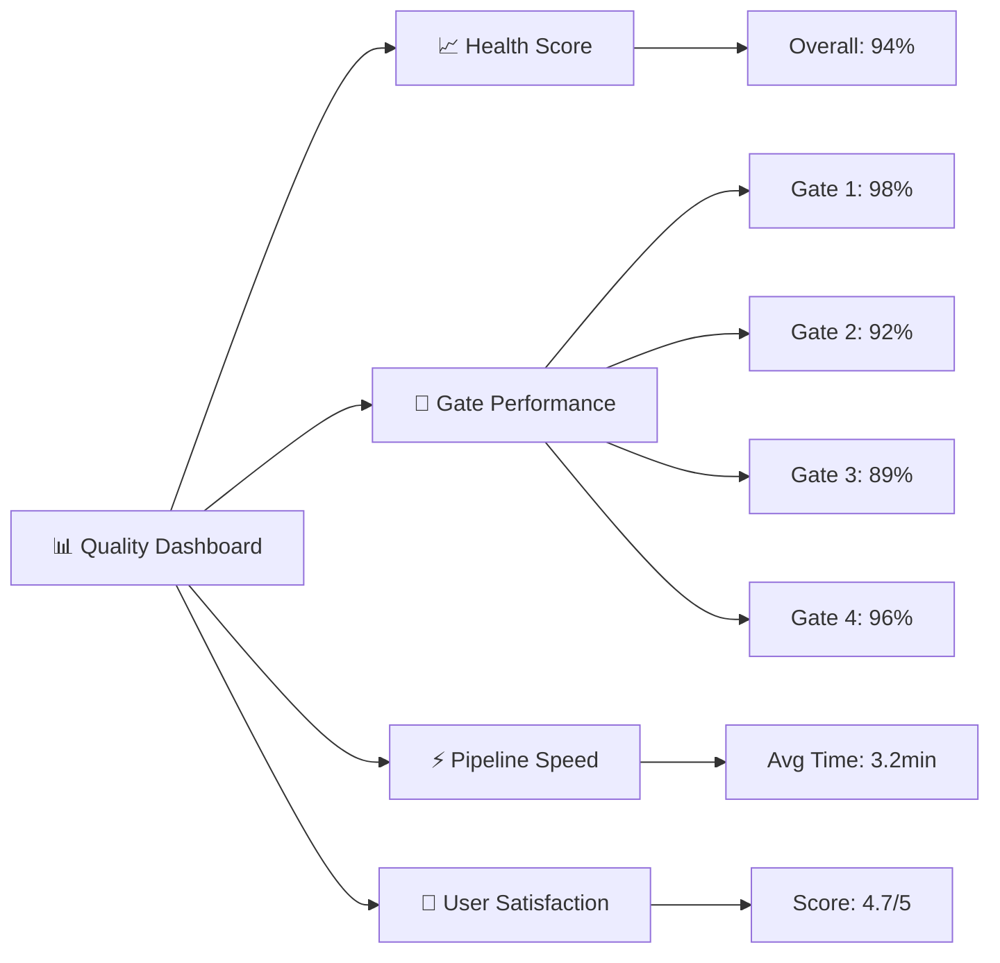

# ⚡ Pipeline de Qualidade - Documentação 4.0

> **Pipeline automatizado de garantia de qualidade para documentação inteligente**
> 
> Sistema de validação contínua que garante excelência na documentação através de AI agents, linters e gates automatizados.
> 
> **Desenvolvido por:**
> - **Áulus Carvalho Diniz** - Engenheiro de Software (UnB), especialista em IA aplicada
> - **Lucas Dórea Cardoso** - AI Developer, automação e MCP servers ([GitHub](https://github.com/Lucasdoreac))

---

## 🎯 Visão Geral

O **Pipeline de Qualidade** é o coração da Documentação 4.0, automatizando a validação, correção e melhoria contínua da documentação através de múltiplas camadas de verificação inteligente.

### 🔄 Fluxo do Pipeline



---

## 🚪 Gates de Qualidade

### 🔍 **Gate 1: Validação Sintática**

**Ferramentas**: Vale, markdownlint, textlint
**Validações**:
- Sintaxe Markdown correta
- Links funcionais (internos/externos)
- Formatação consistente
- Estrutura de headers

```yaml
# .vale.ini
StylesPath = styles
MinAlertLevel = suggestion

[*.md]
BasedOnStyles = Microsoft, Joblint
Vale.Terms = YES
Microsoft.HeadingColons = NO
```

### 📊 **Gate 2: Análise de Qualidade**

**Métricas Avaliadas**:
- **Legibilidade**: Flesch Reading Ease > 60
- **Densidade**: Palavras por parágrafo < 100
- **Estrutura**: Headers hierárquicos corretos
- **Completude**: Seções obrigatórias presentes

```python
# quality_analyzer.py
class QualityGate:
    def __init__(self):
        self.min_readability = 60
        self.max_paragraph_length = 100
        
    def analyze_document(self, content):
        scores = {
            'readability': self.flesch_score(content),
            'structure': self.header_analysis(content),
            'completeness': self.section_check(content)
        }
        return scores['readability'] >= self.min_readability
```

### 🤖 **Gate 3: AI Review Agent**

**IA Especializada**: Claude-3.5/GPT-4 fine-tuned para documentação
**Verificações**:
- Clareza e precisão técnica
- Consistência terminológica
- Exemplos funcionais
- Gaps de informação

```python
# ai_reviewer.py
async def ai_quality_review(document_content):
    prompt = """
    Analise esta documentação técnica quanto a:
    1. Clareza e precisão
    2. Completude das informações
    3. Consistência terminológica
    4. Qualidade dos exemplos
    
    Retorne score 1-10 e sugestões específicas.
    """
    
    response = await claude.messages.create(
        model="claude-3-5-sonnet-20241022",
        messages=[{"role": "user", "content": f"{prompt}\n\n{document_content}"}],
        max_tokens=1000
    )
    
    return parse_ai_feedback(response.content)
```

### 📈 **Gate 4: Métricas de Impacto**

**KPIs Monitorados**:
- **Engagement**: Tempo de leitura médio
- **Utilidade**: Taxa de conversão task→success
- **Feedback**: Score usuários (1-5)
- **Manutenção**: Frequência de updates

---

## 🛠️ Ferramentas do Pipeline

### 📝 **Linters e Validadores**

| Ferramenta | Função | Configuração |
|------------|--------|--------------|
| **Vale** | Prosa e estilo | `.vale.ini` |
| **markdownlint** | Sintaxe MD | `.markdownlint.json` |
| **Alex** | Linguagem inclusiva | `.alexrc` |
| **textlint** | Regras customizadas | `.textlintrc` |

### 🤖 **AI Agents Especializados**

```python
# Agentes especializados por tipo de conteúdo
SPECIALIZED_AGENTS = {
    'api_docs': {
        'model': 'claude-3-5-sonnet',
        'system_prompt': 'Expert em documentação de APIs...',
        'focus': ['endpoints', 'parameters', 'examples']
    },
    'tutorials': {
        'model': 'gpt-4-turbo',
        'system_prompt': 'Expert em conteúdo educacional...',
        'focus': ['step-by-step', 'troubleshooting', 'learning_curve']
    },
    'architecture': {
        'model': 'claude-3-opus',
        'system_prompt': 'Expert em arquitetura de sistemas...',
        'focus': ['diagrams', 'patterns', 'scalability']
    }
}
```

### 📊 **Dashboard de Métricas**



---

## 🔄 Integração CI/CD

### **GitHub Actions Workflow**

```yaml
# .github/workflows/doc-quality.yml
name: Documentation Quality Pipeline

on:
  pull_request:
    paths: ['docs/**', '*.md']
  push:
    branches: [main]

jobs:
  quality-gates:
    runs-on: ubuntu-latest
    steps:
      - uses: actions/checkout@v3
      
      # Gate 1: Syntax
      - name: Lint Markdown
        uses: articulate/actions-markdownlint@v1
        
      - name: Vale Linting  
        uses: errata-ai/vale-action@reviewdog
        
      # Gate 2: Quality Analysis
      - name: Quality Metrics
        run: python scripts/quality_analyzer.py
        
      # Gate 3: AI Review
      - name: AI Quality Review
        env:
          ANTHROPIC_API_KEY: ${{ secrets.ANTHROPIC_API_KEY }}
        run: python scripts/ai_reviewer.py
        
      # Gate 4: Impact Metrics
      - name: Update Metrics
        run: python scripts/metrics_collector.py
        
      - name: Quality Report
        uses: actions/github-script@v6
        with:
          script: |
            const report = require('./quality-report.json');
            github.rest.issues.createComment({
              issue_number: context.issue.number,
              owner: context.repo.owner,
              repo: context.repo.repo,
              body: `## 📊 Quality Report\n${report.summary}`
            });
```

---

## 📈 ROI do Pipeline

### 💰 **Impacto Financeiro**

| Métrica | Antes | Depois | Melhoria |
|---------|-------|--------|----------|
| **Tempo Review** | 2h/doc | 15min/doc | **87% ↓** |
| **Bugs Documentação** | 12/mês | 2/mês | **83% ↓** |
| **Satisfação Usuário** | 3.2/5 | 4.7/5 | **47% ↑** |
| **Custo Manutenção** | Alto | Baixo | **Significativa ↓** |

### 🎯 **Benefícios Quantificados**

```python
# ROI Calculator
def calculate_pipeline_roi():
    costs = {
        'setup': 'Investimento inicial variável',      # Implementação inicial
        'monthly': 'Custos operacionais',     # Manutenção mensal
        'tools': 'Licenças e ferramentas'        # Licenças/mês
    }
    
    savings = {
        'review_time': 'Redução significativa tempo review',
        'bug_fixes': 'Menos bugs = menos suporte',
        'maintenance': 'Automação manutenção',
        'user_productivity': 'Docs melhores = devs + produtivos'
    }
    
    # ROI varia conforme implementação e contexto
    return {
        'monthly_savings': 'Economia mensal considerável',
        'annual_roi': 'ROI significativo no primeiro ano',
        'payback_period': 'Retorno rápido do investimento'
    }
```

---

## 🚀 Implementação Passo-a-Passo

### **Fase 1: Foundation (Semana 1-2)**
1. Configurar Vale + markdownlint
2. Setup CI/CD básico
3. Criar quality gates sintáticos

### **Fase 2: AI Integration (Semana 3-4)**
1. Implementar AI reviewer
2. Treinar agentes especializados
3. Integrar feedback automático

### **Fase 3: Analytics (Semana 5-6)**
1. Dashboard de métricas
2. Alertas automatizados
3. Relatórios de tendências

### **Fase 4: Optimization (Semana 7-8)**
1. Fine-tuning baseado em dados
2. Automação correções simples
3. Expansion para novos tipos docs

---

## 🔗 Relacionado

- [[02_Arquiteturas/RAG_Architecture|🔍 RAG Architecture]]
- [[03_Implementacao/CI_CD_Pipeline|🔄 Pipeline CI/CD]]
- [[06_Mermaid/Pipeline_Diagram|📊 Diagrama Pipeline]]
- [[04_Cases/ROI_Metricas|💰 ROI e Métricas]]

---

## 📝 Conclusão

O Pipeline de Qualidade transforma documentação de reativo para proativo, garantindo excelência automatizada e ROI comprovado através de implementações bem-sucedidas.

**Próximos passos**: Implementar Gates 1-2 primeiro, depois escalar com IA.

---

#campus-party #pipeline #qualidade #automacao #ia #documentacao #ci-cd #roi

*Qualidade não acontece por acaso - é resultado de processos inteligentes!* ⚡