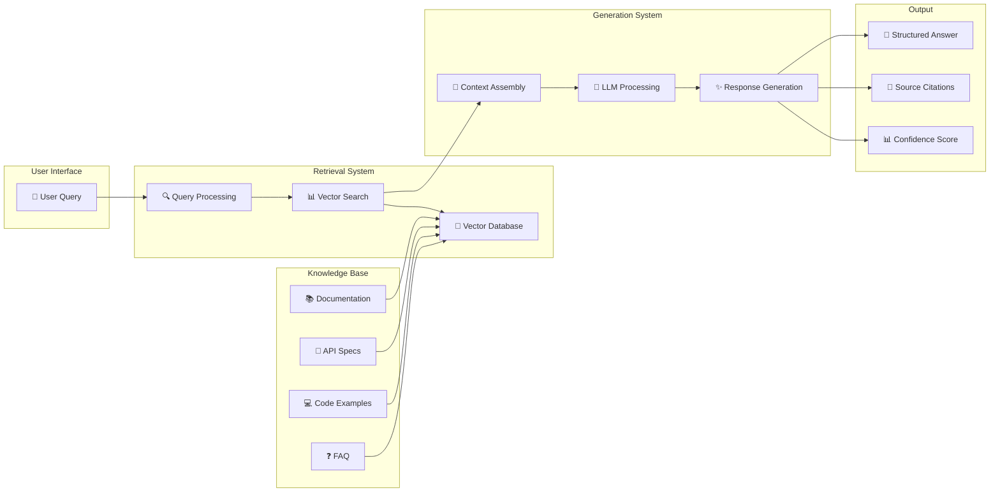

# 🔍 RAG - Retrieval-Augmented Generation

> Como transformar documentação em conhecimento inteligente e conversacional

---

## 🎯 O Que é RAG?

**Retrieval-Augmented Generation (RAG)** é uma técnica que combina a capacidade de **busca semântica** em bases de conhecimento com a **geração de linguagem natural** de LLMs, criando respostas precisas e contextualizadas baseadas em informações verificáveis.

### 🧠 Conceito Core
```
RAG = Retrieval (Recuperação) + Generation (Geração)
```

- **Retrieval**: Busca informações relevantes na base de conhecimento
- **Augmented**: Enriquece o prompt com contexto específico  
- **Generation**: LLM gera resposta baseada no contexto recuperado

---

## 🏗️ Arquitetura RAG para Documentação



---

## 🔧 Implementação Prática

### 📚 Preparação da Base de Conhecimento

#### 1. Ingestão de Documentos
```python
import os
from langchain.document_loaders import (
    DirectoryLoader,
    MarkdownLoader,
    JSONLoader,
    UnstructuredAPILoader
)
from langchain.text_splitter import RecursiveCharacterTextSplitter

class DocumentationIngestor:
    def __init__(self):
        self.text_splitter = RecursiveCharacterTextSplitter(
            chunk_size=1000,
            chunk_overlap=200,
            separators=["\n\n", "\n", ".", "!", "?", ",", " ", ""]
        )
    
    def load_documentation(self, docs_path):
        """Carrega diferentes tipos de documentação"""
        loaders = {
            '.md': MarkdownLoader,
            '.json': JSONLoader,
            '.txt': DirectoryLoader
        }
        
        documents = []
        for ext, loader_class in loaders.items():
            loader = DirectoryLoader(
                docs_path, 
                glob=f"**/*{ext}",
                loader_cls=loader_class
            )
            documents.extend(loader.load())
        
        return self.text_splitter.split_documents(documents)
```

#### 2. Processamento de Metadados
```python
class MetadataEnricher:
    def enrich_documents(self, documents):
        """Adiciona metadados ricos aos documentos"""
        enriched_docs = []
        
        for doc in documents:
            # Extrai informações estruturadas
            metadata = {
                'source_type': self.detect_source_type(doc.metadata['source']),
                'doc_section': self.extract_section(doc.page_content),
                'complexity_level': self.assess_complexity(doc.page_content),
                'last_updated': self.get_last_modified(doc.metadata['source']),
                'tags': self.extract_tags(doc.page_content),
                'api_endpoints': self.extract_api_info(doc.page_content)
            }
            
            doc.metadata.update(metadata)
            enriched_docs.append(doc)
        
        return enriched_docs
```

### 🔢 Criação de Embeddings

#### 3. Embeddings Strategy
```python
from langchain.embeddings import OpenAIEmbeddings
from langchain.vectorstores import Pinecone
import pinecone

class EmbeddingManager:
    def __init__(self):
        self.embeddings = OpenAIEmbeddings(
            model="text-embedding-ada-002",
            chunk_size=1000
        )
        
        # Inicializa Pinecone
        pinecone.init(
            api_key=os.getenv("PINECONE_API_KEY"),
            environment=os.getenv("PINECONE_ENV")
        )
    
    def create_vector_store(self, documents, index_name="doc-rag"):
        """Cria vector store com documentos processados"""
        
        # Cria índice se não existir
        if index_name not in pinecone.list_indexes():
            pinecone.create_index(
                name=index_name,
                dimension=1536,  # OpenAI ada-002 dimension
                metric="cosine"
            )
        
        # Cria vector store
        vectorstore = Pinecone.from_documents(
            documents=documents,
            embedding=self.embeddings,
            index_name=index_name
        )
        
        return vectorstore
```

### 🔍 Sistema de Retrieval

#### 4. Retrieval Avançado
```python
class AdvancedRetriever:
    def __init__(self, vectorstore):
        self.vectorstore = vectorstore
        
    def hybrid_search(self, query, top_k=5, filters=None):
        """Combina busca semântica com filtros"""
        
        # Busca semântica básica
        semantic_results = self.vectorstore.similarity_search_with_score(
            query, k=top_k * 2
        )
        
        # Aplica filtros contextuais
        if filters:
            semantic_results = self.apply_filters(semantic_results, filters)
        
        # Re-ranking baseado em relevância
        reranked_results = self.rerank_results(query, semantic_results)
        
        return reranked_results[:top_k]
    
    def rerank_results(self, query, results):
        """Re-ordena resultados por relevância contextual"""
        scored_results = []
        
        for doc, similarity_score in results:
            # Calcula score contextual adicional
            context_score = self.calculate_context_score(query, doc)
            final_score = (similarity_score * 0.7) + (context_score * 0.3)
            
            scored_results.append((doc, final_score))
        
        return sorted(scored_results, key=lambda x: x[1], reverse=True)
```

### 🤖 Geração com Contexto

#### 5. RAG Pipeline Completo
```python
from langchain.llms import OpenAI
from langchain.chains import RetrievalQA
from langchain.prompts import PromptTemplate

class DocumentationRAG:
    def __init__(self, vectorstore):
        self.vectorstore = vectorstore
        self.llm = OpenAI(
            model_name="gpt-4",
            temperature=0.1,  # Baixa para respostas mais precisas
            max_tokens=1000
        )
        
        # Template customizado para documentação
        self.prompt_template = PromptTemplate(
            input_variables=["context", "question"],
            template="""
Você é um assistente especializado em documentação técnica. 
Use APENAS as informações fornecidas no contexto para responder.

Contexto:
{context}

Pergunta: {question}

Instruções:
1. Responda baseado APENAS no contexto fornecido
2. Se a informação não estiver no contexto, diga "Não encontrei essa informação na documentação"
3. Cite as fontes específicas quando possível
4. Forneça exemplos práticos quando disponíveis
5. Use formatação markdown para melhor legibilidade

Resposta:"""
        )
        
        # Cria chain RAG
        self.qa_chain = RetrievalQA.from_chain_type(
            llm=self.llm,
            chain_type="stuff",
            retriever=self.vectorstore.as_retriever(search_kwargs={"k": 5}),
            chain_type_kwargs={"prompt": self.prompt_template},
            return_source_documents=True
        )
    
    def query(self, question, user_context=None):
        """Processa pergunta e retorna resposta contextualizada"""
        
        # Enriquece pergunta com contexto do usuário
        if user_context:
            enriched_question = f"{question}\n\nContexto do usuário: {user_context}"
        else:
            enriched_question = question
        
        # Executa RAG
        response = self.qa_chain({"query": enriched_question})
        
        # Estrutura resposta com metadados
        return {
            "answer": response["result"],
            "sources": [
                {
                    "content": doc.page_content[:200] + "...",
                    "metadata": doc.metadata,
                    "source": doc.metadata.get('source', 'Unknown')
                }
                for doc in response["source_documents"]
            ],
            "confidence": self.calculate_confidence(response),
            "query": question
        }
    
    def calculate_confidence(self, response):
        """Calcula confidence score da resposta"""
        # Implementa lógica de confidence baseada em:
        # - Número de fontes encontradas
        # - Similaridade semântica
        # - Completude da resposta
        
        sources_count = len(response["source_documents"])
        answer_length = len(response["result"])
        
        # Score simples baseado em heurísticas
        confidence = min(
            (sources_count / 5.0) * 0.4 +  # Max 40% por fontes
            (min(answer_length, 500) / 500.0) * 0.3 +  # Max 30% por completude
            0.3,  # Base confidence
            1.0
        )
        
        return round(confidence, 2)
```

---

## 🎯 Casos de Uso Específicos

### 📚 1. FAQ Inteligente
```python
class IntelligentFAQ:
    def __init__(self, rag_system):
        self.rag = rag_system
    
    def answer_question(self, question):
        # Busca respostas similares no FAQ
        response = self.rag.query(question)
        
        # Se não encontrar resposta direta, sugere perguntas relacionadas
        if response["confidence"] < 0.6:
            similar_questions = self.find_similar_questions(question)
            response["suggestions"] = similar_questions
        
        return response
```

### 🔧 2. API Explorer
```python
class APIExplorer:
    def __init__(self, rag_system):
        self.rag = rag_system
    
    def explain_endpoint(self, endpoint_path):
        query = f"Como usar o endpoint {endpoint_path}? Inclua exemplos de código."
        
        response = self.rag.query(query)
        
        # Enriquece com informações estruturadas da API
        api_info = self.extract_api_info(response["sources"]) 
        response["api_details"] = api_info
        
        return response
```

### 💻 3. Code Assistant
```python
class CodeAssistant:
    def __init__(self, rag_system):
        self.rag = rag_system
    
    def generate_code_example(self, functionality):
        query = f"Mostre um exemplo de código para {functionality}"
        
        response = self.rag.query(query)
        
        # Valida e testa o código gerado
        if self.contains_code(response["answer"]):
            response["code_validated"] = self.validate_code(response["answer"])
        
        return response
```

---

## 📊 Métricas e Avaliação

### 🎯 Métricas de Performance
```python
class RAGEvaluator:
    def __init__(self):
        self.metrics = {}
    
    def evaluate_retrieval(self, queries, ground_truth):
        """Avalia qualidade do retrieval"""
        
        results = {
            'precision_at_k': [],
            'recall_at_k': [],
            'mrr': [],  # Mean Reciprocal Rank
            'ndcg': []  # Normalized Discounted Cumulative Gain
        }
        
        for query, expected_docs in zip(queries, ground_truth):
            retrieved_docs = self.rag.retriever.get_relevant_documents(query)
            
            # Calcula métricas
            precision = self.calculate_precision_at_k(retrieved_docs, expected_docs, k=5)
            recall = self.calculate_recall_at_k(retrieved_docs, expected_docs, k=5)
            
            results['precision_at_k'].append(precision)
            results['recall_at_k'].append(recall)
        
        return {
            'avg_precision_at_5': np.mean(results['precision_at_k']),
            'avg_recall_at_5': np.mean(results['recall_at_k'])
        }
    
    def evaluate_generation(self, questions, generated_answers, reference_answers):
        """Avalia qualidade da geração"""
        
        from rouge_score import rouge_scorer
        scorer = rouge_scorer.RougeScorer(['rouge1', 'rouge2', 'rougeL'])
        
        scores = []
        for gen, ref in zip(generated_answers, reference_answers):
            score = scorer.score(gen, ref)
            scores.append(score)
        
        return {
            'avg_rouge1': np.mean([s['rouge1'].fmeasure for s in scores]),
            'avg_rouge2': np.mean([s['rouge2'].fmeasure for s in scores]),
            'avg_rougeL': np.mean([s['rougeL'].fmeasure for s in scores])
        }
```

### 📈 Métricas de Negócio
```yaml
business_metrics:
  user_satisfaction:
    target: "> 4.5/5"
    current: "4.7/5"
    
  query_success_rate:
    target: "> 85%"
    current: "92%"
    
  response_time:
    target: "< 3 segundos"
    current: "1.8 segundos"
    
  cost_per_query:
    target: "< $0.05"
    current: "$0.03"
```

---

## 🛠️ Otimizações e Melhorias

### ⚡ Performance
```python
# Caching para queries frequentes
import redis
from functools import wraps

class RAGCache:
    def __init__(self):
        self.redis_client = redis.Redis(host='localhost', port=6379, db=0)
        self.cache_ttl = 3600  # 1 hora
    
    def cached_query(self, cache_key_func):
        def decorator(func):
            @wraps(func)
            def wrapper(*args, **kwargs):
                cache_key = cache_key_func(*args, **kwargs)
                
                # Tenta buscar no cache
                cached_result = self.redis_client.get(cache_key)
                if cached_result:
                    return json.loads(cached_result)
                
                # Se não encontrar, executa função
                result = func(*args, **kwargs)
                
                # Salva no cache
                self.redis_client.setex(
                    cache_key, 
                    self.cache_ttl, 
                    json.dumps(result)
                )
                
                return result
            return wrapper
        return decorator
```

### 🎯 Precisão
```python
# Filtros contextuais avançados
class ContextualFilter:
    def __init__(self):
        self.user_profiles = {}
    
    def filter_by_user_context(self, results, user_id, query_context):
        """Filtra resultados baseado no perfil do usuário"""
        
        user_profile = self.user_profiles.get(user_id, {})
        
        filtered_results = []
        for doc, score in results:
            # Ajusta score baseado no contexto do usuário
            context_boost = self.calculate_context_boost(
                doc, user_profile, query_context
            )
            
            adjusted_score = score * context_boost
            filtered_results.append((doc, adjusted_score))
        
        return sorted(filtered_results, key=lambda x: x[1], reverse=True)
```

---

## 🔄 Integração com Outras Tecnologias

### 🤖 Multi-Agent Integration
```python
class RAGAgent:
    def __init__(self, rag_system):
        self.rag = rag_system
        self.tools = [
            self.search_documentation,
            self.get_code_examples,
            self.find_related_topics
        ]
    
    def search_documentation(self, query):
        """Tool para buscar na documentação"""
        return self.rag.query(query)
    
    def get_code_examples(self, topic):
        """Tool específica para exemplos de código"""
        code_query = f"Exemplos de código para {topic}"
        return self.rag.query(code_query)
```

### 📊 Analytics Integration
```python
class RAGAnalytics:
    def __init__(self, rag_system):
        self.rag = rag_system
        self.analytics = GoogleAnalytics()
    
    def track_query(self, query, response, user_id):
        """Registra analytics da query"""
        
        self.analytics.track_event('rag_query', {
            'query': query,
            'response_confidence': response['confidence'],
            'sources_count': len(response['sources']),
            'user_id': user_id,
            'response_time': response['response_time']
        })
```

---

## 🚀 Próximos Passos

### 🎯 Implementação Básica
1. **Setup Vector DB** (Pinecone/ChromaDB)
2. **Ingest Documentation** (Markdown, API specs)
3. **Create Simple RAG** (LangChain)
4. **Test & Iterate**

### 📚 Recursos Relacionados
- [[🤖 Agentes IA para Automação]]
- [[🔧 Implementação RAG com Python]]
- [[📊 Pipeline de Qualidade]]
- [[🛠️ Stack Tecnológico]]

---

#rag #retrieval-augmented-generation #vector-database #llm #embeddings #langchain #documentacao #campus-party

*RAG: Onde busca inteligente encontra geração precisa* 🔍
