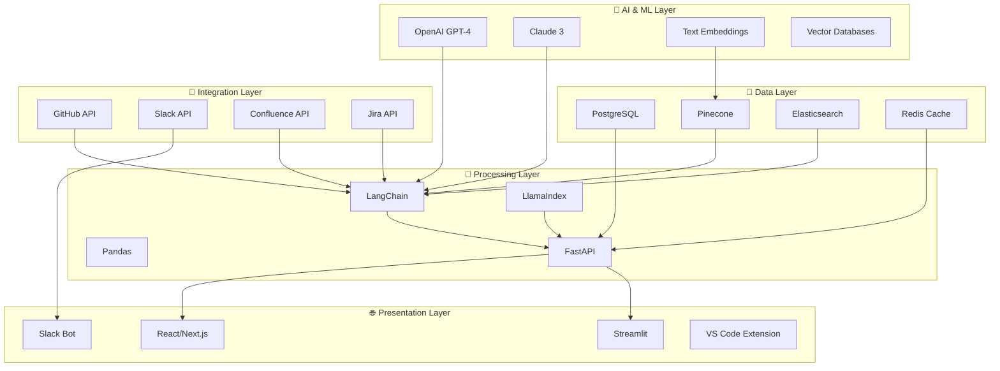

# 🛠️ Stack Tecnológico para Documentação 4.0

> Tecnologias, ferramentas e arquiteturas que compõem um ecossistema completo de documentação inteligente

---

## 🎯 Visão Geral do Stack

### 🏗️ Arquitetura em Camadas



---

## 🤖 Camada de IA e ML

### 🧠 Large Language Models
```yaml
llm_providers:
  openai:
    models:
      - gpt-4-turbo: "Análise complexa e geração"
      - gpt-3.5-turbo: "Tasks rápidas e econômicas"
      - text-embedding-3-large: "Embeddings de alta qualidade"
    use_cases:
      - content_generation
      - code_analysis
      - quality_assessment
      
  anthropic:
    models:
      - claude-3-opus: "Raciocínio complexo"
      - claude-3-sonnet: "Balanceado custo/performance"
    use_cases:
      - technical_writing
      - code_review
      - documentation_analysis
      
  open_source:
    models:
      - llama-2-70b: "Self-hosted option"
      - mistral-7b: "Lightweight local"
    use_cases:
      - privacy_sensitive_content
      - cost_optimization
```

### 🔢 Vector Databases
```python
vector_db_comparison = {
    "pinecone": {
        "pros": ["Managed service", "High performance", "Easy scaling"],
        "cons": ["Cost", "Vendor lock-in"],
        "best_for": "Production enterprise",
        "pricing": "Usage-based"
    },
    
    "weaviate": {
        "pros": ["Open source", "GraphQL API", "Multi-modal"],
        "cons": ["Self-hosted complexity"],
        "best_for": "Flexible deployments",
        "pricing": "Free + Enterprise"
    },
    
    "chroma": {
        "pros": ["Lightweight", "Easy setup", "Python native"],
        "cons": ["Limited scale"],
        "best_for": "Development and prototypes",
        "pricing": "Free"
    },
    
    "qdrant": {
        "pros": ["Rust performance", "Filtering", "Hybrid search"],
        "cons": ["Newer ecosystem"],
        "best_for": "Performance critical",
        "pricing": "Open source + Cloud"
    }
}
```

---

## 🔧 Camada de Processamento

### 🦜 Frameworks RAG
```python
# LangChain - Framework completo
from langchain.chains import ConversationalRetrievalChain
from langchain.vectorstores import Pinecone
from langchain.llms import OpenAI

class LangChainRAG:
    def __init__(self):
        self.vectorstore = Pinecone.from_existing_index("docs-index")
        self.llm = OpenAI(temperature=0)
        
    def setup_chain(self):
        return ConversationalRetrievalChain.from_llm(
            llm=self.llm,
            retriever=self.vectorstore.as_retriever(search_kwargs={"k": 5}),
            return_source_documents=True
        )

# LlamaIndex - Focused on indexing
from llama_index import VectorStoreIndex, ServiceContext
from llama_index.llms import OpenAI

class LlamaIndexRAG:
    def __init__(self):
        self.service_context = ServiceContext.from_defaults(
            llm=OpenAI(model="gpt-4")
        )
        
    def create_index(self, documents):
        return VectorStoreIndex.from_documents(
            documents, 
            service_context=self.service_context
        )
```

### ⚡ APIs e Backend
```yaml
backend_stack:
  framework: FastAPI
  features:
    - automatic_openapi_docs
    - async_support
    - type_validation
    - dependency_injection
    
  middleware:
    - cors_middleware
    - rate_limiting
    - authentication_jwt
    - logging_structured
    
  deployment:
    - docker_containers
    - kubernetes_orchestration
    - nginx_reverse_proxy
    - ssl_termination
```

---

## 💾 Camada de Dados

### 🗃️ Bancos de Dados
```yaml
data_storage:
  relational:
    postgresql:
      use_cases:
        - user_management
        - audit_logs
        - configuration_data
      extensions:
        - pgvector: "Vector similarity search"
        - full_text_search: "Document search"
        
  search_engines:
    elasticsearch:
      use_cases:
        - full_text_search
        - analytics_dashboards
        - log_aggregation
      features:
        - multilingual_analysis
        - custom_analyzers
        - aggregations
        
  caching:
    redis:
      use_cases:
        - session_storage
        - api_response_cache
        - rate_limiting
        - pub_sub_messaging
```

### 📊 Pipeline de Dados
```python
# Apache Airflow para ETL
from airflow import DAG
from airflow.operators.python import PythonOperator
from datetime import datetime, timedelta

def create_documentation_pipeline():
    default_args = {
        'owner': 'docs-team',
        'depends_on_past': False,
        'start_date': datetime(2024, 1, 1),
        'retries': 1,
        'retry_delay': timedelta(minutes=5)
    }
    
    dag = DAG(
        'documentation_pipeline',
        default_args=default_args,
        description='Extract, process and index documentation',
        schedule_interval='0 2 * * *',  # Daily at 2 AM
        catchup=False
    )
    
    # Tasks
    extract_sources = PythonOperator(
        task_id='extract_sources',
        python_callable=extract_from_multiple_sources,
        dag=dag
    )
    
    process_content = PythonOperator(
        task_id='process_content',
        python_callable=clean_and_enrich_content,
        dag=dag
    )
    
    generate_embeddings = PythonOperator(
        task_id='generate_embeddings',
        python_callable=create_vector_embeddings,
        dag=dag
    )
    
    update_index = PythonOperator(
        task_id='update_index',
        python_callable=update_vector_store,
        dag=dag
    )
    
    # Dependencies
    extract_sources >> process_content >> generate_embeddings >> update_index
    
    return dag
```

---

## 🔄 Camada de Integração

### 🔌 APIs e Conectores
```python
class IntegrationHub:
    """Hub central para todas as integrações"""
    
    def __init__(self):
        self.connectors = {
            'github': GitHubConnector(),
            'confluence': ConfluenceConnector(),
            'slack': SlackConnector(),
            'jira': JiraConnector(),
            'notion': NotionConnector(),
            'google_docs': GoogleDocsConnector()
        }
    
    async def sync_all_sources(self):
        """Sincroniza todas as fontes de dados"""
        results = {}
        
        for name, connector in self.connectors.items():
            try:
                result = await connector.sync()
                results[name] = {
                    'status': 'success',
                    'documents_processed': result.get('count', 0),
                    'last_sync': datetime.now().isoformat()
                }
            except Exception as e:
                results[name] = {
                    'status': 'error',
                    'error': str(e),
                    'last_sync': None
                }
        
        return results

class GitHubConnector:
    def __init__(self):
        self.client = Github(os.getenv('GITHUB_TOKEN'))
        
    async def sync(self):
        """Extrai README, wikis, issues e PRs"""
        repos = self.get_organization_repos()
        documents = []
        
        for repo in repos:
            # README files
            try:
                readme = repo.get_readme()
                documents.append({
                    'content': readme.decoded_content.decode(),
                    'source': f'github/{repo.name}/README.md',
                    'type': 'documentation',
                    'last_modified': readme.last_modified
                })
            except:
                pass
            
            # Wiki pages
            try:
                wiki_pages = self.extract_wiki_pages(repo)
                documents.extend(wiki_pages)
            except:
                pass
                
        return {'count': len(documents), 'documents': documents}
```

### 🤖 Slack Bot Framework
```python
from slack_bolt import App
from slack_bolt.adapter.socket_mode import SocketModeHandler

class DocumentationBot:
    def __init__(self, token, app_token):
        self.app = App(token=token)
        self.setup_handlers()
        
    def setup_handlers(self):
        @self.app.message("help")
        def handle_help(message, say):
            say({
                "blocks": [
                    {
                        "type": "section",
                        "text": {
                            "type": "mrkdwn",
                            "text": "🤖 *Documentation Bot Commands*\n\n" +
                                   "• `@bot search <query>` - Search documentation\n" +
                                   "• `@bot explain <concept>` - Explain technical concept\n" +
                                   "• `@bot api <endpoint>` - Get API documentation\n" +
                                   "• `@bot onboard` - New team member guide"
                        }
                    }
                ]
            })
        
        @self.app.message(r"search (.*)")
        def handle_search(message, say, context):
            query = context['matches'][0]
            results = self.search_documentation(query)
            
            blocks = [
                {
                    "type": "section",
                    "text": {
                        "type": "mrkdwn",
                        "text": f"🔍 *Search results for: {query}*"
                    }
                }
            ]
            
            for result in results[:3]:
                blocks.append({
                    "type": "section",
                    "text": {
                        "type": "mrkdwn",
                        "text": f"*{result['title']}*\n{result['snippet']}"
                    },
                    "accessory": {
                        "type": "button",
                        "text": {"type": "plain_text", "text": "View"},
                        "url": result['url']
                    }
                })
            
            say({"blocks": blocks})
    
    def start(self):
        handler = SocketModeHandler(self.app, os.getenv('SLACK_APP_TOKEN'))
        handler.start()
```

---

## 🌐 Camada de Apresentação

### ⚛️ Frontend Stack
```yaml
frontend_technologies:
  framework: Next.js 14
  styling: Tailwind CSS
  components: Radix UI
  state_management: Zustand
  forms: React Hook Form
  charts: Recharts
  
  features:
    - server_side_rendering
    - static_site_generation
    - api_routes
    - middleware_support
    - image_optimization
    
  deployment:
    - vercel_platform
    - cloudflare_pages
    - aws_amplify
```

### 📱 Interface Components
```typescript
// Componente de busca inteligente
interface SearchProps {
  onSearch: (query: string) => Promise<SearchResult[]>;
  placeholder?: string;
  suggestions?: string[];
}

const IntelligentSearch: React.FC<SearchProps> = ({ 
  onSearch, 
  placeholder = "Search documentation...",
  suggestions = []
}) => {
  const [query, setQuery] = useState('');
  const [results, setResults] = useState<SearchResult[]>([]);
  const [isLoading, setIsLoading] = useState(false);
  
  const handleSearch = async (searchQuery: string) => {
    if (!searchQuery.trim()) return;
    
    setIsLoading(true);
    try {
      const searchResults = await onSearch(searchQuery);
      setResults(searchResults);
    } finally {
      setIsLoading(false);
    }
  };
  
  return (
    <div className="search-container">
      <SearchInput
        value={query}
        onChange={setQuery}
        onSubmit={handleSearch}
        placeholder={placeholder}
        isLoading={isLoading}
      />
      
      {suggestions.length > 0 && (
        <SearchSuggestions
          suggestions={suggestions}
          onSelect={handleSearch}
        />
      )}
      
      <SearchResults
        results={results}
        isLoading={isLoading}
        query={query}
      />
    </div>
  );
};

// Hook para gerenciar estado da documentação
const useDocumentation = () => {
  const [docs, setDocs] = useState<Document[]>([]);
  const [isLoading, setIsLoading] = useState(false);
  const [error, setError] = useState<string | null>(null);
  
  const searchDocuments = useCallback(async (query: string): Promise<SearchResult[]> => {
    setIsLoading(true);
    setError(null);
    
    try {
      const response = await fetch('/api/search', {
        method: 'POST',
        headers: { 'Content-Type': 'application/json' },
        body: JSON.stringify({ query, limit: 10 })
      });
      
      if (!response.ok) throw new Error('Search failed');
      
      const results = await response.json();
      return results.data;
    } catch (err) {
      setError(err instanceof Error ? err.message : 'Unknown error');
      return [];
    } finally {
      setIsLoading(false);
    }
  }, []);
  
  return {
    docs,
    isLoading,
    error,
    searchDocuments
  };
};
```

---

## 🔒 Segurança e Compliance

### 🛡️ Security Stack
```yaml
security_measures:
  authentication:
    - oauth2_providers: ["Google", "GitHub", "Microsoft"]
    - jwt_tokens: "Short-lived access tokens"
    - refresh_tokens: "Secure rotation"
    
  authorization:
    - rbac: "Role-based access control"
    - api_keys: "Service-to-service auth"
    - rate_limiting: "Per-user and global limits"
    
  data_protection:
    - encryption_at_rest: "AES-256"
    - encryption_in_transit: "TLS 1.3"
    - pii_detection: "Automated scanning"
    - data_classification: "Automated tagging"
    
  compliance:
    - gdpr_compliance: "Data subject rights"
    - audit_logging: "All actions logged"
    - data_retention: "Configurable policies"
    - privacy_by_design: "Default secure settings"
```

### 🔐 Implementation Example
```python
from fastapi import Depends, HTTPException, status
from fastapi.security import HTTPBearer, HTTPAuthorizationCredentials
import jwt
from datetime import datetime, timedelta

security = HTTPBearer()

class SecurityManager:
    def __init__(self, secret_key: str):
        self.secret_key = secret_key
        self.algorithm = "HS256"
    
    def create_access_token(self, data: dict, expires_delta: timedelta = None):
        to_encode = data.copy()
        
        if expires_delta:
            expire = datetime.utcnow() + expires_delta
        else:
            expire = datetime.utcnow() + timedelta(hours=1)
            
        to_encode.update({"exp": expire})
        
        return jwt.encode(to_encode, self.secret_key, algorithm=self.algorithm)
    
    async def get_current_user(
        self, 
        credentials: HTTPAuthorizationCredentials = Depends(security)
    ):
        try:
            payload = jwt.decode(
                credentials.credentials, 
                self.secret_key, 
                algorithms=[self.algorithm]
            )
            
            user_id: str = payload.get("sub")
            if user_id is None:
                raise HTTPException(
                    status_code=status.HTTP_401_UNAUTHORIZED,
                    detail="Invalid authentication credentials"
                )
                
            return user_id
            
        except jwt.PyJWTError:
            raise HTTPException(
                status_code=status.HTTP_401_UNAUTHORIZED,
                detail="Invalid authentication credentials"
            )
```

---

## 📊 Monitoramento e Observabilidade

### 📈 Monitoring Stack
```yaml
monitoring_tools:
  metrics:
    - prometheus: "Time series metrics"
    - grafana: "Visualization dashboards"
    - custom_metrics: "Business KPIs"
    
  logging:
    - structured_logs: "JSON format"
    - log_aggregation: "ELK Stack or Loki"
    - distributed_tracing: "Jaeger or Zipkin"
    
  alerting:
    - pagerduty: "Incident management"
    - slack_notifications: "Team alerts"
    - email_escalation: "Management notifications"
    
  health_checks:
    - endpoint_monitoring: "/health endpoints"
    - database_connectivity: "Connection pooling"
    - external_service_status: "Dependency checks"
```

### 🔍 Observability Implementation
```python
import logging
import structlog
from prometheus_client import Counter, Histogram, generate_latest

# Structured logging
structlog.configure(
    processors=[
        structlog.stdlib.filter_by_level,
        structlog.stdlib.add_logger_name,
        structlog.stdlib.add_log_level,
        structlog.stdlib.PositionalArgumentsFormatter(),
        structlog.processors.TimeStamper(fmt="iso"),
        structlog.processors.StackInfoRenderer(),
        structlog.processors.format_exc_info,
        structlog.processors.UnicodeDecoder(),
        structlog.processors.JSONRenderer()
    ],
    context_class=dict,
    logger_factory=structlog.stdlib.LoggerFactory(),
    wrapper_class=structlog.stdlib.BoundLogger,
    cache_logger_on_first_use=True,
)

logger = structlog.get_logger()

# Prometheus metrics
SEARCH_REQUESTS = Counter('search_requests_total', 'Total search requests')
SEARCH_DURATION = Histogram('search_duration_seconds', 'Search duration')
DOCUMENT_UPDATES = Counter('document_updates_total', 'Total document updates')

class MetricsMiddleware:
    def __init__(self, app):
        self.app = app
    
    async def __call__(self, scope, receive, send):
        if scope["type"] == "http":
            start_time = time.time()
            
            # Process request
            await self.app(scope, receive, send)
            
            # Record metrics
            duration = time.time() - start_time
            path = scope.get("path", "unknown")
            method = scope.get("method", "unknown")
            
            REQUEST_DURATION.labels(
                method=method, 
                path=path
            ).observe(duration)
            
            logger.info(
                "request_completed",
                method=method,
                path=path,
                duration=duration
            )
```

---

## 🚀 Deployment e DevOps

### 🐳 Containerization
```dockerfile
# Multi-stage Docker build
FROM python:3.11-slim AS base

WORKDIR /app

# Install system dependencies
RUN apt-get update && apt-get install -y \
    build-essential \
    curl \
    && rm -rf /var/lib/apt/lists/*

# Install Python dependencies
COPY requirements.txt .
RUN pip install --no-cache-dir -r requirements.txt

# Copy application code
COPY . .

# Production stage
FROM base AS production

# Create non-root user
RUN useradd --create-home --shell /bin/bash app
USER app

# Health check
HEALTHCHECK --interval=30s --timeout=30s --start-period=5s --retries=3 \
    CMD curl -f http://localhost:8000/health || exit 1

EXPOSE 8000

CMD ["uvicorn", "main:app", "--host", "0.0.0.0", "--port", "8000"]
```

### ☸️ Kubernetes Deployment
```yaml
apiVersion: apps/v1
kind: Deployment
metadata:
  name: documentation-api
  labels:
    app: documentation-api
spec:
  replicas: 3
  selector:
    matchLabels:
      app: documentation-api
  template:
    metadata:
      labels:
        app: documentation-api
    spec:
      containers:
      - name: api
        image: documentation-api:latest
        ports:
        - containerPort: 8000
        env:
        - name: DATABASE_URL
          valueFrom:
            secretKeyRef:
              name: db-secret
              key: url
        resources:
          requests:
            memory: "256Mi"
            cpu: "250m"
          limits:
            memory: "512Mi"
            cpu: "500m"
        livenessProbe:
          httpGet:
            path: /health
            port: 8000
          initialDelaySeconds: 30
          periodSeconds: 10
        readinessProbe:
          httpGet:
            path: /ready
            port: 8000
          initialDelaySeconds: 5
          periodSeconds: 5
---
apiVersion: v1
kind: Service
metadata:
  name: documentation-api-service
spec:
  selector:
    app: documentation-api
  ports:
  - port: 80
    targetPort: 8000
  type: LoadBalancer
```

---

## 💰 Custos e Considerações

### 📊 Análise de Custos
```yaml
monthly_costs_estimate:
  ai_services:
    openai_api: "$200-500"
    anthropic_api: "$100-300"
    embedding_generation: "$50-150"
    
  infrastructure:
    vector_database: "$100-400"
    postgresql: "$50-200" 
    redis_cache: "$30-100"
    kubernetes_cluster: "$200-800"
    
  third_party_services:
    monitoring: "$50-200"
    analytics: "$30-100"
    cdn: "$20-80"
    
  total_range: "$830-2730/month"
  
cost_optimization:
  - cache_expensive_operations
  - batch_ai_requests
  - use_smaller_models_when_possible
  - implement_intelligent_caching
  - optimize_vector_search_parameters
```

---

## 🔗 Relacionado

- [[🔍 RAG - Retrieval-Augmented Generation]]
- [[🤖 Agentes IA para Automação]]
- [[💰 ROI e Métricas de Sucesso]]
- [[🗺️ Roadmap de Implementação]]

---

#stack-tecnologico #arquitetura #ferramentas #infraestrutura #devops #ai #rag #campus-party

*Stack completo: Do conceito à produção com tecnologias de ponta* 🛠️