# 🧪 Automação de Testes para Documentação

> Como garantir qualidade contínua da documentação através de testes automatizados e validação inteligente

---

## 🎯 Visão Geral da Automação

### 🔄 Pipeline de Qualidade Automatizado

```mermaid
flowchart TD
    A[📝 Documento Criado/Atualizado] --> B[🔍 Detecção de Mudanças]
    B --> C[⚡ Trigger Pipeline]
    
    C --> D[📖 Testes de Conteúdo]
    C --> E[🔗 Testes de Links]
    C --> F[💻 Testes de Código]
    C --> G[🎨 Testes de Formato]
    
    D --> H{✅ Todos os Testes Passaram?}
    E --> H
    F --> H
    G --> H
    
    H -->|❌ Falha| I[📊 Relatório de Problemas]
    H -->|✅ Sucesso| J[🚀 Deploy Automático]
    
    I --> K[👥 Notifica Autores]
    J --> L[📈 Atualiza Métricas]
    
    K --> M[🔧 Correções]
    M --> C
    
    L --> N[🎉 Documentação Atualizada]
```



### 📋 Categorias de Testes
```yaml
tipos_testes:
  conteudo:
    - precisao_tecnica
    - completude_informacoes
    - clareza_linguagem
    - consistencia_terminologia
    
  qualidade_codigo:
    - sintaxe_correta
    - exemplos_executaveis
    - versoes_atualizadas
    - dependencias_validas
    
  estrutura:
    - formatacao_markdown
    - hierarquia_titulos
    - links_funcionais
    - imagens_validas
    
  acessibilidade:
    - alt_text_imagens
    - contraste_cores
    - navegacao_teclado
    - leitores_tela
```

---

## 🔍 Framework de Testes de Conteúdo

### 📚 Validação Semântica com IA

```python
import openai
from typing import Dict, List, Optional
import asyncio
import json

class ContentQualityTester:
    def __init__(self, openai_api_key: str):
        self.client = openai.AsyncOpenAI(api_key=openai_api_key)
        self.test_results = []
        
    async def test_content_accuracy(self, content: str, context: Dict) -> Dict:
        """Testa precisão técnica do conteúdo"""
        
        prompt = f"""
        Analise o seguinte conteúdo técnico e avalie sua precisão:
        
        CONTEÚDO:
        {content}
        
        CONTEXTO:
        - Tipo: {context.get('type', 'documentação geral')}
        - Audiência: {context.get('audience', 'desenvolvedores')}
        - Tecnologia: {context.get('technology', 'não especificado')}
        
        Avalie os seguintes aspectos (escala 0-100):
        1. Precisão técnica das informações
        2. Completude das instruções
        3. Clareza para a audiência alvo
        4. Presença de exemplos práticos
        5. Atualidade das informações
        
        Retorne JSON com:
        - scores: objeto com pontuações para cada aspecto
        - overall_score: média das pontuações
        - issues: lista de problemas encontrados
        - suggestions: lista de melhorias sugeridas
        """
        
        try:
            response = await self.client.chat.completions.create(
                model="gpt-4",
                messages=[{"role": "user", "content": prompt}],
                temperature=0.1
            )
            
            result = json.loads(response.choices[0].message.content)
            
            return {
                "test_type": "content_accuracy",
                "passed": result["overall_score"] >= 80,
                "score": result["overall_score"],
                "details": result,
                "timestamp": datetime.now().isoformat()
            }
            
        except Exception as e:
            return {
                "test_type": "content_accuracy",
                "passed": False,
                "error": str(e),
                "timestamp": datetime.now().isoformat()
            }
    
    async def test_completeness(self, content: str, required_sections: List[str]) -> Dict:
        """Verifica se todas as seções obrigatórias estão presentes"""
        
        missing_sections = []
        
        for section in required_sections:
            if section.lower() not in content.lower():
                missing_sections.append(section)
        
        completeness_score = ((len(required_sections) - len(missing_sections)) / len(required_sections)) * 100
        
        return {
            "test_type": "completeness",
            "passed": len(missing_sections) == 0,
            "score": completeness_score,
            "details": {
                "required_sections": required_sections,
                "missing_sections": missing_sections,
                "found_sections": len(required_sections) - len(missing_sections)
            },
            "timestamp": datetime.now().isoformat()
        }
    
    async def test_readability(self, content: str) -> Dict:
        """Testa legibilidade do conteúdo"""
        
        # Métricas básicas de legibilidade
        word_count = len(content.split())
        sentence_count = content.count('.') + content.count('!') + content.count('?')
        avg_words_per_sentence = word_count / max(sentence_count, 1)
        
        # Verifica complexidade
        complex_words = self.count_complex_words(content)
        complexity_ratio = complex_words / max(word_count, 1)
        
        # Calcula score de legibilidade (simplificado)
        readability_score = max(0, 100 - (avg_words_per_sentence * 2) - (complexity_ratio * 100))
        
        return {
            "test_type": "readability",
            "passed": readability_score >= 60,
            "score": readability_score,
            "details": {
                "word_count": word_count,
                "sentence_count": sentence_count,
                "avg_words_per_sentence": avg_words_per_sentence,
                "complex_words": complex_words,
                "complexity_ratio": complexity_ratio
            },
            "timestamp": datetime.now().isoformat()
        }
    
    def count_complex_words(self, text: str) -> int:
        """Conta palavras complexas (> 3 sílabas)"""
        # Implementação simplificada
        words = text.split()
        complex_count = 0
        
        for word in words:
            # Estimativa simples baseada em vogais
            vowels = 'aeiouAEIOU'
            syllable_count = sum(1 for char in word if char in vowels)
            if syllable_count > 3:
                complex_count += 1
        
        return complex_count
```

### 🔗 Validação de Links e Referências

```python
import aiohttp
import asyncio
from urllib.parse import urljoin, urlparse
import re

class LinkValidator:
    def __init__(self, max_concurrent=10):
        self.max_concurrent = max_concurrent
        self.session = None
        
    async def __aenter__(self):
        connector = aiohttp.TCPConnector(limit=self.max_concurrent)
        self.session = aiohttp.ClientSession(
            connector=connector,
            timeout=aiohttp.ClientTimeout(total=30)
        )
        return self
    
    async def __aexit__(self, exc_type, exc_val, exc_tb):
        if self.session:
            await self.session.close()
    
    async def validate_all_links(self, content: str, base_url: str = None) -> Dict:
        """Valida todos os links em um documento"""
        
        # Extrai todos os links
        links = self.extract_links(content)
        
        # Valida links em paralelo
        semaphore = asyncio.Semaphore(self.max_concurrent)
        tasks = [
            self.validate_single_link(link, base_url, semaphore) 
            for link in links
        ]
        
        results = await asyncio.gather(*tasks, return_exceptions=True)
        
        # Processa resultados
        valid_links = []
        broken_links = []
        
        for i, result in enumerate(results):
            if isinstance(result, Exception):
                broken_links.append({
                    "url": links[i],
                    "error": str(result),
                    "status": "error"
                })
            elif result["valid"]:
                valid_links.append(result)
            else:
                broken_links.append(result)
        
        total_links = len(links)
        success_rate = len(valid_links) / max(total_links, 1) * 100
        
        return {
            "test_type": "link_validation",
            "passed": success_rate >= 95,
            "score": success_rate,
            "details": {
                "total_links": total_links,
                "valid_links": len(valid_links),
                "broken_links": len(broken_links),
                "broken_details": broken_links
            },
            "timestamp": datetime.now().isoformat()
        }
    
    def extract_links(self, content: str) -> List[str]:
        """Extrai todos os links de um conteúdo markdown"""
        
        # Padrões para diferentes tipos de links
        patterns = [
            r'\[.*?\]\((https?://[^\s\)]+)\)',  # [text](url)
            r'<(https?://[^\s>]+)>',           # <url>
            r'(?<!\()https?://[^\s<>\[\]]+',   # URLs diretas
        ]
        
        links = []
        for pattern in patterns:
            matches = re.findall(pattern, content)
            links.extend(matches)
        
        return list(set(links))  # Remove duplicatas
    
    async def validate_single_link(self, url: str, base_url: str, semaphore) -> Dict:
        """Valida um único link"""
        
        async with semaphore:
            try:
                # Resolve URL relativa se necessário
                if base_url and not url.startswith(('http://', 'https://')):
                    url = urljoin(base_url, url)
                
                async with self.session.head(url, allow_redirects=True) as response:
                    return {
                        "url": url,
                        "valid": response.status < 400,
                        "status_code": response.status,
                        "final_url": str(response.url),
                        "redirected": str(response.url) != url
                    }
                    
            except asyncio.TimeoutError:
                return {
                    "url": url,
                    "valid": False,
                    "error": "timeout",
                    "status_code": None
                }
            except Exception as e:
                return {
                    "url": url,
                    "valid": False,
                    "error": str(e),
                    "status_code": None
                }
```

---

## 💻 Testes de Código e Exemplos

### 🚀 Validação de Snippets de Código

```python
import ast
import subprocess
import tempfile
import os
import re
from typing import Dict, List

class CodeValidator:
    def __init__(self):
        self.supported_languages = {
            'python': self.validate_python,
            'javascript': self.validate_javascript,
            'bash': self.validate_bash,
            'yaml': self.validate_yaml,
            'json': self.validate_json
        }
    
    async def validate_all_code_blocks(self, content: str) -> Dict:
        """Valida todos os blocos de código em um documento"""
        
        code_blocks = self.extract_code_blocks(content)
        results = []
        
        for block in code_blocks:
            language = block['language'].lower()
            
            if language in self.supported_languages:
                validator = self.supported_languages[language]
                result = await validator(block['code'])
                result['block_info'] = block
                results.append(result)
        
        # Calcula métricas gerais
        total_blocks = len(results)
        valid_blocks = sum(1 for r in results if r['valid'])
        success_rate = valid_blocks / max(total_blocks, 1) * 100
        
        return {
            "test_type": "code_validation",
            "passed": success_rate >= 90,
            "score": success_rate,
            "details": {
                "total_blocks": total_blocks,
                "valid_blocks": valid_blocks,
                "invalid_blocks": total_blocks - valid_blocks,
                "results": results
            },
            "timestamp": datetime.now().isoformat()
        }
    
    def extract_code_blocks(self, content: str) -> List[Dict]:
        """Extrai blocos de código do markdown"""
        
        pattern = r'```(\w+)?\n(.*?)```'
        matches = re.findall(pattern, content, re.MULTILINE | re.DOTALL)
        
        blocks = []
        for language, code in matches:
            blocks.append({
                'language': language or 'text',
                'code': code.strip(),
                'line_count': len(code.strip().split('\n'))
            })
        
        return blocks
    
    async def validate_python(self, code: str) -> Dict:
        """Valida código Python"""
        
        result = {
            "language": "python",
            "valid": False,
            "errors": [],
            "warnings": []
        }
        
        try:
            # Verifica sintaxe
            ast.parse(code)
            result["valid"] = True
            
            # Testa execução em sandbox (opcional)
            if self.is_safe_python_code(code):
                execution_result = await self.execute_python_safely(code)
                result["execution"] = execution_result
            
        except SyntaxError as e:
            result["errors"].append({
                "type": "syntax_error",
                "message": str(e),
                "line": e.lineno
            })
        except Exception as e:
            result["errors"].append({
                "type": "general_error",
                "message": str(e)
            })
        
        return result
    
    def is_safe_python_code(self, code: str) -> bool:
        """Verifica se o código Python é seguro para execução"""
        
        dangerous_patterns = [
            r'import\s+os',
            r'import\s+subprocess',
            r'import\s+sys',
            r'__import__',
            r'eval\s*\(',
            r'exec\s*\(',
            r'open\s*\(',
            r'file\s*\(',
        ]
        
        for pattern in dangerous_patterns:
            if re.search(pattern, code, re.IGNORECASE):
                return False
        
        return True
    
    async def execute_python_safely(self, code: str) -> Dict:
        """Executa código Python em ambiente seguro"""
        
        try:
            with tempfile.NamedTemporaryFile(mode='w', suffix='.py', delete=False) as f:
                f.write(code)
                temp_file = f.name
            
            # Executa com timeout e limitações
            process = subprocess.run(
                ['python', temp_file],
                capture_output=True,
                text=True,
                timeout=5,
                cwd=tempfile.gettempdir()
            )
            
            os.unlink(temp_file)
            
            return {
                "success": process.returncode == 0,
                "stdout": process.stdout,
                "stderr": process.stderr,
                "return_code": process.returncode
            }
            
        except subprocess.TimeoutExpired:
            return {
                "success": False,
                "error": "execution_timeout",
                "timeout": 5
            }
        except Exception as e:
            return {
                "success": False,
                "error": str(e)
            }
    
    async def validate_yaml(self, code: str) -> Dict:
        """Valida código YAML"""
        
        import yaml
        
        result = {
            "language": "yaml",
            "valid": False,
            "errors": []
        }
        
        try:
            yaml.safe_load(code)
            result["valid"] = True
        except yaml.YAMLError as e:
            result["errors"].append({
                "type": "yaml_error",
                "message": str(e)
            })
        
        return result
    
    async def validate_json(self, code: str) -> Dict:
        """Valida código JSON"""
        
        import json
        
        result = {
            "language": "json",
            "valid": False,
            "errors": []
        }
        
        try:
            json.loads(code)
            result["valid"] = True
        except json.JSONDecodeError as e:
            result["errors"].append({
                "type": "json_error",
                "message": str(e),
                "line": e.lineno,
                "column": e.colno
            })
        
        return result
```

---

## 🎨 Testes de Formatação e Estrutura

### 📝 Validador de Markdown

```python
import re
from typing import Dict, List, Optional

class MarkdownValidator:
    def __init__(self):
        self.rules = {
            'heading_hierarchy': self.check_heading_hierarchy,
            'proper_formatting': self.check_formatting,
            'image_alt_text': self.check_image_alt_text,
            'table_formatting': self.check_table_formatting,
            'list_formatting': self.check_list_formatting
        }
    
    async def validate_structure(self, content: str) -> Dict:
        """Valida estrutura do markdown"""
        
        results = {}
        total_score = 0
        
        for rule_name, rule_func in self.rules.items():
            result = rule_func(content)
            results[rule_name] = result
            total_score += result['score']
        
        average_score = total_score / len(self.rules)
        
        return {
            "test_type": "markdown_structure",
            "passed": average_score >= 80,
            "score": average_score,
            "details": results,
            "timestamp": datetime.now().isoformat()
        }
    
    def check_heading_hierarchy(self, content: str) -> Dict:
        """Verifica hierarquia correta dos títulos"""
        
        # Extrai todos os cabeçalhos
        headings = re.findall(r'^(#{1,6})\s+(.+)$', content, re.MULTILINE)
        
        issues = []
        previous_level = 0
        
        for i, (hashes, title) in enumerate(headings):
            current_level = len(hashes)
            
            # Verifica se não pula níveis
            if current_level > previous_level + 1:
                issues.append({
                    "line": i + 1,
                    "issue": f"Heading level jump from {previous_level} to {current_level}",
                    "title": title
                })
            
            previous_level = current_level
        
        score = max(0, 100 - (len(issues) * 10))
        
        return {
            "rule": "heading_hierarchy",
            "passed": len(issues) == 0,
            "score": score,
            "issues": issues,
            "total_headings": len(headings)
        }
    
    def check_image_alt_text(self, content: str) -> Dict:
        """Verifica se imagens têm texto alternativo"""
        
        # Padrão para imagens: 
        images = re.findall(r'!\[(.*?)\]\([^\)]+\)', content)
        
        missing_alt = []
        for i, alt_text in enumerate(images):
            if not alt_text.strip():
                missing_alt.append(f"Image {i + 1}")
        
        total_images = len(images)
        score = 100 if total_images == 0 else ((total_images - len(missing_alt)) / total_images) * 100
        
        return {
            "rule": "image_alt_text",
            "passed": len(missing_alt) == 0,
            "score": score,
            "total_images": total_images,
            "missing_alt": missing_alt
        }
    
    def check_table_formatting(self, content: str) -> Dict:
        """Verifica formatação de tabelas"""
        
        # Encontra tabelas markdown
        table_pattern = r'(\|.+\|\n)+\|[-\s\|:]+\|\n(\|.+\|\n)+'
        tables = re.findall(table_pattern, content)
        
        issues = []
        
        for i, table in enumerate(tables):
            # Verifica alinhamento de colunas
            lines = table.strip().split('\n')
            if len(lines) < 3:  # Header + separator + pelo menos 1 row
                issues.append(f"Table {i + 1}: Incomplete table structure")
                continue
            
            # Verifica se separador está presente
            if not re.match(r'\|[-\s\|:]+\|', lines[1]):
                issues.append(f"Table {i + 1}: Missing or malformed separator row")
        
        score = 100 if len(tables) == 0 else max(0, 100 - (len(issues) * 20))
        
        return {
            "rule": "table_formatting",
            "passed": len(issues) == 0,
            "score": score,
            "total_tables": len(tables),
            "issues": issues
        }
```

---

## 🔄 Pipeline de CI/CD para Documentação

### 🚀 Configuração GitHub Actions

```yaml
# .github/workflows/docs-quality.yml
name: Documentation Quality Check

on:
  push:
    paths:
      - 'docs/**'
      - '**/*.md'
  pull_request:
    paths:
      - 'docs/**'
      - '**/*.md'

jobs:
  docs-quality:
    runs-on: ubuntu-latest
    
    steps:
    - name: Checkout code
      uses: actions/checkout@v3
      
    - name: Setup Python
      uses: actions/setup-python@v4
      with:
        python-version: '3.11'
        
    - name: Install dependencies
      run: |
        pip install -r requirements-docs.txt
        
    - name: Run documentation tests
      run: |
        python -m pytest tests/docs/ -v --junitxml=docs-test-results.xml
        
    - name: Validate links
      run: |
        python scripts/validate_links.py docs/
        
    - name: Check code examples
      run: |
        python scripts/validate_code.py docs/
        
    - name: Generate quality report
      run: |
        python scripts/generate_quality_report.py
        
    - name: Upload test results
      uses: actions/upload-artifact@v3
      if: always()
      with:
        name: docs-test-results
        path: |
          docs-test-results.xml
          quality-report.html
          
    - name: Comment PR with results
      uses: actions/github-script@v6
      if: github.event_name == 'pull_request'
      with:
        script: |
          const fs = require('fs');
          const report = fs.readFileSync('quality-summary.md', 'utf8');
          
          github.rest.issues.createComment({
            issue_number: context.issue.number,
            owner: context.repo.owner,
            repo: context.repo.repo,
            body: report
          });
```

### 🐳 Container para Testes

```dockerfile
# Dockerfile.docs-testing
FROM python:3.11-slim

WORKDIR /app

# Install system dependencies for testing
RUN apt-get update && apt-get install -y \
    curl \
    git \
    nodejs \
    npm \
    && rm -rf /var/lib/apt/lists/*

# Install Python dependencies
COPY requirements-docs.txt .
RUN pip install --no-cache-dir -r requirements-docs.txt

# Install Node.js tools for markdown processing
RUN npm install -g markdownlint-cli

# Copy testing scripts
COPY scripts/ ./scripts/
COPY tests/ ./tests/

# Create entrypoint script
RUN echo '#!/bin/bash\n\
set -e\n\
echo "Running documentation quality tests..."\n\
python scripts/validate_all.py "$@"\n\
echo "Tests completed successfully!"' > /entrypoint.sh \
    && chmod +x /entrypoint.sh

ENTRYPOINT ["/entrypoint.sh"]
```

---

## 📊 Relatórios e Métricas

### 📈 Dashboard de Qualidade

```python
class QualityDashboard:
    def __init__(self, db_connection):
        self.db = db_connection
        
    async def generate_quality_report(self, period_days: int = 30) -> Dict:
        """Gera relatório de qualidade da documentação"""
        
        # Coleta métricas do período
        metrics = await self.collect_metrics(period_days)
        
        report = {
            "period": f"Last {period_days} days",
            "overall_health": self.calculate_overall_health(metrics),
            "trends": {
                "quality_score": await self.get_quality_trend(period_days),
                "coverage": await self.get_coverage_trend(period_days),
                "freshness": await self.get_freshness_trend(period_days)
            },
            "top_issues": await self.get_top_issues(),
            "improvements": await self.get_recent_improvements(),
            "recommendations": await self.generate_recommendations(metrics)
        }
        
        return report
    
    def calculate_overall_health(self, metrics: Dict) -> Dict:
        """Calcula saúde geral da documentação"""
        
        health_indicators = {
            "accuracy": metrics.get("avg_accuracy_score", 0),
            "completeness": metrics.get("coverage_percentage", 0),
            "freshness": metrics.get("freshness_score", 0),
            "accessibility": metrics.get("accessibility_score", 0)
        }
        
        overall_score = sum(health_indicators.values()) / len(health_indicators)
        
        # Determina status
        if overall_score >= 90:
            status = "excellent"
        elif overall_score >= 80:
            status = "good"
        elif overall_score >= 70:
            status = "fair"
        else:
            status = "needs_attention"
        
        return {
            "overall_score": overall_score,
            "status": status,
            "indicators": health_indicators
        }
    
    async def generate_html_report(self, report_data: Dict) -> str:
        """Gera relatório HTML visual"""
        
        html_template = """
        <!DOCTYPE html>
        <html>
        <head>
            <title>Documentation Quality Report</title>
            <style>
                body { font-family: Arial, sans-serif; margin: 40px; }
                .header { background: #2196F3; color: white; padding: 20px; border-radius: 8px; }
                .metrics { display: grid; grid-template-columns: repeat(auto-fit, minmax(300px, 1fr)); gap: 20px; margin: 20px 0; }
                .metric-card { background: #f5f5f5; padding: 20px; border-radius: 8px; border-left: 4px solid #2196F3; }
                .score { font-size: 2em; font-weight: bold; color: #2196F3; }
                .trend-up { color: #4CAF50; }
                .trend-down { color: #F44336; }
                .issues { background: #fff3cd; border: 1px solid #ffc107; padding: 15px; border-radius: 8px; margin: 20px 0; }
                .recommendations { background: #d1ecf1; border: 1px solid #bee5eb; padding: 15px; border-radius: 8px; margin: 20px 0; }
            </style>
        </head>
        <body>
            <div class="header">
                <h1>📊 Documentation Quality Report</h1>
                <p>Period: {period} | Generated: {timestamp}</p>
            </div>
            
            <div class="metrics">
                <div class="metric-card">
                    <h3>Overall Health</h3>
                    <div class="score">{overall_score:.1f}%</div>
                    <p>Status: <strong>{status}</strong></p>
                </div>
                
                <div class="metric-card">
                    <h3>Accuracy Score</h3>
                    <div class="score">{accuracy:.1f}%</div>
                    <p>Technical precision of content</p>
                </div>
                
                <div class="metric-card">
                    <h3>Coverage</h3>
                    <div class="score">{coverage:.1f}%</div>
                    <p>Documentation completeness</p>
                </div>
                
                <div class="metric-card">
                    <h3>Freshness</h3>
                    <div class="score">{freshness:.1f}%</div>
                    <p>Content recency</p>
                </div>
            </div>
            
            <div class="issues">
                <h3>🚨 Top Issues</h3>
                <ul>
                {issues_list}
                </ul>
            </div>
            
            <div class="recommendations">
                <h3>💡 Recommendations</h3>
                <ul>
                {recommendations_list}
                </ul>
            </div>
        </body>
        </html>
        """
        
        return html_template.format(
            period=report_data["period"],
            timestamp=datetime.now().strftime("%Y-%m-%d %H:%M"),
            overall_score=report_data["overall_health"]["overall_score"],
            status=report_data["overall_health"]["status"].title(),
            accuracy=report_data["overall_health"]["indicators"]["accuracy"],
            coverage=report_data["overall_health"]["indicators"]["completeness"],
            freshness=report_data["overall_health"]["indicators"]["freshness"],
            issues_list="\n".join(f"<li>{issue}</li>" for issue in report_data["top_issues"]),
            recommendations_list="\n".join(f"<li>{rec}</li>" for rec in report_data["recommendations"])
        )
```

---

## 🔧 Ferramentas e Configuração

### 📦 Requirements e Setup

```python
# requirements-docs.txt
pytest>=7.0.0
pytest-asyncio>=0.21.0
aiohttp>=3.8.0
openai>=1.0.0
PyYAML>=6.0
beautifulsoup4>=4.11.0
markdownify>=0.11.0
python-dateutil>=2.8.0
pydantic>=2.0.0
fastapi>=0.100.0
uvicorn>=0.23.0
```

```python
# scripts/validate_all.py
#!/usr/bin/env python3
"""
Script principal para executar todos os testes de documentação
"""

import asyncio
import sys
import argparse
from pathlib import Path

from tests.content_quality import ContentQualityTester
from tests.link_validator import LinkValidator
from tests.code_validator import CodeValidator
from tests.markdown_validator import MarkdownValidator

async def main():
    parser = argparse.ArgumentParser(description='Validate documentation quality')
    parser.add_argument('docs_path', help='Path to documentation directory')
    parser.add_argument('--config', help='Configuration file path')
    parser.add_argument('--output', help='Output file for results')
    
    args = parser.parse_args()
    
    docs_path = Path(args.docs_path)
    if not docs_path.exists():
        print(f"Error: Documentation path {docs_path} does not exist")
        sys.exit(1)
    
    # Inicializa validadores
    content_tester = ContentQualityTester(os.getenv('OPENAI_API_KEY'))
    link_validator = LinkValidator()
    code_validator = CodeValidator()
    markdown_validator = MarkdownValidator()
    
    # Coleta todos os arquivos markdown
    md_files = list(docs_path.rglob('*.md'))
    
    print(f"Found {len(md_files)} markdown files to validate...")
    
    all_results = []
    
    # Valida cada arquivo
    for md_file in md_files:
        print(f"Validating {md_file.relative_to(docs_path)}...")
        
        with open(md_file, 'r', encoding='utf-8') as f:
            content = f.read()
        
        # Executa todos os testes
        tests = [
            content_tester.test_content_accuracy(content, {'type': 'documentation'}),
            link_validator.validate_all_links(content),
            code_validator.validate_all_code_blocks(content),
            markdown_validator.validate_structure(content)
        ]
        
        results = await asyncio.gather(*tests)
        
        file_result = {
            'file': str(md_file.relative_to(docs_path)),
            'tests': results,
            'overall_passed': all(r['passed'] for r in results),
            'overall_score': sum(r['score'] for r in results) / len(results)
        }
        
        all_results.append(file_result)
    
    # Gera resumo
    total_files = len(all_results)
    passed_files = sum(1 for r in all_results if r['overall_passed'])
    average_score = sum(r['overall_score'] for r in all_results) / total_files
    
    summary = {
        'total_files': total_files,
        'passed_files': passed_files,
        'failed_files': total_files - passed_files,
        'success_rate': (passed_files / total_files) * 100,
        'average_score': average_score,
        'results': all_results
    }
    
    # Salva resultados
    if args.output:
        import json
        with open(args.output, 'w') as f:
            json.dump(summary, f, indent=2)
    
    # Imprime resumo
    print(f"\n📊 Validation Summary:")
    print(f"Files processed: {total_files}")
    print(f"Files passed: {passed_files}")
    print(f"Files failed: {total_files - passed_files}")
    print(f"Success rate: {summary['success_rate']:.1f}%")
    print(f"Average score: {average_score:.1f}")
    
    # Exit code baseado no sucesso
    if summary['success_rate'] < 80:
        print("\n❌ Quality threshold not met (80% required)")
        sys.exit(1)
    else:
        print("\n✅ All quality checks passed!")
        sys.exit(0)

if __name__ == '__main__':
    asyncio.run(main())
```

---

## 🔗 Relacionado

- [[⚡ Pipeline de Qualidade]]
- [[🔍 RAG - Retrieval-Augmented Generation]]
- [[🗺️ Roadmap de Implementação]]
- [[💰 ROI e Métricas de Sucesso]]

---

#automacao #testes #qualidade #ci-cd #validacao #pipeline #documentacao #campus-party

*Qualidade garantida: Testes inteligentes para documentação de classe mundial* 🧪