# 🔄 CI/CD Pipeline para Documentação

> Pipeline completo de integração e entrega contínua para Documentação 4.0

---

## 🎯 Visão Geral

O **CI/CD Pipeline para Documentação** automatiza todo o ciclo de vida da documentação, desde a criação até a publicação, garantindo qualidade, consistência e deploy automático.

### 🏗️ Arquitetura do Pipeline

```mermaid
flowchart TB
    subgraph "Triggers"
        A[📝 Code Push]
        B[📋 PR Created]
        C[🔄 Schedule]
        D[👤 Manual Trigger]
    end
    
    subgraph "CI Phase - Continuous Integration"
        E[🔍 Source Analysis]
        F[📊 Quality Gates]
        G[🧪 Automated Tests]
        H[📝 Content Generation]
        I[✅ Validation]
    end
    
    subgraph "CD Phase - Continuous Deployment"
        J[🏗️ Build Artifacts]
        K[🚀 Deploy Staging]
        L[🔬 E2E Testing]
        M[✅ Approval Gate]
        N[🌐 Deploy Production]
    end
    
    subgraph "Post-Deploy"
        O[📊 Monitoring]
        P[📈 Analytics]
        Q[🔔 Notifications]
        R[🔄 Feedback Loop]
    end
    
    A --> E
    B --> E
    C --> E
    D --> E
    
    E --> F
    F --> G
    G --> H
    H --> I
    
    I --> J
    J --> K
    K --> L
    L --> M
    M --> N
    
    N --> O
    O --> P
    P --> Q
    Q --> R
    
    R --> E
```



---

## 🚀 Configurações GitHub Actions

### 📋 Workflow Principal

```yaml
# .github/workflows/docs-pipeline.yml
name: Documentation 4.0 Pipeline

on:
  push:
    branches: [main, develop]
    paths: ['docs/**', 'src/**', 'api/**', '*.md']
  pull_request:
    branches: [main]
    paths: ['docs/**', 'src/**', 'api/**', '*.md']
  schedule:
    # Daily at 2 AM UTC
    - cron: '0 2 * * *'
  workflow_dispatch:
    inputs:
      environment:
        description: 'Target environment'
        required: true
        default: 'staging'
        type: choice
        options:
        - staging
        - production

env:
  NODE_VERSION: '18'
  PYTHON_VERSION: '3.11'
  DOCS_PATH: './docs'

jobs:
  # Job 1: Análise e Qualidade
  analyze-and-validate:
    name: 📊 Analyze & Validate
    runs-on: ubuntu-latest
    outputs:
      changes-detected: ${{ steps.changes.outputs.docs }}
      quality-score: ${{ steps.quality.outputs.score }}
      
    steps:
    - name: 📥 Checkout Code
      uses: actions/checkout@v4
      with:
        fetch-depth: 0  # Full history for better analysis
    
    - name: 🔍 Detect Changes
      uses: dorny/paths-filter@v2
      id: changes
      with:
        filters: |
          docs:
            - 'docs/**'
            - 'src/**/*.py'
            - 'api/**/*.yaml'
            - '**/*.md'
    
    - name: 🐍 Setup Python
      if: steps.changes.outputs.docs == 'true'
      uses: actions/setup-python@v4
      with:
        python-version: ${{ env.PYTHON_VERSION }}
        cache: 'pip'
    
    - name: 📦 Install Dependencies
      if: steps.changes.outputs.docs == 'true'
      run: |
        pip install -r requirements-docs.txt
        # Core tools
        pip install vale textlint markdownlint-cli
        # AI tools
        pip install openai langchain
        # Testing tools
        pip install pytest playwright
    
    - name: 🔍 Source Code Analysis
      if: steps.changes.outputs.docs == 'true'
      run: |
        echo "🔍 Analyzing source code changes..."
        python scripts/analyze_code_changes.py \
          --since=${{ github.event.before }} \
          --output=analysis.json
    
    - name: 📊 Quality Assessment
      if: steps.changes.outputs.docs == 'true'
      id: quality
      run: |
        echo "📊 Running quality assessment..."
        
        # Vale linting
        vale --config=.vale.ini --output=JSON docs/ > vale-results.json || true
        
        # Markdown linting
        markdownlint docs/ --json > markdownlint-results.json || true
        
        # Custom quality checks
        python scripts/quality_checker.py \
          --input=docs/ \
          --output=quality-report.json \
          --format=github-actions
        
        # Extract quality score
        QUALITY_SCORE=$(jq -r '.overall_score' quality-report.json)
        echo "score=$QUALITY_SCORE" >> $GITHUB_OUTPUT
        echo "Quality Score: $QUALITY_SCORE"
    
    - name: 📋 Upload Analysis Artifacts
      if: steps.changes.outputs.docs == 'true'
      uses: actions/upload-artifact@v3
      with:
        name: analysis-results
        path: |
          analysis.json
          quality-report.json
          vale-results.json
          markdownlint-results.json
        retention-days: 30

  # Job 2: Geração de Conteúdo
  generate-content:
    name: 🤖 Generate Content
    runs-on: ubuntu-latest
    needs: analyze-and-validate
    if: needs.analyze-and-validate.outputs.changes-detected == 'true'
    
    steps:
    - name: 📥 Checkout Code
      uses: actions/checkout@v4
    
    - name: 🐍 Setup Python
      uses: actions/setup-python@v4
      with:
        python-version: ${{ env.PYTHON_VERSION }}
    
    - name: 📥 Download Analysis
      uses: actions/download-artifact@v3
      with:
        name: analysis-results
    
    - name: 🤖 AI Content Generation
      env:
        OPENAI_API_KEY: ${{ secrets.OPENAI_API_KEY }}
        ANTHROPIC_API_KEY: ${{ secrets.ANTHROPIC_API_KEY }}
      run: |
        echo "🤖 Generating AI-powered content..."
        
        # Generate missing documentation
        python scripts/ai_content_generator.py \
          --analysis=analysis.json \
          --output-dir=generated-docs/ \
          --mode=gaps-only
        
        # Update existing documentation
        python scripts/ai_content_updater.py \
          --analysis=analysis.json \
          --docs-dir=docs/ \
          --mode=incremental
    
    - name: 📊 Generate API Documentation
      run: |
        echo "📊 Generating API documentation..."
        
        # OpenAPI to docs
        python scripts/openapi_to_docs.py \
          --spec=api/openapi.yaml \
          --output=docs/api/
        
        # Code comments to docs
        python scripts/code_to_docs.py \
          --source=src/ \
          --output=docs/reference/
    
    - name: 📋 Upload Generated Content
      uses: actions/upload-artifact@v3
      with:
        name: generated-content
        path: |
          generated-docs/
          docs/
        retention-days: 7

  # Job 3: Testes Automatizados
  test-documentation:
    name: 🧪 Test Documentation
    runs-on: ubuntu-latest
    needs: generate-content
    
    services:
      postgres:
        image: postgres:15
        env:
          POSTGRES_PASSWORD: test_password
          POSTGRES_DB: test_docs
        ports:
          - 5432:5432
        options: --health-cmd pg_isready --health-interval 10s --health-timeout 5s --health-retries 5
    
    steps:
    - name: 📥 Checkout Code
      uses: actions/checkout@v4
    
    - name: 📥 Download Generated Content
      uses: actions/download-artifact@v3
      with:
        name: generated-content
        path: ./
    
    - name: 🐍 Setup Python
      uses: actions/setup-python@v4
      with:
        python-version: ${{ env.PYTHON_VERSION }}
    
    - name: 🌐 Setup Node.js
      uses: actions/setup-node@v3
      with:
        node-version: ${{ env.NODE_VERSION }}
        cache: 'npm'
    
    - name: 📦 Install Dependencies
      run: |
        pip install -r requirements-test.txt
        npm install -g @playwright/test
        playwright install chromium
    
    - name: 🔗 Link Testing
      run: |
        echo "🔗 Testing all links..."
        python scripts/test_links.py \
          --docs-dir=docs/ \
          --output=link-test-results.json \
          --timeout=30
    
    - name: 💻 Code Example Testing
      run: |
        echo "💻 Testing code examples..."
        python scripts/test_code_examples.py \
          --docs-dir=docs/ \
          --output=code-test-results.json
    
    - name: ♿ Accessibility Testing
      run: |
        echo "♿ Testing accessibility..."
        python scripts/build_test_site.py --docs-dir=docs/ --port=3000 &
        sleep 10
        
        playwright test tests/accessibility.spec.js --reporter=json:accessibility-results.json
    
    - name: 🚀 Performance Testing
      run: |
        echo "🚀 Testing performance..."
        playwright test tests/performance.spec.js --reporter=json:performance-results.json
    
    - name: 📊 Generate Test Report
      if: always()
      run: |
        python scripts/generate_test_report.py \
          --link-results=link-test-results.json \
          --code-results=code-test-results.json \
          --a11y-results=accessibility-results.json \
          --perf-results=performance-results.json \
          --output=test-summary.json
    
    - name: 📋 Upload Test Results
      if: always()
      uses: actions/upload-artifact@v3
      with:
        name: test-results
        path: |
          *-test-results.json
          *-results.json
          test-summary.json

  # Job 4: Build e Deploy
  build-and-deploy:
    name: 🚀 Build & Deploy
    runs-on: ubuntu-latest
    needs: [analyze-and-validate, test-documentation]
    if: |
      needs.analyze-and-validate.outputs.changes-detected == 'true' &&
      needs.analyze-and-validate.outputs.quality-score >= '85'
    
    strategy:
      matrix:
        environment: [staging, production]
        exclude:
          - environment: production
            # Only deploy to production on main branch
        include:
          - environment: production
            if: github.ref == 'refs/heads/main'
    
    environment: ${{ matrix.environment }}
    
    steps:
    - name: 📥 Checkout Code
      uses: actions/checkout@v4
    
    - name: 📥 Download Generated Content
      uses: actions/download-artifact@v3
      with:
        name: generated-content
        path: ./
    
    - name: 🌐 Setup Node.js
      uses: actions/setup-node@v3
      with:
        node-version: ${{ env.NODE_VERSION }}
        cache: 'npm'
    
    - name: 📦 Install Build Dependencies
      run: |
        npm install -g @docusaurus/core @docusaurus/preset-classic
        npm install
    
    - name: 🏗️ Build Documentation Site
      env:
        NODE_ENV: production
        DOCS_ENV: ${{ matrix.environment }}
      run: |
        echo "🏗️ Building documentation site for ${{ matrix.environment }}"
        
        # Build static site
        npm run build
        
        # Optimize assets
        python scripts/optimize_assets.py --build-dir=build/
        
        # Generate sitemap
        python scripts/generate_sitemap.py --build-dir=build/ --base-url=${{ vars.BASE_URL }}
    
    - name: 🧪 Test Built Site
      run: |
        echo "🧪 Testing built site..."
        npm run serve &
        sleep 10
        
        # Smoke tests
        curl -f http://localhost:3000/ || exit 1
        curl -f http://localhost:3000/api/ || exit 1
        curl -f http://localhost:3000/guides/ || exit 1
    
    - name: 🚀 Deploy to ${{ matrix.environment }}
      env:
        AWS_ACCESS_KEY_ID: ${{ secrets.AWS_ACCESS_KEY_ID }}
        AWS_SECRET_ACCESS_KEY: ${{ secrets.AWS_SECRET_ACCESS_KEY }}
        S3_BUCKET: ${{ vars.S3_BUCKET }}
        CLOUDFRONT_DISTRIBUTION: ${{ vars.CLOUDFRONT_DISTRIBUTION }}
      run: |
        echo "🚀 Deploying to ${{ matrix.environment }}"
        
        # Deploy to S3
        aws s3 sync build/ s3://$S3_BUCKET/ \
          --delete \
          --cache-control "public, max-age=31536000" \
          --exclude "*.html" \
          --exclude "service-worker.js"
        
        # Deploy HTML with shorter cache
        aws s3 sync build/ s3://$S3_BUCKET/ \
          --cache-control "public, max-age=3600" \
          --include "*.html" \
          --include "service-worker.js"
        
        # Invalidate CloudFront
        aws cloudfront create-invalidation \
          --distribution-id $CLOUDFRONT_DISTRIBUTION \
          --paths "/*"
    
    - name: 🔔 Notify Deployment
      if: always()
      uses: 8398a7/action-slack@v3
      with:
        status: ${{ job.status }}
        channel: '#docs-deployments'
        webhook_url: ${{ secrets.SLACK_WEBHOOK }}
        fields: repo,message,commit,author,action,eventName,ref,workflow

  # Job 5: Post-Deploy Monitoring
  post-deploy-monitoring:
    name: 📊 Post-Deploy Monitoring
    runs-on: ubuntu-latest
    needs: build-and-deploy
    if: always() && needs.build-and-deploy.result == 'success'
    
    steps:
    - name: 📥 Checkout Code
      uses: actions/checkout@v4
    
    - name: 🔍 Health Checks
      run: |
        echo "🔍 Running health checks..."
        
        # Wait for deployment to propagate
        sleep 30
        
        # Check main pages
        URLS=(
          "${{ vars.BASE_URL }}/"
          "${{ vars.BASE_URL }}/api/"
          "${{ vars.BASE_URL }}/guides/"
          "${{ vars.BASE_URL }}/search"
        )
        
        for url in "${URLS[@]}"; do
          echo "Checking $url"
          curl -f "$url" || exit 1
        done
    
    - name: 📊 Update Monitoring
      env:
        DATADOG_API_KEY: ${{ secrets.DATADOG_API_KEY }}
        NEW_RELIC_API_KEY: ${{ secrets.NEW_RELIC_API_KEY }}
      run: |
        echo "📊 Updating monitoring dashboards..."
        
        # Send deployment marker to DataDog
        curl -X POST "https://api.datadoghq.com/api/v1/events" \
          -H "Content-Type: application/json" \
          -H "DD-API-KEY: $DATADOG_API_KEY" \
          -d '{
            "title": "Documentation Deployed",
            "text": "New documentation deployed to ${{ matrix.environment }}",
            "tags": ["environment:${{ matrix.environment }}", "service:docs"]
          }'
    
    - name: 📈 Analytics Setup
      run: |
        echo "📈 Setting up analytics tracking..."
        python scripts/setup_analytics.py \
          --environment=${{ matrix.environment }} \
          --version=${{ github.sha }}
```

---

## ⚙️ Scripts de Automação

### 🔍 Análise de Mudanças de Código

```python
#!/usr/bin/env python3
"""
Script para analisar mudanças no código e identificar 
necessidades de documentação
"""

import argparse
import json
import subprocess
from pathlib import Path
from typing import List, Dict

class CodeChangeAnalyzer:
    def __init__(self, since_commit: str):
        self.since_commit = since_commit
        self.changes = {
            'new_functions': [],
            'modified_apis': [],
            'deprecated_features': [],
            'new_dependencies': [],
            'documentation_needs': []
        }
    
    def analyze_changes(self) -> Dict:
        """Analisa mudanças desde o último commit"""
        
        # Pega arquivos modificados
        changed_files = self.get_changed_files()
        
        for file_path in changed_files:
            if file_path.suffix == '.py':
                self.analyze_python_file(file_path)
            elif file_path.suffix in ['.yaml', '.yml']:
                self.analyze_api_spec(file_path)
            elif file_path.name == 'requirements.txt':
                self.analyze_dependencies(file_path)
        
        # Identifica necessidades de documentação
        self.identify_documentation_needs()
        
        return self.changes
    
    def get_changed_files(self) -> List[Path]:
        """Obtém lista de arquivos modificados"""
        cmd = f"git diff --name-only {self.since_commit} HEAD"
        result = subprocess.run(cmd, shell=True, capture_output=True, text=True)
        
        files = []
        for line in result.stdout.strip().split('\n'):
            if line:
                files.append(Path(line))
        
        return files
    
    def analyze_python_file(self, file_path: Path):
        """Analisa arquivo Python para mudanças"""
        # Implementação simplificada
        # Na realidade, usaria AST parsing
        
        with open(file_path, 'r') as f:
            content = f.read()
        
        # Procura por novas funções
        lines = content.split('\n')
        for i, line in enumerate(lines):
            if line.strip().startswith('def ') and 'def __' not in line:
                func_name = line.split('def ')[1].split('(')[0]
                self.changes['new_functions'].append({
                    'function': func_name,
                    'file': str(file_path),
                    'line': i + 1
                })
    
    def identify_documentation_needs(self):
        """Identifica o que precisa ser documentado"""
        
        if self.changes['new_functions']:
            self.changes['documentation_needs'].append({
                'type': 'api_reference',
                'priority': 'high',
                'description': f"{len(self.changes['new_functions'])} new functions need documentation"
            })
        
        if self.changes['modified_apis']:
            self.changes['documentation_needs'].append({
                'type': 'api_changelog',
                'priority': 'high', 
                'description': f"{len(self.changes['modified_apis'])} APIs were modified"
            })

if __name__ == "__main__":
    parser = argparse.ArgumentParser()
    parser.add_argument('--since', required=True)
    parser.add_argument('--output', required=True)
    
    args = parser.parse_args()
    
    analyzer = CodeChangeAnalyzer(args.since)
    results = analyzer.analyze_changes()
    
    with open(args.output, 'w') as f:
        json.dump(results, f, indent=2)
    
    print(f"Analysis complete. Results saved to {args.output}")
```

### 🤖 Gerador de Conteúdo AI

```python
#!/usr/bin/env python3
"""
Gerador automático de conteúdo usando IA
"""

import json
import argparse
from pathlib import Path
import openai
from typing import Dict, List

class AIContentGenerator:
    def __init__(self, api_key: str):
        openai.api_key = api_key
        self.generated_content = []
    
    def generate_from_analysis(self, analysis: Dict, output_dir: Path):
        """Gera conteúdo baseado na análise de código"""
        
        output_dir.mkdir(exist_ok=True)
        
        # Gera documentação para novas funções
        if analysis.get('new_functions'):
            self.generate_function_docs(analysis['new_functions'], output_dir)
        
        # Gera changelog para APIs modificadas
        if analysis.get('modified_apis'):
            self.generate_api_changelog(analysis['modified_apis'], output_dir)
        
        # Gera guias para novas dependências
        if analysis.get('new_dependencies'):
            self.generate_dependency_guides(analysis['new_dependencies'], output_dir)
    
    def generate_function_docs(self, functions: List[Dict], output_dir: Path):
        """Gera documentação para funções"""
        
        for func in functions:
            prompt = f"""
            Generate comprehensive API documentation for this Python function:
            
            Function: {func['function']}
            File: {func['file']}
            
            Include:
            - Description of what the function does
            - Parameters with types and descriptions
            - Return value description
            - Usage example
            - Possible exceptions
            
            Format as Markdown.
            """
            
            response = openai.ChatCompletion.create(
                model="gpt-4",
                messages=[{"role": "user", "content": prompt}],
                temperature=0.3
            )
            
            content = response.choices[0].message.content
            
            # Salva documentação
            doc_file = output_dir / f"{func['function']}.md"
            with open(doc_file, 'w') as f:
                f.write(content)
            
            self.generated_content.append({
                'type': 'function_doc',
                'source': func,
                'output': str(doc_file)
            })

if __name__ == "__main__":
    parser = argparse.ArgumentParser()
    parser.add_argument('--analysis', required=True)
    parser.add_argument('--output-dir', required=True)
    parser.add_argument('--mode', default='full')
    
    args = parser.parse_args()
    
    with open(args.analysis, 'r') as f:
        analysis = json.load(f)
    
    generator = AIContentGenerator(os.getenv('OPENAI_API_KEY'))
    generator.generate_from_analysis(analysis, Path(args.output_dir))
    
    print(f"Generated {len(generator.generated_content)} documents")
```

---

## 🧪 Testes Específicos

### 🔗 Teste de Links

```python
#!/usr/bin/env python3
"""
Teste automatizado de todos os links na documentação
"""

import asyncio
import aiohttp
import json
import re
from pathlib import Path
from typing import List, Dict
import argparse

class LinkTester:
    def __init__(self, timeout: int = 30):
        self.timeout = timeout
        self.results = []
        self.session = None
    
    async def test_all_links(self, docs_dir: Path) -> Dict:
        """Testa todos os links encontrados na documentação"""
        
        # Extrai links de todos os arquivos
        all_links = self.extract_links_from_docs(docs_dir)
        
        # Testa links em paralelo
        async with aiohttp.ClientSession(timeout=aiohttp.ClientTimeout(total=self.timeout)) as session:
            self.session = session
            tasks = [self.test_single_link(link) for link in all_links]
            results = await asyncio.gather(*tasks, return_exceptions=True)
        
        # Processa resultados
        return self.process_results(results)
    
    def extract_links_from_docs(self, docs_dir: Path) -> List[Dict]:
        """Extrai links de arquivos markdown"""
        links = []
        
        for md_file in docs_dir.rglob('*.md'):
            with open(md_file, 'r', encoding='utf-8') as f:
                content = f.read()
            
            # Regex para links markdown
            link_pattern = r'\[([^\]]+)\]\(([^)]+)\)'
            matches = re.findall(link_pattern, content)
            
            for text, url in matches:
                if url.startswith(('http://', 'https://')):
                    links.append({
                        'text': text,
                        'url': url,
                        'source_file': str(md_file),
                        'type': 'external'
                    })
                elif url.startswith('/'):
                    links.append({
                        'text': text,
                        'url': url,
                        'source_file': str(md_file),
                        'type': 'internal'
                    })
        
        return links
    
    async def test_single_link(self, link: Dict) -> Dict:
        """Testa um único link"""
        try:
            if link['type'] == 'external':
                async with self.session.head(link['url']) as response:
                    return {
                        **link,
                        'status': response.status,
                        'valid': response.status < 400,
                        'error': None
                    }
            else:
                # Para links internos, verifica se arquivo existe
                return {
                    **link,
                    'status': 200,
                    'valid': True,  # Simplificado
                    'error': None
                }
        except Exception as e:
            return {
                **link,
                'status': None,
                'valid': False,
                'error': str(e)
            }
    
    def process_results(self, results: List) -> Dict:
        """Processa resultados dos testes"""
        valid_links = [r for r in results if isinstance(r, dict) and r.get('valid', False)]
        broken_links = [r for r in results if isinstance(r, dict) and not r.get('valid', True)]
        errors = [r for r in results if isinstance(r, Exception)]
        
        return {
            'total_links': len(results),
            'valid_links': len(valid_links),
            'broken_links': len(broken_links),
            'errors': len(errors),
            'success_rate': len(valid_links) / len(results) * 100 if results else 0,
            'broken_details': broken_links,
            'error_details': [str(e) for e in errors]
        }

async def main():
    parser = argparse.ArgumentParser()
    parser.add_argument('--docs-dir', required=True)
    parser.add_argument('--output', required=True)
    parser.add_argument('--timeout', type=int, default=30)
    
    args = parser.parse_args()
    
    tester = LinkTester(timeout=args.timeout)
    results = await tester.test_all_links(Path(args.docs_dir))
    
    with open(args.output, 'w') as f:
        json.dump(results, f, indent=2)
    
    print(f"Link testing complete. Success rate: {results['success_rate']:.1f}%")

if __name__ == "__main__":
    asyncio.run(main())
```

---

## 🔔 Configuração de Monitoramento

### 📊 DataDog Integration

```yaml
# datadog-config.yaml
monitors:
  - name: "Documentation Site Availability"
    type: "http_check"
    query: "http_response_time"
    options:
      url: "${BASE_URL}"
      timeout: 10
    alerts:
      - condition: "avg(last_5m) > 5000"
        message: "Documentation site is slow"
      - condition: "avg(last_1m) > 0.5"
        message: "@channel Documentation site is down!"

  - name: "Documentation Build Success Rate"
    type: "metric alert"
    query: "avg(last_10m):github.actions.workflow.success_rate{workflow:docs-pipeline} < 0.9"
    message: "Documentation build success rate dropped below 90%"

dashboards:
  - name: "Documentation 4.0 Pipeline"
    widgets:
      - title: "Build Success Rate"
        type: "timeseries"
        queries:
          - "github.actions.workflow.success_rate{workflow:docs-pipeline}"
      
      - title: "Response Time"
        type: "timeseries"
        queries:
          - "http_response_time{url:${BASE_URL}}"
      
      - title: "Quality Score Trend"
        type: "timeseries"
        queries:
          - "docs.quality.score"
```

---

## 📋 Checklist de Deploy

### ✅ Pre-Deploy Checklist

```yaml
pre_deploy_checklist:
  code_quality:
    - [ ] Quality score >= 85%
    - [ ] All linting checks pass
    - [ ] No broken links detected
    - [ ] Code examples tested
    
  content_quality:
    - [ ] New content AI-generated where needed
    - [ ] All required sections present
    - [ ] Screenshots/diagrams up to date
    - [ ] Accessibility compliance checked
    
  testing:
    - [ ] Unit tests pass
    - [ ] Integration tests pass
    - [ ] E2E tests pass
    - [ ] Performance tests within limits
    
  security:
    - [ ] No secrets in documentation
    - [ ] All external links HTTPS
    - [ ] Content sanitized
    - [ ] Permissions configured
```

### ✅ Post-Deploy Checklist

```yaml
post_deploy_checklist:
  verification:
    - [ ] Site loads correctly
    - [ ] Search functionality works
    - [ ] All major pages accessible
    - [ ] Mobile responsiveness verified
    
  monitoring:
    - [ ] Analytics tracking active
    - [ ] Error monitoring configured
    - [ ] Performance monitoring setup
    - [ ] Alerts configured
    
  communication:
    - [ ] Team notified of changes
    - [ ] Stakeholders informed
    - [ ] Release notes published
    - [ ] Documentation updated
```

---

## 🔗 Relacionado

- [[⚡ Pipeline de Qualidade]]
- [[🧪 Automação de Testes]]
- [[🗺️ Roadmap de Implementação]]
- [[🛠️ Stack Tecnológico]]

---

#ci-cd #pipeline #automation #deployment #github-actions #quality #monitoring #campus-party

*Pipeline completo: Da criação à produção com qualidade garantida* 🔄