# 🗺️ Roadmap de Implementação Prática

> Guia completo para implementar Documentação 4.0 em 12 meses, do zero à maturidade

---

## 🎯 Visão Geral da Implementação

### 📊 Cronograma Executivo

```mermaid
gantt
    title Roadmap Documentação 4.0 - 12 Meses
    dateFormat  YYYY-MM-DD
    section Fase 1 - Fundação
    Análise Atual         :done,    ana, 2024-01-01, 2024-01-15
    Setup Básico          :done,    setup, 2024-01-16, 2024-02-15
    MVP RAG               :active,  mvp, 2024-02-16, 2024-03-31
    
    section Fase 2 - Expansão
    Automação Testes      :auto, 2024-04-01, 2024-05-31
    Agentes IA            :agents, 2024-05-15, 2024-07-15
    Integrações          :integ, 2024-06-01, 2024-08-31
    
    section Fase 3 - Otimização
    Pipeline Avançado     :pipe, 2024-08-01, 2024-10-31
    Analytics            :analytics, 2024-09-01, 2024-11-30
    Scale & Performance  :scale, 2024-10-01, 2024-12-31
```



### 🏆 Marcos de Sucesso
```yaml
success_milestones:
  mes_3:
    - mvp_rag_funcionando
    - primeiros_usuarios_testando
    - baseline_metricas_estabelecido
    
  mes_6:
    - automacao_testes_implementada
    - 5_integracao_ferramentas
    - 80_porcento_adocao_time
    
  mes_9:
    - agentes_ia_operacionais
    - pipeline_ci_cd_completo
    - metricas_roi_positivo
    
  mes_12:
    - sistema_producao_escala
    - cultura_documentacao_estabelecida
    - benchmarks_industria_superados
```

---

## 🚀 Fase 1: Fundação (Meses 1-3)

### 📋 Mês 1: Análise e Preparação

#### 🔍 Auditoria da Situação Atual
```python
class DocumentationAudit:
    def __init__(self):
        self.sources = []
        self.metrics = {}
        self.pain_points = []
    
    def conduct_audit(self):
        audit_results = {
            "inventory": self.inventory_existing_docs(),
            "quality_assessment": self.assess_quality(),
            "user_satisfaction": self.survey_users(),
            "technical_debt": self.identify_tech_debt(),
            "integration_points": self.map_integrations()
        }
        
        return audit_results
    
    def inventory_existing_docs(self):
        """Mapeia toda documentação existente"""
        inventory = {
            "confluence_spaces": self.scan_confluence(),
            "github_repos": self.scan_github_repos(),
            "wiki_pages": self.scan_internal_wikis(),
            "api_docs": self.scan_api_documentation(),
            "runbooks": self.scan_operational_docs()
        }
        
        return {
            "total_documents": sum(len(docs) for docs in inventory.values()),
            "by_source": inventory,
            "quality_scores": self.calculate_quality_scores(inventory)
        }
    
    def assess_quality(self):
        """Avalia qualidade da documentação existente"""
        quality_metrics = {
            "completeness": self.check_completeness(),
            "accuracy": self.verify_accuracy(),
            "freshness": self.check_last_updated(),
            "accessibility": self.test_findability(),
            "consistency": self.check_formatting()
        }
        
        return quality_metrics
```

#### 🎯 Definição de Objetivos SMART
```yaml
objetivos_smart:
  mes_3:
    especifico: "Implementar MVP RAG com busca semântica"
    mensuravel: "Reduzir tempo busca de 30min para 5min"
    atingivel: "Com equipe de 2 devs + 1 PM"
    relevante: "90% do time usa busca diariamente"
    temporal: "Entregar até 31 de março"
    
  mes_6:
    especifico: "Automatizar 80% dos testes de documentação"
    mensuravel: "De 0% para 80% automação"
    atingivel: "Usando ferramentas existentes"
    relevante: "Reduz 70% do trabalho manual"
    temporal: "Entregar até 30 de junho"
    
  mes_12:
    especifico: "Alcançar ROI de 300% na iniciativa"
    mensuravel: "Benefícios $1.2M vs investimento $400K"
    atingivel: "Baseado em cases similares"
    relevante: "Justifica investimento contínuo"
    temporal: "Medir até dezembro"
```

### 🛠️ Mês 2: Setup da Infraestrutura

#### 🏗️ Arquitetura Base
```python
# Configuração inicial do ambiente
import os
from pathlib import Path
import yaml

class ProjectSetup:
    def __init__(self, project_name="doc40"):
        self.project_name = project_name
        self.base_path = Path(f"./{project_name}")
        
    def create_project_structure(self):
        """Cria estrutura base do projeto"""
        structure = {
            "src/": {
                "api/": ["__init__.py", "main.py", "routes/"],
                "services/": ["__init__.py", "rag_service.py", "vector_service.py"],
                "models/": ["__init__.py", "document.py", "user.py"],
                "utils/": ["__init__.py", "helpers.py", "config.py"]
            },
            "tests/": {
                "unit/": ["test_rag.py", "test_api.py"],
                "integration/": ["test_pipeline.py"],
                "e2e/": ["test_workflows.py"]
            },
            "docs/": {
                "api/": ["openapi.yaml"],
                "architecture/": ["diagrams/", "decisions/"],
                "deployment/": ["docker/", "k8s/"]
            },
            "scripts/": ["setup.sh", "deploy.sh", "backup.sh"],
            "config/": ["development.yaml", "production.yaml"]
        }
        
        self.create_directories(structure)
        self.create_config_files()
        self.setup_version_control()
        
    def create_config_files(self):
        """Cria arquivos de configuração essenciais"""
        configs = {
            "docker-compose.yml": self.get_docker_compose(),
            "requirements.txt": self.get_python_requirements(),
            ".env.template": self.get_env_template(),
            "Makefile": self.get_makefile()
        }
        
        for filename, content in configs.items():
            with open(self.base_path / filename, 'w') as f:
                f.write(content)
```

#### 📦 Docker Environment
```yaml
# docker-compose.yml
version: '3.8'

services:
  api:
    build: .
    ports:
      - "8000:8000"
    environment:
      - DATABASE_URL=postgresql://user:pass@db:5432/docs
      - REDIS_URL=redis://redis:6379
      - OPENAI_API_KEY=${OPENAI_API_KEY}
    depends_on:
      - db
      - redis
      - vector-db
    volumes:
      - ./src:/app/src
      
  db:
    image: postgres:15
    environment:
      POSTGRES_DB: docs
      POSTGRES_USER: user
      POSTGRES_PASSWORD: pass
    volumes:
      - postgres_data:/var/lib/postgresql/data
    ports:
      - "5432:5432"
      
  redis:
    image: redis:7-alpine
    ports:
      - "6379:6379"
      
  vector-db:
    image: qdrant/qdrant:latest
    ports:
      - "6333:6333"
    volumes:
      - qdrant_data:/qdrant/storage
      
  elasticsearch:
    image: elasticsearch:8.8.0
    environment:
      - discovery.type=single-node
      - xpack.security.enabled=false
    ports:
      - "9200:9200"
    volumes:
      - es_data:/usr/share/elasticsearch/data

volumes:
  postgres_data:
  qdrant_data:
  es_data:
```

### 🎯 Mês 3: MVP RAG Implementation

#### 🔍 Core RAG System
```python
from langchain.embeddings import OpenAIEmbeddings
from langchain.vectorstores import Qdrant
from langchain.text_splitter import RecursiveCharacterTextSplitter
from langchain.chains import ConversationalRetrievalChain
from langchain.llms import OpenAI

class MVPRAGSystem:
    def __init__(self):
        self.embeddings = OpenAIEmbeddings()
        self.text_splitter = RecursiveCharacterTextSplitter(
            chunk_size=1000,
            chunk_overlap=200
        )
        self.llm = OpenAI(temperature=0)
        self.vector_store = None
        
    def setup_vector_store(self, collection_name="docs"):
        """Configura o vector store"""
        from qdrant_client import QdrantClient
        
        client = QdrantClient(host="localhost", port=6333)
        
        self.vector_store = Qdrant(
            client=client,
            collection_name=collection_name,
            embeddings=self.embeddings
        )
        
    def ingest_documents(self, documents):
        """Ingere documentos no sistema"""
        # Divide documentos em chunks
        chunks = []
        for doc in documents:
            doc_chunks = self.text_splitter.split_text(doc['content'])
            for i, chunk in enumerate(doc_chunks):
                chunks.append({
                    'content': chunk,
                    'source': doc['source'],
                    'chunk_id': f"{doc['id']}_{i}",
                    'metadata': doc.get('metadata', {})
                })
        
        # Adiciona ao vector store
        texts = [chunk['content'] for chunk in chunks]
        metadatas = [
            {
                'source': chunk['source'],
                'chunk_id': chunk['chunk_id'],
                **chunk['metadata']
            }
            for chunk in chunks
        ]
        
        self.vector_store.add_texts(texts, metadatas=metadatas)
        
        return len(chunks)
    
    def create_qa_chain(self):
        """Cria chain de Q&A conversacional"""
        retriever = self.vector_store.as_retriever(
            search_kwargs={"k": 5}
        )
        
        qa_chain = ConversationalRetrievalChain.from_llm(
            llm=self.llm,
            retriever=retriever,
            return_source_documents=True,
            verbose=True
        )
        
        return qa_chain
    
    def query(self, question, chat_history=[]):
        """Executa query no sistema RAG"""
        qa_chain = self.create_qa_chain()
        
        result = qa_chain({
            "question": question,
            "chat_history": chat_history
        })
        
        return {
            "answer": result["answer"],
            "sources": [
                {
                    "content": doc.page_content,
                    "source": doc.metadata.get("source"),
                    "chunk_id": doc.metadata.get("chunk_id")
                }
                for doc in result["source_documents"]
            ]
        }
```

#### 🌐 API Básica
```python
from fastapi import FastAPI, HTTPException
from pydantic import BaseModel
from typing import List, Optional

app = FastAPI(title="Documentation 4.0 API", version="0.1.0")

class QueryRequest(BaseModel):
    question: str
    chat_history: Optional[List[tuple]] = []

class QueryResponse(BaseModel):
    answer: str
    sources: List[dict]
    confidence: float

class DocumentRequest(BaseModel):
    content: str
    source: str
    metadata: Optional[dict] = {}

# Inicializa sistema RAG
rag_system = MVPRAGSystem()
rag_system.setup_vector_store()

@app.post("/query", response_model=QueryResponse)
async def query_documentation(request: QueryRequest):
    """Endpoint para queries de documentação"""
    try:
        result = rag_system.query(
            question=request.question,
            chat_history=request.chat_history
        )
        
        return QueryResponse(
            answer=result["answer"],
            sources=result["sources"],
            confidence=0.85  # Placeholder - implementar cálculo real
        )
        
    except Exception as e:
        raise HTTPException(status_code=500, detail=str(e))

@app.post("/documents")
async def add_document(request: DocumentRequest):
    """Endpoint para adicionar documentos"""
    try:
        documents = [{
            'id': f"doc_{hash(request.content)}",
            'content': request.content,
            'source': request.source,
            'metadata': request.metadata
        }]
        
        chunks_added = rag_system.ingest_documents(documents)
        
        return {
            "message": "Document added successfully",
            "chunks_created": chunks_added
        }
        
    except Exception as e:
        raise HTTPException(status_code=500, detail=str(e))

@app.get("/health")
async def health_check():
    """Health check endpoint"""
    return {"status": "healthy", "version": "0.1.0"}
```

---

## ⚡ Fase 2: Expansão (Meses 4-6)

### 🧪 Mês 4: Automação de Testes

#### 🔬 Framework de Testes
```python
import pytest
from typing import List, Dict
import yaml
from pathlib import Path

class DocumentationTestFramework:
    def __init__(self, config_path="tests/config.yaml"):
        self.config = self.load_config(config_path)
        self.test_cases = []
        
    def load_config(self, path):
        with open(path, 'r') as f:
            return yaml.safe_load(f)
    
    def add_test_case(self, test_case: Dict):
        """Adiciona caso de teste"""
        required_fields = ['name', 'type', 'input', 'expected']
        
        if not all(field in test_case for field in required_fields):
            raise ValueError(f"Test case must have fields: {required_fields}")
            
        self.test_cases.append(test_case)
    
    async def run_all_tests(self):
        """Executa todos os testes"""
        results = []
        
        for test_case in self.test_cases:
            result = await self.run_test(test_case)
            results.append(result)
            
        return self.generate_report(results)
    
    async def run_test(self, test_case: Dict):
        """Executa um teste específico"""
        test_type = test_case['type']
        
        if test_type == 'accuracy':
            return await self.test_accuracy(test_case)
        elif test_type == 'completeness':
            return await self.test_completeness(test_case)
        elif test_type == 'freshness':
            return await self.test_freshness(test_case)
        elif test_type == 'consistency':
            return await self.test_consistency(test_case)
        else:
            raise ValueError(f"Unknown test type: {test_type}")
    
    async def test_accuracy(self, test_case: Dict):
        """Testa precisão das respostas"""
        question = test_case['input']['question']
        expected_answer = test_case['expected']['answer']
        
        # Query no sistema RAG
        result = await rag_system.query(question)
        actual_answer = result['answer']
        
        # Calcula similaridade
        similarity_score = self.calculate_similarity(
            expected_answer, 
            actual_answer
        )
        
        return {
            'test_name': test_case['name'],
            'type': 'accuracy',
            'passed': similarity_score >= test_case.get('threshold', 0.8),
            'score': similarity_score,
            'details': {
                'question': question,
                'expected': expected_answer,
                'actual': actual_answer
            }
        }
```

#### 📊 Métricas de Qualidade
```yaml
# tests/quality_metrics.yaml
quality_tests:
  accuracy_tests:
    - name: "API endpoint documentation accuracy"
      type: accuracy
      input:
        question: "How do I authenticate with the user API?"
      expected:
        answer: "Use Bearer token in Authorization header"
        sources: ["api/auth.md"]
      threshold: 0.85
      
    - name: "Configuration setup accuracy"
      type: accuracy
      input:
        question: "What environment variables are required?"
      expected:
        answer: "DATABASE_URL, REDIS_URL, and OPENAI_API_KEY"
        sources: ["setup/config.md"]
      threshold: 0.8
      
  completeness_tests:
    - name: "All API endpoints documented"
      type: completeness
      input:
        api_spec: "openapi.yaml"
      expected:
        coverage: 100
        missing_endpoints: []
        
  freshness_tests:
    - name: "Documentation updated within 30 days"
      type: freshness
      input:
        max_age_days: 30
      expected:
        outdated_docs: []
        
  consistency_tests:
    - name: "Code examples work correctly"
      type: consistency
      input:
        code_blocks: "all"
      expected:
        syntax_errors: 0
        execution_errors: 0
```

### 🤖 Mês 5: Agentes IA Especializados

#### 🧠 Sistema de Agentes
```python
from abc import ABC, abstractmethod
from enum import Enum
import asyncio

class AgentType(Enum):
    CONTENT_GENERATOR = "content_generator"
    QUALITY_CHECKER = "quality_checker"
    CODE_ANALYZER = "code_analyzer"
    TRANSLATOR = "translator"

class BaseAgent(ABC):
    def __init__(self, name: str, agent_type: AgentType):
        self.name = name
        self.type = agent_type
        self.llm = None
        
    @abstractmethod
    async def process(self, input_data: dict) -> dict:
        pass
    
    async def validate_input(self, input_data: dict) -> bool:
        """Valida entrada do agente"""
        return True

class ContentGeneratorAgent(BaseAgent):
    def __init__(self):
        super().__init__("Content Generator", AgentType.CONTENT_GENERATOR)
        self.llm = OpenAI(temperature=0.7)
        
    async def process(self, input_data: dict) -> dict:
        """Gera conteúdo baseado em especificações"""
        spec = input_data.get('specification')
        content_type = input_data.get('type', 'documentation')
        
        if content_type == 'api_docs':
            return await self.generate_api_documentation(spec)
        elif content_type == 'tutorial':
            return await self.generate_tutorial(spec)
        elif content_type == 'readme':
            return await self.generate_readme(spec)
        else:
            raise ValueError(f"Unsupported content type: {content_type}")
    
    async def generate_api_documentation(self, api_spec: dict):
        """Gera documentação de API"""
        prompt = f"""
        Generate comprehensive API documentation for the following specification:
        
        {api_spec}
        
        Include:
        - Overview and purpose
        - Authentication methods
        - Endpoint descriptions
        - Request/response examples
        - Error codes
        - Rate limiting information
        """
        
        result = await self.llm.agenerate([prompt])
        
        return {
            'content': result.generations[0][0].text,
            'type': 'api_documentation',
            'metadata': {
                'generated_by': self.name,
                'source_spec': api_spec.get('source'),
                'version': api_spec.get('version')
            }
        }

class QualityCheckerAgent(BaseAgent):
    def __init__(self):
        super().__init__("Quality Checker", AgentType.QUALITY_CHECKER)
        self.llm = OpenAI(temperature=0)
        
    async def process(self, input_data: dict) -> dict:
        """Verifica qualidade da documentação"""
        content = input_data.get('content')
        checks = input_data.get('checks', ['completeness', 'accuracy', 'clarity'])
        
        quality_report = {
            'overall_score': 0,
            'checks': {},
            'suggestions': [],
            'issues': []
        }
        
        for check in checks:
            if check == 'completeness':
                result = await self.check_completeness(content)
                quality_report['checks']['completeness'] = result
            elif check == 'accuracy':
                result = await self.check_accuracy(content)
                quality_report['checks']['accuracy'] = result
            elif check == 'clarity':
                result = await self.check_clarity(content)
                quality_report['checks']['clarity'] = result
        
        # Calcula score geral
        scores = [check['score'] for check in quality_report['checks'].values()]
        quality_report['overall_score'] = sum(scores) / len(scores) if scores else 0
        
        return quality_report
    
    async def check_completeness(self, content: str):
        """Verifica completude do conteúdo"""
        prompt = f"""
        Analyze the following documentation for completeness:
        
        {content}
        
        Check for:
        1. Are all necessary sections present?
        2. Are examples provided where needed?
        3. Are prerequisites clearly stated?
        4. Is there enough detail for users to accomplish their goals?
        
        Return a score from 0-100 and list any missing elements.
        """
        
        # Implementação simplificada
        return {
            'score': 85,
            'missing_elements': ['prerequisites', 'troubleshooting'],
            'suggestions': ['Add prerequisites section', 'Include common issues']
        }

class AgentOrchestrator:
    def __init__(self):
        self.agents = {
            AgentType.CONTENT_GENERATOR: ContentGeneratorAgent(),
            AgentType.QUALITY_CHECKER: QualityCheckerAgent(),
            # Adicionar outros agentes conforme necessário
        }
        self.workflows = []
    
    def create_workflow(self, steps: List[dict]):
        """Cria workflow de agentes"""
        workflow_id = len(self.workflows)
        workflow = {
            'id': workflow_id,
            'steps': steps,
            'status': 'created'
        }
        self.workflows.append(workflow)
        return workflow_id
    
    async def execute_workflow(self, workflow_id: int, initial_data: dict):
        """Executa workflow de agentes"""
        workflow = self.workflows[workflow_id]
        current_data = initial_data
        results = []
        
        for step in workflow['steps']:
            agent_type = AgentType(step['agent'])
            agent = self.agents[agent_type]
            
            # Processa com o agente
            result = await agent.process(current_data)
            results.append({
                'step': step['name'],
                'agent': agent.name,
                'result': result
            })
            
            # Prepara dados para próximo step
            if 'output_mapping' in step:
                current_data = self.map_output(result, step['output_mapping'])
            else:
                current_data = result
        
        return {
            'workflow_id': workflow_id,
            'results': results,
            'final_output': current_data
        }
```

### 🔗 Mês 6: Integrações Avançadas

#### 🔌 Conectores Empresariais
```python
class EnterpriseConnector:
    """Conector base para ferramentas empresariais"""
    
    def __init__(self, config: dict):
        self.config = config
        self.client = None
        self.rate_limiter = None
        
    async def connect(self):
        """Estabelece conexão com a ferramenta"""
        pass
    
    async def sync(self, since: datetime = None):
        """Sincroniza dados desde uma data"""
        pass
    
    async def extract_content(self, resource_id: str):
        """Extrai conteúdo de um recurso específico"""
        pass

class JiraConnector(EnterpriseConnector):
    def __init__(self, config: dict):
        super().__init__(config)
        self.jira_client = None
        
    async def connect(self):
        from atlassian import Jira
        
        self.jira_client = Jira(
            url=self.config['url'],
            username=self.config['username'],
            password=self.config['api_token']
        )
        
    async def sync(self, since: datetime = None):
        """Sincroniza tickets e comentários do Jira"""
        # Busca tickets atualizados
        jql = "updated >= -7d" if not since else f"updated >= '{since.strftime('%Y-%m-%d')}'"
        
        issues = self.jira_client.jql(jql)
        
        documents = []
        for issue in issues['issues']:
            # Extrai conteúdo do ticket
            doc = {
                'id': f"jira_{issue['key']}",
                'title': issue['fields']['summary'],
                'content': issue['fields']['description'] or '',
                'source': f"jira/issues/{issue['key']}",
                'metadata': {
                    'type': 'jira_issue',
                    'status': issue['fields']['status']['name'],
                    'priority': issue['fields']['priority']['name'],
                    'assignee': issue['fields']['assignee']['displayName'] if issue['fields']['assignee'] else None,
                    'created': issue['fields']['created'],
                    'updated': issue['fields']['updated']
                }
            }
            
            # Adiciona comentários
            comments = self.jira_client.issue_comments(issue['key'])
            for comment in comments:
                doc['content'] += f"\n\nComment by {comment['author']['displayName']}:\n{comment['body']}"
            
            documents.append(doc)
        
        return documents

class SlackConnector(EnterpriseConnector):
    def __init__(self, config: dict):
        super().__init__(config)
        self.slack_client = None
        
    async def connect(self):
        from slack_sdk.web.async_client import AsyncWebClient
        
        self.slack_client = AsyncWebClient(token=self.config['bot_token'])
        
    async def sync(self, since: datetime = None):
        """Sincroniza mensagens importantes do Slack"""
        documents = []
        
        # Lista canais públicos
        channels_result = await self.slack_client.conversations_list(
            types="public_channel"
        )
        
        for channel in channels_result['channels']:
            # Filtra apenas canais relevantes (ex: que contenham 'docs', 'help', etc.)
            if any(keyword in channel['name'].lower() for keyword in ['docs', 'help', 'support', 'tech']):
                
                # Busca mensagens com threads/respostas
                messages = await self.get_threaded_messages(
                    channel['id'], 
                    since
                )
                
                for message in messages:
                    if self.is_valuable_content(message):
                        doc = {
                            'id': f"slack_{channel['id']}_{message['ts']}",
                            'title': f"Discussion in #{channel['name']}",
                            'content': self.format_slack_thread(message),
                            'source': f"slack/channels/{channel['name']}",
                            'metadata': {
                                'type': 'slack_thread',
                                'channel': channel['name'],
                                'timestamp': message['ts'],
                                'user': message.get('user'),
                                'thread_length': len(message.get('replies', []))
                            }
                        }
                        documents.append(doc)
        
        return documents
    
    def is_valuable_content(self, message: dict) -> bool:
        """Determina se uma mensagem tem valor documental"""
        # Critérios: tem replies, contém links, é longa, etc.
        if len(message.get('replies', [])) >= 3:  # Thread com várias respostas
            return True
        if len(message.get('text', '')) > 200:  # Mensagem longa
            return True
        if 'http' in message.get('text', ''):  # Contém links
            return True
        return False
```

---

## 🎯 Fase 3: Otimização (Meses 7-12)

### 📊 Meses 7-9: Analytics e Insights

#### 📈 Sistema de Analytics
```python
class DocumentationAnalytics:
    def __init__(self, db_connection):
        self.db = db_connection
        self.metrics_cache = {}
        
    async def generate_usage_report(self, period: str = "30d"):
        """Gera relatório de uso da documentação"""
        
        usage_data = await self.get_usage_data(period)
        
        report = {
            "period": period,
            "summary": {
                "total_queries": usage_data['total_queries'],
                "unique_users": usage_data['unique_users'],
                "avg_response_time": usage_data['avg_response_time'],
                "satisfaction_score": usage_data['satisfaction_score']
            },
            "trends": {
                "daily_queries": await self.get_daily_trends(period),
                "popular_topics": await self.get_popular_topics(period),
                "user_engagement": await self.get_engagement_metrics(period)
            },
            "insights": await self.generate_insights(usage_data)
        }
        
        return report
    
    async def identify_content_gaps(self):
        """Identifica lacunas no conteúdo"""
        
        # Queries sem respostas satisfatórias
        low_confidence_queries = await self.get_low_confidence_queries()
        
        # Tópicos frequentemente buscados mas pouco documentados
        gap_analysis = await self.analyze_search_patterns()
        
        return {
            "content_gaps": gap_analysis['gaps'],
            "improvement_suggestions": gap_analysis['suggestions'],
            "priority_topics": gap_analysis['priority_topics']
        }
    
    async def calculate_roi_metrics(self):
        """Calcula métricas de ROI"""
        
        # Tempo economizado
        time_savings = await self.calculate_time_savings()
        
        # Melhoria na qualidade
        quality_improvements = await self.measure_quality_improvements()
        
        # Satisfação do usuário
        satisfaction_metrics = await self.get_satisfaction_metrics()
        
        return {
            "time_savings": time_savings,
            "quality_improvements": quality_improvements,
            "satisfaction_metrics": satisfaction_metrics,
            "estimated_value": self.calculate_monetary_value(
                time_savings, 
                quality_improvements, 
                satisfaction_metrics
            )
        }
```

### 🚀 Meses 10-12: Scale e Performance

#### ⚡ Otimizações de Performance
```python
class PerformanceOptimizer:
    def __init__(self):
        self.cache_manager = CacheManager()
        self.query_optimizer = QueryOptimizer()
        self.load_balancer = LoadBalancer()
        
    async def optimize_vector_search(self):
        """Otimiza busca vetorial"""
        optimizations = {
            "index_tuning": await self.tune_vector_indices(),
            "query_preprocessing": await self.optimize_query_preprocessing(),
            "caching_strategy": await self.implement_semantic_caching(),
            "batch_processing": await self.setup_batch_processing()
        }
        
        return optimizations
    
    async def implement_semantic_caching(self):
        """Implementa cache semântico para queries similares"""
        
        class SemanticCache:
            def __init__(self, similarity_threshold=0.95):
                self.threshold = similarity_threshold
                self.cache = {}
                self.embeddings_model = OpenAIEmbeddings()
            
            async def get(self, query: str):
                query_embedding = await self.embeddings_model.aembed_query(query)
                
                # Busca queries similares no cache
                for cached_query, cached_data in self.cache.items():
                    similarity = self.cosine_similarity(
                        query_embedding, 
                        cached_data['embedding']
                    )
                    
                    if similarity >= self.threshold:
                        return cached_data['result']
                
                return None
            
            async def set(self, query: str, result: dict):
                query_embedding = await self.embeddings_model.aembed_query(query)
                self.cache[query] = {
                    'embedding': query_embedding,
                    'result': result,
                    'timestamp': datetime.now()
                }
        
        return SemanticCache()
    
    async def setup_horizontal_scaling(self):
        """Configura escalonamento horizontal"""
        
        scaling_config = {
            "api_replicas": {
                "min": 2,
                "max": 10,
                "cpu_threshold": 70,
                "memory_threshold": 80
            },
            "vector_db_sharding": {
                "strategy": "semantic_sharding",
                "shards": 4,
                "replication_factor": 2
            },
            "load_balancing": {
                "algorithm": "least_connections",
                "health_checks": True,
                "failover": True
            }
        }
        
        return scaling_config
```

---

## 📋 Checklist de Implementação

### ✅ Fase 1 - Fundação
```yaml
mes_1_checklist:
  - [ ] Auditoria documentação existente completa
  - [ ] Stakeholders identificados e alinhados
  - [ ] Objetivos SMART definidos
  - [ ] Baseline de métricas estabelecido
  - [ ] Equipe formada e treinada
  - [ ] Budget aprovado
  
mes_2_checklist:
  - [ ] Infraestrutura Docker configurada
  - [ ] Databases (Postgres, Vector DB) funcionando
  - [ ] APIs básicas implementadas
  - [ ] CI/CD pipeline inicial
  - [ ] Monitoramento básico ativo
  - [ ] Documentação técnica inicial
  
mes_3_checklist:
  - [ ] Sistema RAG MVP funcionando
  - [ ] Integração com 2-3 fontes de dados
  - [ ] Interface web básica
  - [ ] Testes automatizados básicos
  - [ ] Primeiros usuários testando
  - [ ] Métricas de qualidade coletadas
```

### ✅ Fase 2 - Expansão
```yaml
mes_4_6_checklist:
  - [ ] Framework de testes automatizados completo
  - [ ] Agentes IA especializados operacionais
  - [ ] 5+ integrações com ferramentas empresariais
  - [ ] Pipeline de qualidade automatizado
  - [ ] Sistema de notificações ativo
  - [ ] Documentação de usuário completa
  - [ ] Training dos usuários realizado
  - [ ] Feedback loop implementado
```

### ✅ Fase 3 - Otimização
```yaml
mes_7_12_checklist:
  - [ ] Sistema de analytics robusto
  - [ ] Dashboards executivos funcionando
  - [ ] Performance otimizada (< 3s resposta)
  - [ ] Escalonamento horizontal configurado
  - [ ] ROI positivo comprovado
  - [ ] Cultura de documentação estabelecida
  - [ ] Benchmarks da indústria superados
  - [ ] Plano de evolução contínua definido
```

---

## 🎯 Métricas de Sucesso por Fase

### 📊 KPIs por Trimestre
```yaml
q1_kpis:
  - mvp_funcional: "Sistema básico operacional"
  - usuarios_ativanddo: "> 50 usuários testando"
  - tempo_resposta: "< 10 segundos"
  - satisfacao_inicial: "> 4.0/5.0"
  
q2_kpis:
  - cobertura_testes: "> 80% automação"
  - integracao_ferramentas: "> 5 sistemas"
  - adocao_time: "> 80% do time ativo"
  - qualidade_conteudo: "> 90% precisão"
  
q3_kpis:
  - performance_otimizada: "< 3 segundos resposta"
  - analytics_funcionando: "Dashboards ativos"
  - roi_positivo: "> 200% retorno"
  - gaps_identificados: "100% lacunas mapeadas"
  
q4_kpis:
  - escala_produtiva: "Sistema suporta crescimento"
  - cultura_estabelecida: "Doc-first mindset"
  - benchmarks_superados: "Acima da indústria"
  - evolucao_continua: "Roadmap próximo ano"
```

---

## 🔗 Relacionado

- [[🛠️ Stack Tecnológico]]
- [[💰 ROI e Métricas de Sucesso]]
- [[🤖 Agentes IA para Automação]]
- [[🔍 RAG - Retrieval-Augmented Generation]]

---

#roadmap #implementacao #cronograma #fases #metodologia #planejamento #campus-party

*Transformação estruturada: Do plano à execução em 12 meses* 🗺️