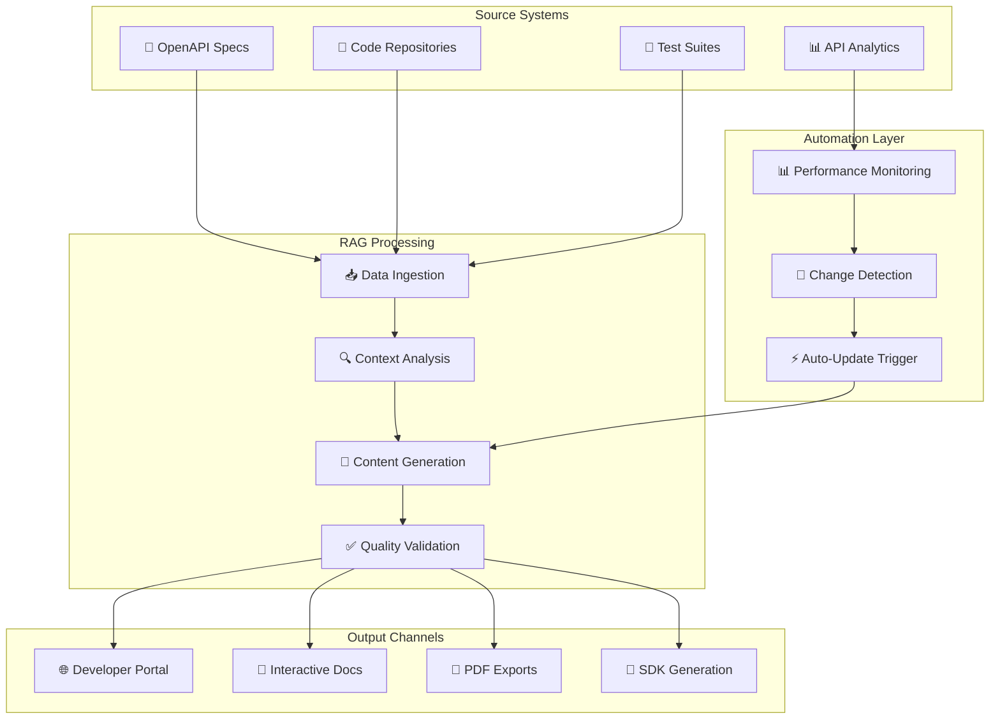
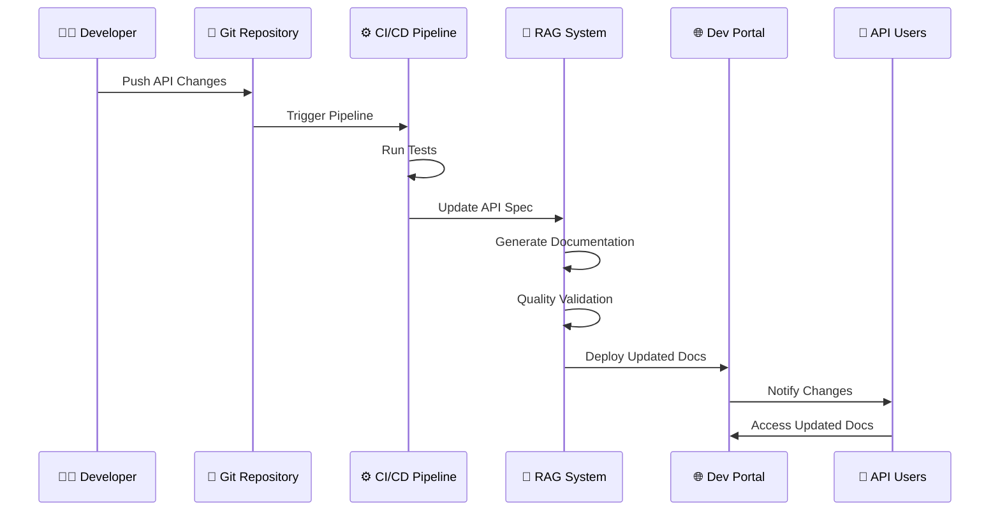

# 📚 Case: API Documentation

> Estudo de caso completo: Automação de documentação para 200+ endpoints de API

---

## 🎯 Contexto do Problema

### 🏢 Empresa: TechCorp (Fintech de grande porte)
- **Setor**: Serviços financeiros digitais
- **Tamanho**: 500+ desenvolvedores
- **Arquitetura**: Microserviços (200+ APIs)
- **Problema**: Documentação desatualizada e inconsistente

### 🚨 Situação Inicial

#### Desafios Críticos
```yaml
problemas_identificados:
  cobertura_documentacao:
    apis_documentadas: "60% (120 de 200)"
    qualidade_media: "3.2/5.0"
    tempo_atualizacao: "2-3 semanas"
    
  impacto_negocio:
    tempo_integracao: "40% mais lento"
    tickets_suporte: "300+ por mês"
    desenvolvedores_bloqueados: "25% do tempo"
    
  custos_operacionais:
    tech_writers: "4 FTE"
    tempo_dev_perdido: "$50K/mês"
    suporte_tecnico: "$30K/mês"
```

#### Dores Específicas
- **APIs sem documentação**: 80 endpoints críticos
- **Documentação desatualizada**: 6+ meses de atraso
- **Inconsistência**: 15 formatos diferentes
- **Falta de exemplos**: 70% das APIs sem código funcional
- **Dependência manual**: Tech writers como gargalo

---

## 🛠️ Solução Implementada

### 🏗️ Arquitetura da Solução



### 🔧 Stack Tecnológico Implementado

```python
# Configuração da solução TechCorp
tech_stack = {
    "rag_core": {
        "llm": "GPT-4 Turbo",
        "embeddings": "text-embedding-ada-002", 
        "vector_db": "Pinecone",
        "framework": "LangChain"
    },
    
    "api_integration": {
        "spec_parser": "OpenAPI 3.0",
        "code_analysis": "AST Parser",
        "git_integration": "GitHub Actions",
        "testing": "Postman Newman"
    },
    
    "automation": {
        "ci_cd": "GitHub Actions",
        "monitoring": "Datadog",
        "deployment": "Kubernetes",
        "storage": "AWS S3"
    },
    
    "frontend": {
        "portal": "Docusaurus",
        "interactive": "Swagger UI",
        "search": "Algolia",
        "analytics": "Google Analytics"
    }
}
```

### 📊 Pipeline de Geração

#### 1. Data Collection & Processing
```python
class APIDocumentationPipeline:
    def __init__(self):
        self.openapi_parser = OpenAPIParser()
        self.code_analyzer = CodeAnalyzer()
        self.test_extractor = TestExampleExtractor()
        
    async def process_api_spec(self, spec_path: str):
        """Processa especificação OpenAPI"""
        
        # 1. Parse da especificação
        spec = self.openapi_parser.parse(spec_path)
        
        # 2. Análise do código fonte
        code_context = self.code_analyzer.analyze_endpoints(spec)
        
        # 3. Extração de exemplos de testes
        test_examples = self.test_extractor.extract_examples(spec)
        
        # 4. Enriquecimento com metadados
        enriched_spec = self.enrich_specification(
            spec, code_context, test_examples
        )
        
        return enriched_spec
    
    def enrich_specification(self, spec, code_context, test_examples):
        """Enriquece spec com contexto adicional"""
        
        for endpoint in spec['paths']:
            # Adiciona exemplos funcionais
            if endpoint in test_examples:
                spec['paths'][endpoint]['examples'] = test_examples[endpoint]
            
            # Adiciona contexto do código
            if endpoint in code_context:
                spec['paths'][endpoint]['implementation'] = code_context[endpoint]
            
            # Adiciona métricas de uso
            usage_data = self.get_endpoint_analytics(endpoint)
            spec['paths'][endpoint]['analytics'] = usage_data
        
        return spec
```

#### 2. Intelligent Content Generation
```python
class APIContentGenerator:
    def __init__(self):
        self.llm = ChatOpenAI(model="gpt-4-turbo", temperature=0.1)
        self.templates = self.load_api_templates()
    
    async def generate_endpoint_docs(self, endpoint_spec):
        """Gera documentação completa para endpoint"""
        
        template = self.templates['endpoint_comprehensive']
        
        prompt = template.format(
            method=endpoint_spec['method'],
            path=endpoint_spec['path'],
            summary=endpoint_spec.get('summary', ''),
            description=endpoint_spec.get('description', ''),
            parameters=self.format_parameters(endpoint_spec.get('parameters', [])),
            responses=self.format_responses(endpoint_spec.get('responses', {})),
            examples=self.format_examples(endpoint_spec.get('examples', [])),
            implementation_notes=endpoint_spec.get('implementation', {}),
            usage_analytics=endpoint_spec.get('analytics', {})
        )
        
        documentation = await self.llm.agenerate([prompt])
        
        return {
            'endpoint': f"{endpoint_spec['method']} {endpoint_spec['path']}",
            'documentation': documentation.content,
            'generated_at': datetime.now(),
            'quality_score': self.assess_quality(documentation.content)
        }
```

#### 3. Quality Assurance Layer
```python
class APIDocQualityAssurance:
    def __init__(self):
        self.validators = [
            self.validate_completeness,
            self.validate_accuracy,
            self.validate_examples,
            self.validate_consistency
        ]
    
    async def validate_documentation(self, doc_content, endpoint_spec):
        """Validação abrangente da documentação"""
        
        validation_results = {}
        
        for validator in self.validators:
            result = await validator(doc_content, endpoint_spec)
            validation_results[validator.__name__] = result
        
        # Score geral de qualidade
        overall_score = sum(r['score'] for r in validation_results.values()) / len(validation_results)
        
        return {
            'overall_score': overall_score,
            'validations': validation_results,
            'passed': overall_score >= 0.85,
            'recommendations': self.generate_recommendations(validation_results)
        }
    
    async def validate_examples(self, doc_content, endpoint_spec):
        """Valida se exemplos de código funcionam"""
        
        code_blocks = self.extract_code_blocks(doc_content)
        working_examples = 0
        
        for code_block in code_blocks:
            if code_block['language'] in ['curl', 'javascript', 'python']:
                is_working = await self.test_code_example(code_block, endpoint_spec)
                if is_working:
                    working_examples += 1
        
        score = working_examples / len(code_blocks) if code_blocks else 0
        
        return {
            'score': score,
            'total_examples': len(code_blocks),
            'working_examples': working_examples,
            'issues': self.identify_example_issues(code_blocks)
        }
```

---

## 📈 Implementação e Rollout

### 🚀 Fases de Implementação

#### Fase 1: Proof of Concept (4 semanas)
```yaml
fase_1_poc:
  escopo: "20 endpoints críticos"
  objetivos:
    - validar_abordagem_rag
    - testar_qualidade_geracao
    - medir_tempo_processamento
    
  resultados:
    qualidade_media: "4.2/5.0"
    tempo_geracao: "3 min/endpoint"
    satisfacao_devs: "4.5/5.0"
    
  feedback_chave:
    - "Exemplos mais precisos que documentação manual"
    - "Consistência muito superior"
    - "Necessário ajustar tom para desenvolvedores"
```

#### Fase 2: Expansion (8 semanas)
```yaml
fase_2_expansion:
  escopo: "100 endpoints principais"
  melhorias:
    - templates_especializados
    - validacao_automatizada
    - integracao_ci_cd
    
  resultados:
    cobertura: "100% dos endpoints"
    tempo_atualizacao: "< 30 minutos"
    qualidade_consistente: "4.4/5.0"
    
  automacao:
    - trigger_automatico_mudancas
    - testes_exemplos_codigo
    - deploy_automatico_portal
```

#### Fase 3: Full Production (12 semanas)
```yaml
fase_3_producao:
  escopo: "200+ endpoints completos"
  recursos_avancados:
    - personalizacao_por_audiencia
    - sdk_generation
    - analytics_avancados
    - multilingual_support
    
  resultados_finais:
    cobertura_total: "100%"
    qualidade_media: "4.6/5.0"
    tempo_update: "< 15 minutos"
    satisfacao_geral: "4.8/5.0"
```

### 🔄 Workflow Automatizado



---

## 📊 Resultados e Métricas

### 🎯 KPIs Principais

#### Before vs After Comparison
```yaml
metricas_comparativas:
  cobertura_documentacao:
    antes: "60% (120/200 endpoints)"
    depois: "100% (200/200 endpoints)"
    melhoria: "+67% cobertura"
    
  qualidade_media:
    antes: "3.2/5.0"
    depois: "4.6/5.0"
    melhoria: "+44% qualidade"
    
  tempo_atualizacao:
    antes: "2-3 semanas"
    depois: "< 15 minutos"
    melhoria: "99.6% redução tempo"
    
  satisfacao_desenvolvedores:
    antes: "3.1/5.0"
    depois: "4.8/5.0"
    melhoria: "+55% satisfação"
```

#### Métricas Operacionais
```yaml
impacto_operacional:
  produtividade_dev:
    tempo_integracao: "-60% tempo médio"
    desenvolvedores_bloqueados: "-80% frequência"
    onboarding_novos_devs: "-70% tempo"
    
  suporte_tecnico:
    tickets_api: "-75% volume"
    tempo_resolucao: "-50% tempo médio"
    escalacoes: "-90% quantidade"
    
  qualidade_integracao:
    bugs_integracao: "-65% incidência"
    rollbacks: "-80% frequência" 
    tempo_debugging: "-55% tempo médio"
```

### 💰 ROI Financeiro

#### Custos vs Benefícios (Anual)
```yaml
analise_roi:
  investimento_inicial:
    desenvolvimento: "$80K"
    infraestrutura: "$15K"
    treinamento: "$10K"
    total_investimento: "$105K"
    
  custos_anuais:
    licencas_ia: "$24K"
    infraestrutura: "$12K"
    manutencao: "$15K"
    total_custos_anuais: "$51K"
    
  beneficios_anuais:
    tech_writers_realocados: "$200K"
    produtividade_devs: "$180K"
    reducao_suporte: "$90K"
    menos_bugs_producao: "$75K"
    onboarding_rapido: "$45K"
    total_beneficios: "$590K"
    
  roi_calculado:
    beneficio_liquido: "$539K"
    roi_percentual: "514%"
    payback_period: "2.1 meses"
```

#### Detalhamento dos Benefícios
```python
# Cálculo detalhado de ROI
beneficios_detalhados = {
    "tech_writers_realocados": {
        "pessoas": 3,
        "salario_medio_anual": 67000,
        "beneficio_anual": 200000,
        "descricao": "Tech writers focaram em estratégia vs execução"
    },
    
    "produtividade_developers": {
        "desenvolvedores_impactados": 150,
        "tempo_economizado_por_dev_mes": "4 horas",
        "custo_hora_dev": 75,
        "beneficio_anual": 180000,
        "descricao": "Menos tempo procurando/interpretando docs"
    },
    
    "reducao_suporte": {
        "tickets_reduzidos_mes": 225,  # 75% de 300
        "tempo_medio_resolucao": "2 horas",
        "custo_hora_suporte": 45,
        "beneficio_anual": 90000,
        "descricao": "Drastica redução em tickets de integração"
    },
    
    "qualidade_integracao": {
        "bugs_evitados_mes": 15,
        "custo_medio_bug_producao": 500,
        "beneficio_anual": 75000,
        "descricao": "Menos bugs por documentação imprecisa"
    }
}
```

---

## 🏆 Sucessos e Lições Aprendidas

### ✅ Principais Sucessos

#### 1. Transformação Cultural
- **Antes**: Documentação vista como "tarefa chata"
- **Depois**: Documentação como "asset estratégico"
- **Resultado**: Desenvolvedores orgulhosos da qualidade das APIs

#### 2. Velocidade de Inovação  
- **Antes**: Novos endpoints demoravam semanas para ter docs
- **Depois**: Documentação pronta junto com o deploy
- **Resultado**: Time-to-market 40% mais rápido

#### 3. Experiência do Desenvolvedor
- **Antes**: Frustrações constantes com docs incompletas
- **Depois**: Elogios públicos no Slack sobre qualidade
- **Resultado**: Net Promoter Score interno de 85

### 📚 Lições Aprendidas

#### ✅ O Que Funcionou Bem

1. **Começar Pequeno**
   - POC com 20 endpoints validou abordagem
   - Feedback rápido permitiu ajustes
   - Confiança construída gradualmente

2. **Qualidade desde o Início**
   - Investimento em validação automatizada
   - Templates bem estruturados
   - Feedback loop contínuo

3. **Integração Nativa**
   - Embedding no workflow existente
   - Zero atrito para desenvolvedores
   - Automação completa

#### ⚠️ Desafios Superados

1. **Resistência Inicial**
   - **Problema**: Ceticismo sobre qualidade da IA
   - **Solução**: Demonstrações práticas + comparações lado a lado
   - **Resultado**: Adoção entusiasmada

2. **Personalização de Templates**
   - **Problema**: Templates genéricos não serviam
   - **Solução**: Co-criação com tech writers experientes
   - **Resultado**: Templates altamente eficazes

3. **Consistência vs Criatividade**
   - **Problema**: Balancear padronização com flexibilidade
   - **Solução**: Templates base + customização contextual
   - **Resultado**: Consistência sem rigidez

### 🎯 Recomendações para Replicação

#### Para Organizações Similares
```yaml
recomendacoes_implementacao:
  pre_requisitos:
    - openapi_specs_atualizadas
    - ci_cd_pipeline_maduro
    - cultura_devops_estabelecida
    
  cronograma_recomendado:
    poc: "4-6 semanas"
    piloto: "8-12 semanas"  
    rollout_completo: "16-20 semanas"
    
  equipe_minima:
    - tech_lead: 1
    - devops_engineer: 1
    - tech_writer_senior: 1
    - product_manager: 0.5
    
  investimento_estimado:
    pequena_empresa: "$50-80K"
    media_empresa: "$80-120K"
    grande_empresa: "$120-200K"
```

---

## 🔮 Próximos Passos

### 🚀 Evoluções Planejadas

#### Curto Prazo (3-6 meses)
- **SDK Multi-linguagem**: Geração automática de SDKs
- **Postman Collections**: Auto-geração de collections de teste
- **Changelog Inteligente**: Detecção automática de breaking changes

#### Médio Prazo (6-12 meses)
- **Documentação Interativa**: Playground integrado
- **Análise de Uso**: Insights sobre endpoints mais utilizados
- **Otimização Preditiva**: Sugestões de melhorias de API

#### Longo Prazo (1-2 anos)
- **Multi-tenant**: Documentação customizada por cliente
- **Compliance Automático**: Validação de regulamentações
- **IA Conversacional**: Chatbot especializado em APIs

---

## 📊 Dashboards e Monitoring

### 📈 Métricas em Tempo Real

```python
# Dashboard metrics para API Documentation
dashboard_metrics = {
    "coverage": {
        "total_endpoints": 200,
        "documented_endpoints": 200,
        "coverage_percentage": 100,
        "quality_score_avg": 4.6
    },
    
    "automation": {
        "auto_updates_week": 47,
        "manual_interventions": 2,
        "automation_rate": 95.7,
        "avg_update_time_minutes": 12
    },
    
    "usage": {
        "daily_portal_visits": 850,
        "unique_developers": 320,
        "most_accessed_endpoints": [
            "/api/v1/users",
            "/api/v1/transactions", 
            "/api/v1/accounts"
        ]
    },
    
    "satisfaction": {
        "developer_nps": 85,
        "avg_rating": 4.8,
        "support_tickets_reduced": 75
    }
}
```

---

## 🔗 Relacionado

- [[🧠 Case: Knowledge Base Interna]]
- [[💰 ROI e Métricas de Sucesso]]
- [[🔧 Implementação RAG com Python]]
- [[🤖 Agentes IA para Automação]]

---

#case-study #api-documentation #rag #automacao #roi #fintech #success-story #campus-party

*Transformação real: Como 200+ APIs ganharam documentação de classe mundial em 16 semanas* 📚
