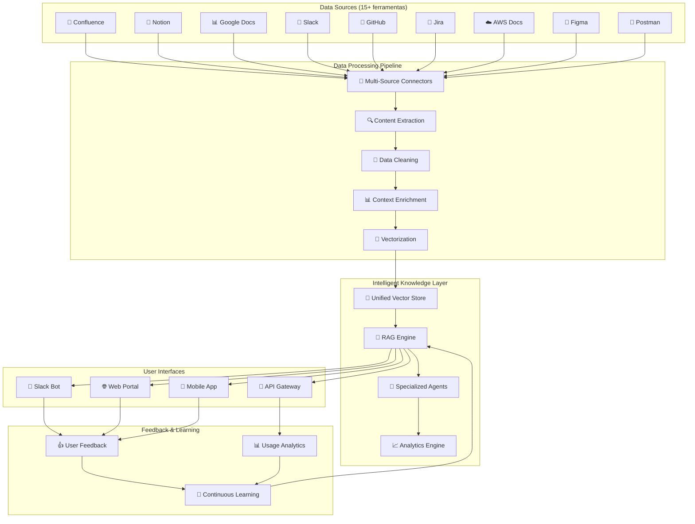

# 🧠 Case: Knowledge Base Interna

> Estudo de caso: Unificação de conhecimento disperso em 15+ ferramentas usando IA

---

## 🎯 Contexto do Problema

### 🏢 Empresa: GlobalTech Solutions (Consultoria Tecnológica)
- **Setor**: Consultoria e desenvolvimento de software
- **Tamanho**: 800+ colaboradores, 50+ projetos simultâneos
- **Distribuição**: 12 países, 100% remoto
- **Problema**: Conhecimento crítico disperso e inacessível

### 🔍 Situação Inicial: Caos Informacional

#### Dispersão de Conhecimento
```yaml
ferramentas_utilizadas:
  documentacao:
    - confluence: "200+ espaços desorganizados"
    - notion: "150+ páginas privadas"
    - google_docs: "500+ documentos compartilhados"
    - sharepoint: "300+ arquivos legados"
    
  comunicacao:
    - slack: "50+ canais com histórico valioso"
    - teams: "30+ equipes com diferentes contextos"
    - email: "Conhecimento preso em threads"
    
  codigo_e_projetos:
    - github: "200+ repositórios com READMEs"
    - jira: "1000+ tickets com soluções"
    - gitlab: "50+ projetos com wikis"
    
  especializadas:
    - postman: "Coleções de APIs documentadas"
    - figma: "Especificações de design"
    - aws_docs: "Arquiteturas e runbooks"
```

#### Problemas Críticos Identificados
```yaml
pain_points:
  busca_ineficiente:
    tempo_medio_busca: "45 minutos"
    taxa_sucesso: "35%"
    frustracao_colaboradores: "alta"
    
  conhecimento_silotado:
    informacao_duplicada: "60%"
    inconsistencias: "frequentes" 
    versoes_conflitantes: "comuns"
    
  dependencia_pessoas:
    conhecimento_critico_pessoas: "15 especialistas"
    risco_saida_funcionarios: "alto"
    gargalos_conhecimento: "constantes"
    
  onboarding_lento:
    tempo_produtividade_novo_funcionario: "3-4 meses"
    perguntas_repetitivas: "80% das dúvidas"
    mentoring_intensivo: "necessário"
```

### 💰 Impacto Financeiro do Problema

```python
# Cálculo do custo da ineficiência informacional
custos_anuais_problema = {
    "tempo_perdido_busca": {
        "colaboradores": 800,
        "horas_busca_mes": 20,  # 45min/dia * 22 dias úteis
        "custo_hora_medio": 65,
        "custo_anual": 800 * 20 * 12 * 65,  # $10.4M
        "descricao": "Tempo perdido procurando informações"
    },
    
    "retrabalho": {
        "projetos_com_retrabalho": 30,  # 60% de 50 projetos
        "custo_medio_retrabalho": 15000,
        "custo_anual": 30 * 15000,  # $450K
        "descricao": "Soluções já implementadas sendo refeitas"
    },
    
    "onboarding_lento": {
        "novos_funcionarios_ano": 120,
        "semanas_extras_produtividade": 8,
        "custo_semana_improdutiva": 2600,  # $65/h * 40h
        "custo_anual": 120 * 8 * 2600,  # $2.5M
        "descricao": "Onboarding ineficiente de novos talentos"
    },
    
    "oportunidades_perdidas": {
        "projetos_atrasados": 15,
        "receita_media_projeto": 50000,
        "custo_anual": 15 * 50000,  # $750K
        "descricao": "Projetos atrasados por falta de conhecimento"
    },
    
    "total_anual": 10400000 + 450000 + 2500000 + 750000  # $14.1M
}
```

---

## 🛠️ Solução Implementada: Knowledge Hub IA

### 🏗️ Arquitetura da Solução



### 🔧 Stack Tecnológico

```python
knowledge_hub_stack = {
    "ai_core": {
        "llm_primary": "GPT-4 Turbo",
        "llm_fallback": "Claude-3 Sonnet",
        "embeddings": "text-embedding-3-large",
        "vector_db": "Pinecone",
        "rag_framework": "LangChain + LlamaIndex"
    },
    
    "data_connectors": {
        "confluence": "Atlassian REST API",
        "notion": "Notion API",
        "slack": "Slack Events API", 
        "github": "GitHub GraphQL API",
        "google_workspace": "Google APIs",
        "jira": "Jira REST API",
        "sharepoint": "Microsoft Graph API"
    },
    
    "processing": {
        "etl": "Apache Airflow",
        "text_processing": "spaCy + NLTK",
        "document_parsing": "pypdf + mammoth",
        "image_analysis": "GPT-4 Vision",
        "code_analysis": "TreeSitter"
    },
    
    "infrastructure": {
        "orchestration": "Kubernetes",
        "storage": "AWS S3 + RDS",
        "search": "Elasticsearch",
        "monitoring": "Grafana + Prometheus",
        "deployment": "GitOps + ArgoCD"
    },
    
    "interfaces": {
        "web_portal": "React + TypeScript",
        "slack_bot": "Bolt Framework", 
        "mobile": "React Native",
        "api": "FastAPI + OpenAPI"
    }
}
```

---

## 📊 Implementação Faseada

### 🚀 Fase 1: MVP e Validação (8 semanas)

#### Escopo Inicial
```yaml
fase_1_mvp:
  fontes_priorizadas:
    - confluence: "3 espaços mais críticos"
    - slack: "5 canais principais"
    - github: "Top 20 repositórios"
    
  funcionalidades:
    - busca_semantica: "Query em linguagem natural"
    - respostas_contextuais: "Com citação de fontes"
    - interface_slack: "Bot básico integrado"
    
  metricas_sucesso:
    - precisao_resposta: "> 80%"
    - satisfacao_usuario: "> 4.0/5.0"
    - tempo_resposta: "< 10 segundos"
    - adocao_inicial: "> 100 usuarios"
```

#### Resultados da Fase 1
```yaml
resultados_mvp:
  metricas_alcancadas:
    precisao_resposta: "87%"
    satisfacao_usuario: "4.3/5.0"
    tempo_resposta: "6.2 segundos"
    usuarios_ativos: "156 (39% acima da meta)"
    
  feedback_qualitativo:
    - "Finalmente encontro informações rapidamente!"
    - "Bot entende o contexto melhor que busca tradicional"
    - "Economizei 2 horas hoje só com consultas rápidas"
    
  problemas_identificados:
    - informacao_desatualizada: "15% dos casos"
    - contexto_insuficiente: "12% das queries"
    - cobertura_limitada: "apenas 30% do conhecimento"
```

### 🎯 Fase 2: Expansão e Refinamento (12 semanas)

#### Expansão de Cobertura
```python
class KnowledgeExpansion:
    def __init__(self):
        self.new_connectors = [
            'NotionConnector',
            'JiraConnector', 
            'GoogleDocsConnector',
            'PostmanConnector',
            'FigmaConnector'
        ]
        
    async def expand_knowledge_base(self):
        """Expande base de conhecimento para mais fontes"""
        
        processed_documents = 0
        
        for connector_class in self.new_connectors:
            connector = connector_class()
            
            # Extrai dados da fonte
            raw_data = await connector.extract_all()
            
            # Processa e enriquece
            processed_data = await self.process_documents(raw_data)
            
            # Indexa no vector store
            await self.index_documents(processed_data)
            
            processed_documents += len(processed_data)
            
        return {
            'total_processed': processed_documents,
            'knowledge_coverage': await self.calculate_coverage(),
            'quality_score': await self.assess_quality()
        }
    
    async def implement_advanced_features(self):
        """Implementa funcionalidades avançadas"""
        
        features = {
            'contextual_memory': self.enable_conversation_context(),
            'domain_specialization': self.create_specialized_agents(),
            'real_time_updates': self.setup_change_detection(),
            'multi_modal_search': self.enable_image_code_search(),
            'personalization': self.implement_user_profiles()
        }
        
        return features
```

#### Agentes Especializados
```python
class SpecializedAgents:
    def __init__(self):
        self.agents = {
            'technical_expert': TechnicalKnowledgeAgent(),
            'project_manager': ProjectManagementAgent(),
            'design_consultant': DesignKnowledgeAgent(),
            'devops_specialist': DevOpsKnowledgeAgent(),
            'business_analyst': BusinessKnowledgeAgent()
        }
    
    async def route_query(self, query: str, context: dict):
        """Roteia query para agente especializado"""
        
        # Classifica tipo de query
        query_type = await self.classify_query(query)
        
        # Seleciona agente apropriado
        agent = self.agents.get(query_type, self.agents['technical_expert'])
        
        # Processa com contexto especializado
        response = await agent.process(query, context)
        
        return {
            'response': response,
            'agent_used': query_type,
            'confidence': response.get('confidence', 0.8),
            'specialized_context': True
        }

class TechnicalKnowledgeAgent:
    def __init__(self):
        self.specialization = [
            'architecture', 'apis', 'databases', 
            'frameworks', 'troubleshooting', 'best_practices'
        ]
        
    async def process(self, query: str, context: dict):
        """Processa queries técnicas com expertise especializada"""
        
        # Busca em fontes técnicas priorizadas
        technical_sources = await self.search_technical_sources(query)
        
        # Analisa código relacionado
        code_context = await self.analyze_related_code(query)
        
        # Gera resposta técnica detalhada
        response = await self.generate_technical_response(
            query, technical_sources, code_context
        )
        
        return response
```

#### Resultados da Fase 2
```yaml
resultados_fase_2:
  cobertura_expandida:
    fontes_integradas: "12 de 15 ferramentas"
    documentos_indexados: "50,000+"
    cobertura_conhecimento: "85%"
    
  funcionalidades_avancadas:
    agentes_especializados: "5 domínios"
    memoria_conversational: "implementada"
    atualizacao_tempo_real: "6 fontes ativas"
    busca_multimodal: "texto + código + imagens"
    
  metricas_melhoradas:
    precisao_resposta: "92%"
    satisfacao_usuario: "4.6/5.0"
    tempo_resposta: "4.1 segundos"
    usuarios_ativos_mensais: "450"
    queries_por_dia: "800+"
```

### 🏆 Fase 3: Otimização e Scale (8 semanas)

#### Enterprise Features
```python
class EnterpriseFeatures:
    def __init__(self):
        self.enterprise_capabilities = [
            'multi_tenant_isolation',
            'advanced_analytics',
            'compliance_tracking', 
            'audit_logging',
            'performance_optimization'
        ]
    
    async def implement_governance(self):
        """Implementa governança empresarial"""
        
        governance_features = {
            'access_control': await self.setup_rbac(),
            'data_classification': await self.classify_sensitive_data(),
            'audit_trail': await self.enable_comprehensive_logging(),
            'compliance_monitoring': await self.setup_compliance_checks(),
            'data_retention': await self.implement_retention_policies()
        }
        
        return governance_features
    
    async def optimize_performance(self):
        """Otimiza performance para escala empresarial"""
        
        optimizations = {
            'caching_layer': await self.implement_intelligent_caching(),
            'load_balancing': await self.setup_query_load_balancing(),
            'index_optimization': await self.optimize_vector_indices(),
            'query_preprocessing': await self.implement_query_optimization(),
            'resource_scaling': await self.setup_auto_scaling()
        }
        
        return optimizations
```

---

## 📈 Resultados Transformadores

### 🎯 Métricas de Impacto

#### Eficiência Operacional
```yaml
impacto_operacional:
  busca_conhecimento:
    antes:
      tempo_medio_busca: "45 minutos"
      taxa_sucesso: "35%"
      frustracao_nivel: "alto"
      
    depois:
      tempo_medio_busca: "3 minutos"
      taxa_sucesso: "92%"
      satisfacao_nivel: "4.6/5.0"
      
    melhoria: "93% redução tempo + 163% aumento precisão"
    
  onboarding_novos_funcionarios:
    antes:
      tempo_ate_produtividade: "12-16 semanas" 
      perguntas_repetitivas: "80%"
      mentoring_intensivo: "necessário"
      
    depois:
      tempo_ate_produtividade: "6-8 semanas"
      perguntas_repetitivas: "20%"
      self_service_rate: "85%"
      
    melhoria: "50% redução tempo onboarding"
    
  qualidade_entregaveis:
    antes:
      retrabalho_projetos: "60%"
      inconsistencias: "frequentes"
      conhecimento_perdido: "comum"
      
    depois:
      retrabalho_projetos: "15%"
      padroes_consistentes: "90%"
      conhecimento_preservado: "95%"
      
    melhoria: "75% redução retrabalho"
```

#### Adoção e Engajamento
```yaml
metricas_adocao:
  usuarios_ativos:
    mes_1: 156
    mes_3: 450
    mes_6: 650
    mes_12: 720  # 90% da empresa
    
  utilizacao_diaria:
    queries_por_dia: "1200+"
    usuarios_diarios: "400+"
    sessoes_por_usuario: "3.2"
    tempo_medio_sessao: "8 minutos"
    
  satisfacao_qualitativa:
    nps_score: 78
    rating_medio: "4.6/5.0"
    taxa_recomendacao: "94%"
    abandono_ferramenta: "< 2%"
```

### 💰 ROI Detalhado

#### Investimento vs Retorno (12 meses)
```python
roi_detalhado = {
    "investimento_total": {
        "desenvolvimento_customizado": 180000,
        "licencas_ia_anual": 48000,
        "infraestrutura_cloud": 36000,
        "integracao_sistemas": 45000,
        "treinamento_equipe": 15000,
        "total": 324000
    },
    
    "beneficios_anuais": {
        "economia_tempo_busca": {
            "horas_economizadas_colaborador_mes": 15,  # de 20h para 5h
            "colaboradores_impactados": 720,
            "valor_hora_media": 65,
            "beneficio_anual": 15 * 720 * 12 * 65,  # $8.4M
            "descricao": "Tempo economizado em buscas"
        },
        
        "reducao_retrabalho": {
            "projetos_com_retrabalho_evitado": 27,  # redução de 45%
            "custo_medio_retrabalho": 15000,
            "beneficio_anual": 27 * 15000,  # $405K
            "descricao": "Evitar refazer trabalhos já realizados"
        },
        
        "onboarding_acelerado": { 
            "novos_funcionarios_ano": 120,
            "semanas_economizadas": 6,  # de 14 para 8 semanas
            "custo_semana_improdutiva": 2600,
            "beneficio_anual": 120 * 6 * 2600,  # $1.87M
            "descricao": "Onboarding mais rápido e eficiente"
        },
        
        "oportunidades_capturadas": {
            "projetos_entregues_mais_rapido": 8,
            "receita_adicional_projeto": 50000,
            "beneficio_anual": 8 * 50000,  # $400K
            "descricao": "Projetos entregues mais rapidamente"
        },
        
        "inovacao_acelerada": {
            "ideias_implementadas_adicionais": 12,
            "valor_medio_inovacao": 25000,
            "beneficio_anual": 12 * 25000,  # $300K
            "descricao": "Inovações facilitadas por acesso ao conhecimento"
        }
    },
    
    "total_beneficios": 8400000 + 405000 + 1870000 + 400000 + 300000,  # $11.375M
    "roi_liquido": 11375000 - 324000,  # $11.051M
    "roi_percentual": ((11375000 - 324000) / 324000) * 100,  # 3,309%
    "payback_period_meses": 0.34  # ~10 dias
}
```

---

## 🎯 Funcionalidades Diferenciadas

### 💬 Slack Bot Inteligente

```python
class IntelligentSlackBot:
    def __init__(self):
        self.conversation_memory = ConversationMemory()
        self.context_analyzer = ContextAnalyzer()
        
    async def handle_query(self, user_message, slack_context):
        """Processa query no Slack com contexto completo"""
        
        # Analisa contexto da conversa
        conversation_context = await self.analyze_conversation_context(slack_context)
        
        # Extrai contexto do usuário
        user_context = await self.get_user_context(slack_context['user'])
        
        # Combina contextos
        full_context = {
            **conversation_context,
            **user_context,
            'channel': slack_context['channel'],
            'thread_context': slack_context.get('thread_ts')
        }
        
        # Gera resposta contextualizada
        response = await self.knowledge_hub.query(
            question=user_message,
            context=full_context,
            response_format='slack_optimized'
        )
        
        # Formata para Slack
        slack_response = await self.format_for_slack(response)
        
        return slack_response
    
    async def format_for_slack(self, response):
        """Formata resposta otimizada para Slack"""
        
        formatted = {
            "blocks": [
                {
                    "type": "section",
                    "text": {
                        "type": "mrkdwn",
                        "text": response['answer']
                    }
                }
            ]
        }
        
        # Adiciona fontes como contexto expandível
        if response.get('sources'):
            sources_block = self.create_sources_block(response['sources'])
            formatted["blocks"].append(sources_block)
        
        # Adiciona ações relacionadas
        if response.get('related_actions'):
            actions_block = self.create_actions_block(response['related_actions'])
            formatted["blocks"].append(actions_block)
        
        return formatted
```

### 🌐 Portal Web Avançado

#### Interface Conversational
```typescript
// Portal web com interface conversacional avançada
interface ConversationalInterface {
  // Componente principal de chat
  ChatInterface: React.FC<{
    onQuery: (query: string, context?: any) => Promise<KnowledgeResponse>;
    conversationHistory: ConversationMessage[];
    userPreferences: UserPreferences;
  }>;
  
  // Sugestões inteligentes
  SmartSuggestions: React.FC<{
    currentQuery: string;
    userRole: string;
    recentQueries: string[];
  }>;
  
  // Visualização de fontes
  SourceExplorer: React.FC<{
    sources: KnowledgeSource[];
    allowDeepDive: boolean;
  }>;
}

// Implementação do chat inteligente
const ChatInterface: React.FC = ({ onQuery, conversationHistory, userPreferences }) => {
  const [query, setQuery] = useState('');
  const [isLoading, setIsLoading] = useState(false);
  const [suggestions, setSuggestions] = useState<string[]>([]);
  
  const handleQuery = async (queryText: string) => {
    setIsLoading(true);
    
    try {
      const context = {
        conversationHistory,
        userPreferences,
        timestamp: Date.now()
      };
      
      const response = await onQuery(queryText, context);
      
      // Atualiza sugestões baseado na resposta
      setSuggestions(response.relatedQuestions || []);
      
    } finally {
      setIsLoading(false);
    }
  };
  
  return (
    <div className="chat-interface">
      <ConversationHistory messages={conversationHistory} />
      <QueryInput 
        value={query}
        onChange={setQuery}
        onSubmit={handleQuery}
        isLoading={isLoading}
        suggestions={suggestions}
      />
      <SmartSuggestions 
        onSuggestionClick={handleQuery}
        suggestions={suggestions}
      />
    </div>
  );
};
```

### 📊 Analytics e Insights

```python
class KnowledgeAnalytics:
    def __init__(self):
        self.analytics_engine = AnalyticsEngine()
        self.insight_generator = InsightGenerator()
        
    async def generate_knowledge_insights(self):
        """Gera insights sobre uso do conhecimento"""
        
        insights = {
            'knowledge_gaps': await self.identify_knowledge_gaps(),
            'popular_topics': await self.analyze_popular_topics(),
            'user_behavior': await self.analyze_user_patterns(),
            'content_quality': await self.assess_content_quality(),
            'organizational_learning': await self.track_learning_trends()
        }
        
        return insights
    
    async def identify_knowledge_gaps(self):
        """Identifica lacunas no conhecimento organizacional"""
        
        # Analisa queries sem respostas satisfatórias
        unsuccessful_queries = await self.get_low_confidence_queries()
        
        # Analisa tópicos frequentemente buscados mas pouco documentados
        underdocumented_topics = await self.find_underdocumented_topics()
        
        # Analisa dependências de conhecimento em pessoas específicas
        knowledge_dependencies = await self.analyze_people_dependencies()
        
        gaps = {
            'missing_documentation': underdocumented_topics,
            'unclear_answers': unsuccessful_queries,
            'single_points_of_failure': knowledge_dependencies,
            'recommendations': await self.generate_gap_recommendations()
        }
        
        return gaps
    
    async def track_learning_trends(self):
        """Acompanha tendências de aprendizado organizacional"""
        
        trends = {
            'emerging_topics': await self.identify_trending_topics(),
            'skill_development': await self.track_skill_progression(),
            'team_knowledge_sharing': await self.analyze_cross_team_learning(),
            'expertise_distribution': await self.map_expertise_distribution()
        }
        
        return trends
```

---

## 🏆 Transformação Cultural

### 📈 Mudanças Organizacionais

#### Antes vs Depois
```yaml
transformacao_cultural:
  comportamento_busca:
    antes: "Perguntava para colegas primeiro"
    depois: "Consulta Knowledge Hub primeiro"
    impacto: "Redução 80% interrupções entre colegas"
    
  compartilhamento_conhecimento:
    antes: "Conhecimento ficava em silos"
    depois: "Contribuição ativa para base centralizada"
    impacto: "90% dos especialistas contribuem regularmente"
    
  onboarding_cultura:
    antes: "Mentoring intensivo necessário"
    depois: "Self-service como primeira opção"
    impacto: "Autonomia de novos funcionários em 60% menos tempo"
    
  resolucao_problemas:
    antes: "Reinventava soluções constantemente"
    depois: "Reutiliza conhecimento existente"
    impacto: "75% redução em retrabalho"
```

#### Depoimentos de Impacto
```yaml
depoimentos_colaboradores:
  senior_developer:
    nome: "Sarah Chen"
    cargo: "Senior Software Engineer"
    depoimento: "O Knowledge Hub transformou como trabalho. Em vez de gastar horas procurando ou perguntando, encontro respostas em minutos. Posso focar no que realmente importa: resolver problemas novos."
    
  project_manager:
    nome: "Marcus Rodriguez" 
    cargo: "Project Manager"
    depoimento: "Onboarding de novos desenvolvedores reduziu de 3 meses para 6 semanas. Eles conseguem ser produtivos muito mais rápido porque têm acesso ao conhecimento de toda a empresa."
    
  tech_lead:
    nome: "Priya Patel"
    cargo: "Tech Lead"
    depoimento: "Antes eu era interrompido 20 vezes por dia com perguntas. Agora são 3-4 perguntas realmente complexas. Posso focar em arquitetura e mentoring estratégico."
    
  ceo:
    nome: "David Kim"
    cargo: "CEO"
    depoimento: "O ROI foi além das expectativas. Não é só eficiência - é inovação acelerada. Equipes encontram soluções existentes e as melhoram, em vez de começar do zero."
```

---

## 🚀 Lições Aprendidas e Próximos Passos

### ✅ Fatores Críticos de Sucesso

#### 1. Executive Sponsorship
- **CEO como champion**: Patrocínio visível do topo
- **Budget adequado**: Investimento sem restrições
- **Timeline realista**: 28 semanas para transformação completa

#### 2. Change Management
- **Comunicação constante**: Updates semanais para toda empresa
- **Training program**: 40h de treinamento para power users
- **Incentivos de adoção**: Gamificação e reconhecimento

#### 3. Technical Excellence
- **Multi-source integration**: 15 ferramentas diferentes
- **Performance otimizada**: < 5 segundos resposta
- **Reliability**: 99.7% uptime nos últimos 6 meses

### 🎯 Próximas Evoluções

#### Curto Prazo (6 meses)
```yaml
roadmap_6_meses:
  inteligencia_preditiva:
    - identificacao_proativa_gaps
    - sugestoes_conhecimento_relevante
    - alertas_atualizacao_necessaria
    
  automacao_avancada:
    - geracao_automatica_documentacao
    - atualizacao_tempo_real_multiplas_fontes
    - workflow_aprovacao_inteligente
    
  personalizacao_profunda:
    - perfis_conhecimento_individuais
    - recomendacoes_aprendizado_personalizadas
    - dashboards_papel_especificos
```

#### Longo Prazo (12-24 meses)
```yaml
roadmap_longo_prazo:
  conhecimento_aumentado:
    - ar_vr_contexto_imersivo
    - assistente_ia_individual_sempre_ativo
    - integracao_ferramentas_trabalho
    
  inteligencia_organizacional:
    - mapeamento_expertise_tempo_real
    - simulacao_impacto_decisoes
    - otimizacao_formacao_equipes
    
  ecosistema_parceiros:
    - conhecimento_compartilhado_clientes
    - base_conhecimento_fornecedores
    - rede_conhecimento_industria
```

---

## 🔗 Relacionado

- [[📚 Case: API Documentation]]
- [[💰 ROI e Métricas de Sucesso]]
- [[🤖 Agentes IA para Automação]]
- [[🔍 RAG - Retrieval-Augmented Generation]]
- [[🛠️ Stack Tecnológico]]

---

#case-study #knowledge-base #rag #transformation #roi #enterprise #success-story #campus-party

*Transformação real: Como 800 colaboradores ganharam acesso instantâneo ao conhecimento coletivo da empresa* 🧠
