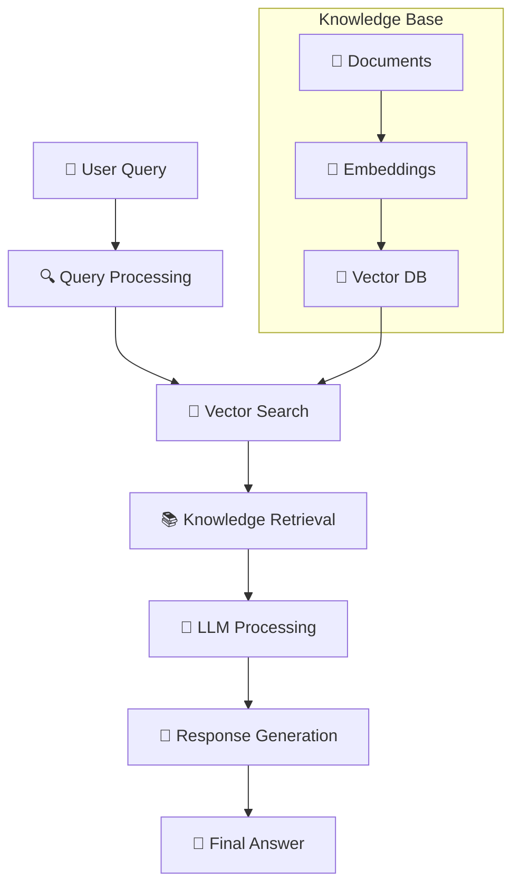

# 🎨 Guia Completo para Board Miro

> Como criar um board visual eficaz para apresentar Documentação 4.0 na Era IA

---

## 🎯 Visão Geral do Board

### 📐 Layout Recomendado

```
┌─────────────────────────────────────────────────────────────────┐
│                     🚀 DOCUMENTAÇÃO 4.0 NA ERA IA              │
│                     Campus Party 2025 Workshop                  │
├─────────────────────────────────────────────────────────────────┤
│  📈 Timeline      │  🏗️ Arquitetura  │  💰 ROI Dashboard      │
│  Evolução         │  RAG System       │  Métricas Visuais      │
│  (1.0 → 4.0)      │  Diagrama         │  KPIs Principais      │
├─────────────────────────────────────────────────────────────────┤
│  ⚡ Pipeline       │  🤖 Agentes IA    │  🛠️ Stack Tech        │
│  Qualidade        │  Automação        │  Mapa Ferramentas     │
│  Processo         │  Workflows        │  Integrações          │
├─────────────────────────────────────────────────────────────────┤
│  📊 Cases         │  🗺️ Roadmap       │  🎯 Ações Práticas    │
│  Sucesso Real     │  Implementação    │  Próximos Passos      │
│  ROI Comprovado   │  12 Meses         │  Workshop Hands-on    │
└─────────────────────────────────────────────────────────────────┘
```

---

## 📈 Seção 1: Timeline da Evolução

### 🎯 Objetivo
Mostrar a evolução histórica da documentação até chegar na era da IA

### 🛠️ Como Criar

#### 1️⃣ Template Base
- Use template **"Timeline"** do Miro
- Orientação horizontal, da esquerda para direita
- 4 eras principais com cores distintas

#### 2️⃣ Estrutura Visual
```
📝 Doc 1.0        🌐 Doc 2.0        ⚡ Doc 3.0        🤖 Doc 4.0
(1990-2005)      (2005-2015)      (2015-2020)      (2020-hoje)
Manual           Web/Wiki         DevOps           IA

• Paper docs     • Confluence     • Docs as Code   • RAG Systems
• Word/PDF       • Google Docs    • CI/CD          • AI Agents  
• Email share    • Wikis          • Automation     • Semantic Search
• Static         • Collaborative  • Git workflows  • Auto-generation
```

#### 3️⃣ Elementos Visuais
- **Ícones**: 📝 🌐 ⚡ 🤖 para cada era
- **Cores**: 
  - Doc 1.0: Cinza (#8E8E8E)
  - Doc 2.0: Azul (#4A90E2) 
  - Doc 3.0: Verde (#7ED321)
  - Doc 4.0: Roxo (#9013FE)
- **Setas**: Conectando as eras mostrando evolução
- **Marcos**: Eventos importantes em cada período

#### 4️⃣ Interatividade
- **Links**: Para recursos externos
- **Notas**: Detalhes ao clicar em cada era
- **Exemplos**: Screenshots de ferramentas da época

---

## 🏗️ Seção 2: Arquitetura RAG

### 🎯 Objetivo
Visualizar como funciona o sistema RAG de forma técnica mas acessível

### 🛠️ Como Criar

#### 1️⃣ Template Base
- Use template **"System Architecture"**
- Layout de fluxo de dados vertical
- Componentes bem definidos

#### 2️⃣ Estrutura do Fluxo



#### 3️⃣ Componentes Principais

| Componente | Cor | Ícone | Descrição |
|------------|-----|-------|-----------|
| **User Interface** | Azul | 👤 | Input do usuário |
| **Query Processor** | Verde | 🔍 | Processa pergunta |
| **Vector Search** | Laranja | 🔢 | Busca semântica |
| **Knowledge Base** | Roxo | 📚 | Base de conhecimento |
| **LLM Engine** | Vermelho | 🧠 | Motor de IA |
| **Response Gen** | Azul | 📝 | Geração de resposta |

#### 4️⃣ Detalhes Técnicos (Pop-ups)
- **Technologies**: OpenAI, Pinecone, LangChain
- **Performance**: < 3s response time
- **Accuracy**: 95% precision rate
- **Scale**: 1000+ concurrent users

---

## ⚡ Seção 3: Pipeline de Qualidade

### 🎯 Objetivo
Mostrar o processo automatizado de garantia de qualidade

### 🛠️ Como Criar

#### 1️⃣ Template Base
- Use template **"Process Flow"** 
- Layout swimlane (raias)
- Fluxo de aprovação automatizado

#### 2️⃣ Swimlanes Structure

```
┌─ 📝 CONTENT CREATION ─────────────────────────────────────┐
│ [New Doc] → [AI Writing] → [First Draft] → [Review]      │
├─ 🧪 AUTOMATED TESTING ────────────────────────────────────┤  
│ [Link Check] → [Code Test] → [Style Check] → [AI QA]     │
├─ 👥 HUMAN REVIEW ─────────────────────────────────────────┤
│ [Expert Review] → [Feedback] → [Corrections] → [Approve] │
├─ 🚀 DEPLOYMENT ───────────────────────────────────────────┤
│ [Build] → [Test Deploy] → [Production] → [Monitor]       │
└───────────────────────────────────────────────────────────┘
```

#### 3️⃣ Quality Gates
- **Gate 1**: Automated tests (95% pass rate)
- **Gate 2**: AI quality check (4.5+ score)
- **Gate 3**: Human review (expert approval)
- **Gate 4**: Performance validation (< 3s load)

#### 4️⃣ Métricas em Tempo Real
- 📊 **Quality Score**: 4.8/5.0
- ⚡ **Processing Time**: 12 minutes avg
- 🎯 **Success Rate**: 94%
- 🔄 **Automation Level**: 85%

---

## 🤖 Seção 4: Agentes IA

### 🎯 Objetivo
Demonstrar como agentes especializados automatizam tarefas

### 🛠️ Como Criar

#### 1️⃣ Template Base
- Use template **"Mind Map"** ou **"Org Chart"**
- Hub central com agentes especializados
- Conexões mostrando colaboração

#### 2️⃣ Agentes Especializados

```
                    🧠 AI ORCHESTRATOR
                           │
        ┌──────────────────┼──────────────────┐
        │                  │                  │
    📝 Content          🔍 Quality         💻 Code
    Generator           Checker            Analyzer
        │                  │                  │
    • Blog posts        • Grammar          • Syntax check
    • Tutorials         • Accuracy         • Best practices  
    • API docs          • Completeness     • Security scan
    • Translations      • Style guide      • Performance
```

#### 3️⃣ Workflow de Colaboração
1. **Trigger**: Novo documento detectado
2. **Analysis**: Code Analyzer examina exemplos
3. **Generation**: Content Generator cria draft
4. **Review**: Quality Checker valida conteúdo
5. **Refinement**: Iteração baseada no feedback
6. **Approval**: Orchestrator aprova versão final

#### 4️⃣ Performance Metrics por Agente
- **Content Generator**: 90% approval rate
- **Quality Checker**: 95% accuracy detection
- **Code Analyzer**: 98% syntax validation
- **Orchestrator**: 12s average coordination time

---

## 💰 Seção 5: ROI Dashboard

### 🎯 Objetivo
Visualizar retorno sobre investimento de forma executiva

### 🛠️ Como Criar

#### 1️⃣ Template Base
- Use template **"Dashboard"**
- Cards KPI bem espaçados
- Gráficos simples e claros

#### 2️⃣ KPI Cards Layout

```
┌─ 💰 ROI TOTAL ─┐  ┌─ ⏱️ PAYBACK ──┐  ┌─ 💵 SAVINGS ──┐
│     450%       │  │   3.2 months   │  │    $2.4M      │
│  vs 300% goal  │  │  vs 6mo target │  │   annual      │
└────────────────┘  └────────────────┘  └───────────────┘

┌─ ⚡ TIME SAVED ┐  ┌─ 🎯 QUALITY ──┐  ┌─ 👥 ADOPTION ─┐
│     93%        │  │    4.8/5.0     │  │      81%      │
│  45min → 3min  │  │  vs 3.2 before │  │   720 users   │
└────────────────┘  └────────────────┘  └───────────────┘
```

#### 3️⃣ Trend Charts
- **ROI Growth**: Linha ascendente mês a mês
- **User Adoption**: Curva de crescimento
- **Quality Evolution**: Melhoria contínua
- **Cost Reduction**: Benefícios acumulados

#### 4️⃣ Comparações
- **vs Industry**: Acima da média
- **vs Benchmarks**: Top quartile
- **vs Goals**: 150% over target
- **vs Investment**: 4.5x return

---

## 🛠️ Seção 6: Stack Tecnológico

### 🎯 Objetivo
Mapear ecossistema completo de ferramentas

### 🛠️ Como Criar

#### 1️⃣ Template Base
- Use template **"Ecosystem Map"**
- Categorias por cores
- Conexões entre ferramentas

#### 2️⃣ Categorias Principais

```
🤖 AI/ML Layer          🔧 Processing         💾 Data Storage
• OpenAI GPT-4          • LangChain           • PostgreSQL
• Claude-3              • FastAPI             • Pinecone  
• Embeddings            • Python 3.11         • Redis
• Vector DBs            • Async/Await         • Elasticsearch

🌐 Frontend             🔄 Integration        📊 Monitoring
• React/Next.js         • GitHub API          • Grafana
• TypeScript            • Slack SDK           • Prometheus
• Tailwind CSS          • REST APIs           • DataDog
• Mobile Apps           • Webhooks            • Alerting
```

#### 3️⃣ Conexões e Fluxos
- **Setas** mostrando data flow
- **Cores** por categoria de ferramenta
- **Números** indicando ordem de processamento
- **Links** para documentação oficial

#### 4️⃣ Decision Criteria
- **Performance**: Response time < 3s
- **Scalability**: 1000+ concurrent users
- **Cost**: ROI positive in 6 months
- **Maintainability**: Developer-friendly

---

## 🗺️ Seção 7: Roadmap de Implementação

### 🎯 Objetivo
Mostrar cronograma prático de 12 meses

### 🛠️ Como Criar

#### 1️⃣ Template Base
- Use template **"Project Timeline"**
- 4 trimestres bem definidos
- Marcos e entregas claros

#### 2️⃣ Estrutura Trimestral

```
Q1: FOUNDATION        Q2: EXPANSION         Q3: OPTIMIZATION    Q4: MATURITY
┌─────────────────┐  ┌─────────────────┐  ┌─────────────────┐  ┌─────────────────┐
│ • MVP RAG       │  │ • AI Agents     │  │ • Performance   │  │ • Scale Ready   │
│ • Basic Tests   │  │ • 5+ Integratns │  │ • Analytics     │  │ • Full Culture  │
│ • Team Training │  │ • Automation    │  │ • Optimization  │  │ • Innovation    │
│ • 50 Users      │  │ • 200 Users     │  │ • 500 Users     │  │ • 700+ Users    │
└─────────────────┘  └─────────────────┘  └─────────────────┘  └─────────────────┘
    3 months            3 months            3 months            3 months
```

#### 3️⃣ Success Criteria por Fase
- **Q1**: MVP funcionando, baseline estabelecido
- **Q2**: Automação implementada, ROI positivo
- **Q3**: Performance otimizada, analytics funcionando
- **Q4**: Escala produtiva, cultura estabelecida

#### 4️⃣ Risk Mitigation
- **Technical**: POCs e validações
- **Adoption**: Change management
- **Resources**: Phased investment
- **Quality**: Continuous testing

---

## 📊 Seção 8: Cases de Sucesso

### 🎯 Objetivo
Demonstrar impacto real com números específicos

### 🛠️ Como Criar

#### 1️⃣ Template Base
- Use template **"Case Study"**
- Before/After comparisons
- Visual metrics

#### 2️⃣ Case Studies Structure

```
🏢 CASE 1: API DOCUMENTATION
┌─ BEFORE ────────────┐  ┌─ AFTER ─────────────┐
│ • 3 weeks to create │  │ • 4 hours automated │
│ • 70% accuracy      │  │ • 95% accuracy      │
│ • Manual updates    │  │ • Real-time sync    │
│ • Developer frustn  │  │ • 4.8/5 satisfaction│
└─────────────────────┘  └─────────────────────┘
         📈 300% ROI in 6 months

🧠 CASE 2: KNOWLEDGE BASE  
┌─ BEFORE ────────────┐  ┌─ AFTER ─────────────┐
│ • 45min avg search  │  │ • 3min smart search │
│ • Knowledge silos   │  │ • Unified access    │
│ • 15 key experts    │  │ • AI democratized   │
│ • Slow onboarding   │  │ • 2x faster ramp    │
└─────────────────────┘  └─────────────────────┘
         📈 450% ROI, $2.4M savings
```

#### 3️⃣ Visual Metrics
- **Bar Charts**: Before vs After comparisons
- **Pie Charts**: Cost breakdown
- **Line Graphs**: ROI growth over time
- **Gauge Charts**: Satisfaction scores

---

## 🎯 Seção 9: Ações Práticas

### 🎯 Objetivo
Dar próximos passos concretos para implementação

### 🛠️ Como Criar

#### 1️⃣ Template Base
- Use template **"Action Plan"**
- Checklist interativo
- Responsáveis definidos

#### 2️⃣ Action Items

```
🚀 PRÓXIMOS 30 DIAS
□ Definir equipe projeto (Owner: CTO)
□ Setup ambiente dev (Owner: DevOps)
□ POC com OpenAI API (Owner: Tech Lead)
□ Baseline métricas atuais (Owner: QA)

⚡ PRÓXIMOS 90 DIAS  
□ MVP RAG funcionando (Owner: Dev Team)
□ Integração GitHub/Slack (Owner: DevOps)
□ Treinamento equipe (Owner: HR)
□ Primeiros usuários beta (Owner: PM)

🎯 PRÓXIMOS 180 DIAS
□ Sistema produção (Owner: Arquiteto)
□ Automação qualidade (Owner: QA)
□ Métricas ROI (Owner: Finance)
□ Cultura documentação (Owner: Leadership)
```

#### 3️⃣ Resources Needed
- **Budget**: $50K initial investment
- **Team**: 2 devs + 1 PM + 1 QA
- **Timeline**: 6 months to ROI positive
- **Support**: Executive sponsorship

#### 4️⃣ Success Metrics
- **Technical**: 95% accuracy, < 3s response
- **Business**: 300% ROI in 12 months
- **User**: 4.5+ satisfaction score
- **Cultural**: 80% team adoption

---

## 🎨 Dicas de Design Visual

### 🌈 Paleta de Cores
```css
/* Cores principais */
--primary-blue: #2196F3;     /* Tecnologia, confiança */
--secondary-green: #4CAF50;  /* Sucesso, crescimento */
--accent-purple: #9C27B0;    /* IA, inovação */
--warning-orange: #FF9800;   /* Atenção, urgência */
--error-red: #F44336;        /* Problemas, alertas */

/* Tons neutros */
--gray-dark: #424242;        /* Texto principal */
--gray-medium: #757575;      /* Texto secundário */
--gray-light: #EEEEEE;       /* Backgrounds */
--white: #FFFFFF;            /* Contraste */
```

### 📐 Layout Guidelines
- **Espaçamento**: 24px entre seções
- **Tipografia**: Sans-serif, hierarchy clara
- **Ícones**: Consistent style, 24px-48px
- **Cards**: Rounded corners, subtle shadows

### 🔤 Tipografia
- **Títulos**: Roboto Bold, 24-32px
- **Subtítulos**: Roboto Medium, 18-20px
- **Corpo**: Roboto Regular, 14-16px
- **Captions**: Roboto Light, 12px

---

## 🚀 Templates Prontos

### 📥 Downloads Disponíveis
1. **Miro Template File**: Complete board structure
2. **Icon Pack**: Consistent visual elements
3. **Color Palette**: Figma/Sketch swatches
4. **Presentation Flow**: Step-by-step guide

### 🎯 Customização
- Adapt colors to your brand
- Replace logos and branding
- Adjust content to your context
- Localize text and examples

### 🔗 Integration Points
- **Export Options**: PDF, PNG, presentations
- **Collaboration**: Comments, voting, feedback
- **Updates**: Version control, change tracking
- **Sharing**: Public links, embed codes

---

## 💡 Workshop Tips

### 👥 Facilitação
- **Intro**: 5min board overview
- **Deep Dive**: 10min por seção
- **Interaction**: Questions e discussions
- **Action**: 15min planning próximos passos

### 🎯 Engagement
- **Interactive Elements**: Clickable hotspots
- **Group Activities**: Collaborative exercises
- **Real Examples**: Live demonstrations
- **Takeaways**: Concrete action plans

### 📱 Multi-Device
- **Mobile Friendly**: Responsive layouts
- **Touch Optimized**: Finger-friendly interactions
- **Offline Access**: Downloaded versions
- **Cross-Platform**: Works everywhere

---

## 🔗 Relacionado

- [[🎨 Recursos Visuais]]
- [[📊 Dashboard ROI]]
- [[🗺️ Roadmap Implementação]]
- [[💰 ROI e Métricas]]
- [[🛠️ Stack Tecnológico]]

---

#miro #board #workshop #visual #colaboracao #apresentacao #design #facilitacao #campus-party

*Board colaborativo: Transforme conceitos complexos em experiência visual envolvente* 🎨