# 🤖 Arquitetura de Agentes

> Diagrama detalhado da arquitetura multi-agente para automação de documentação

---

## 📊 Visão Geral da Arquitetura

Este diagrama mostra como múltiplos agentes especializados trabalham juntos para automatizar completamente o processo de documentação.

### 🏗️ Multi-Agent System Architecture

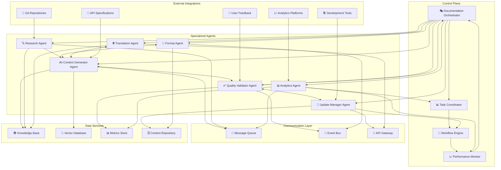

---

## 🔄 Agent Interaction Patterns

### 🎯 Sequential Processing

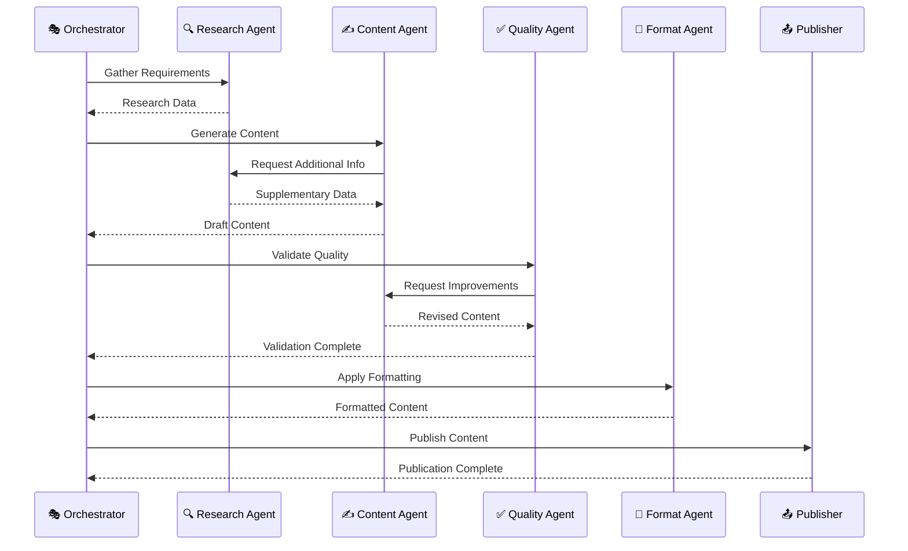

### 🔄 Parallel Processing

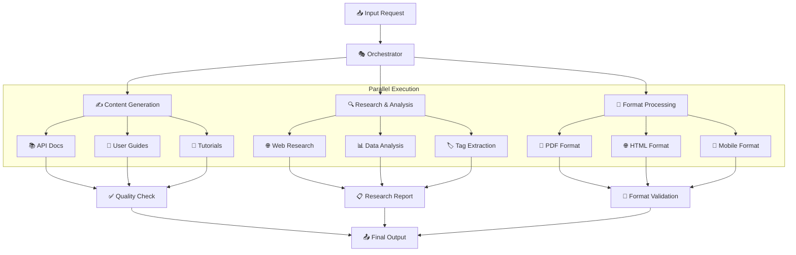

### 🧠 Collaborative Problem Solving

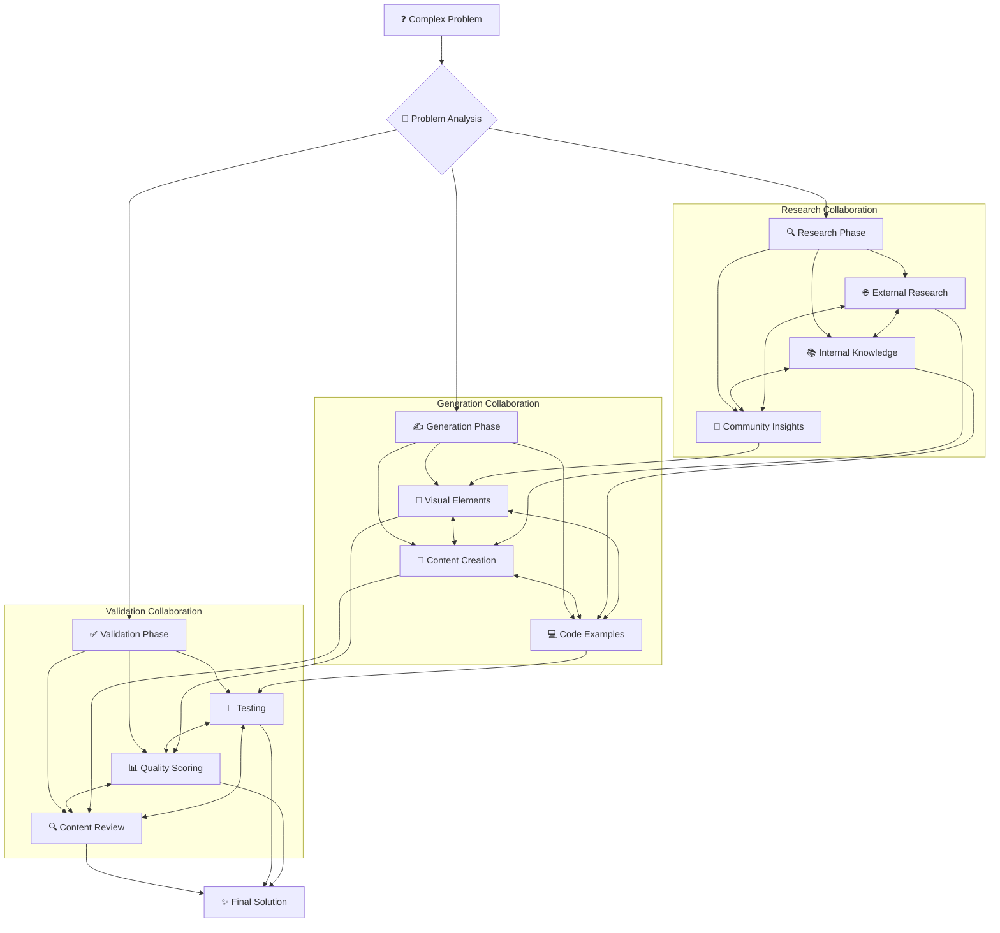

---

## 🎯 Agent Specialization Matrix

### 📊 Agent Capabilities

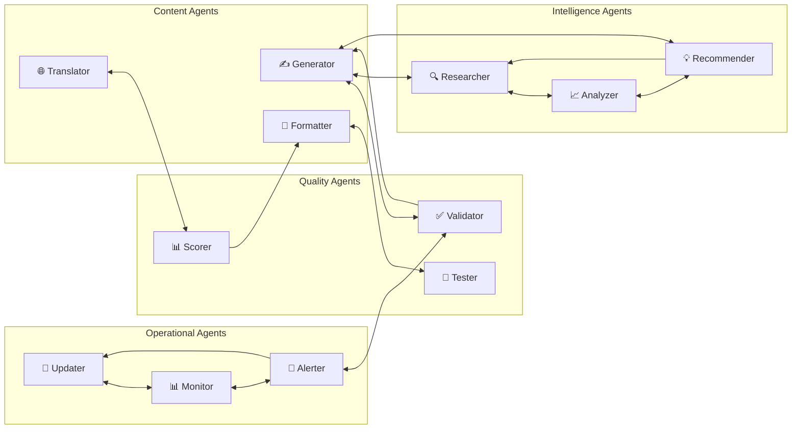

### 🏗️ Agent Technology Stack

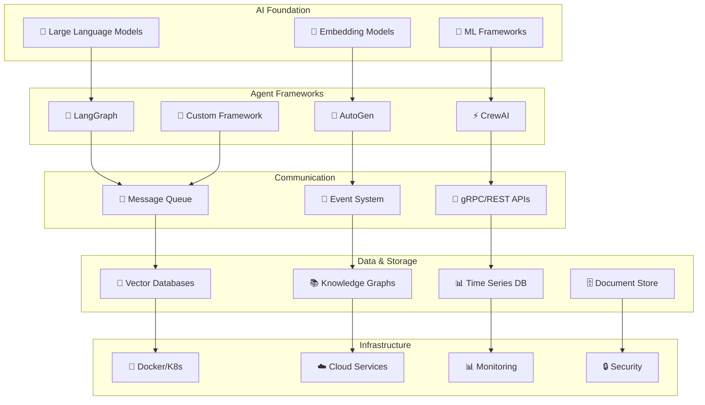

---

## 🔄 Agent Lifecycle Management

### 📅 Agent Deployment Pipeline

```mermaid
flowchart LR
    subgraph "Development"
        A[💻 Code Development]
        B[🧪 Local Testing]
        C[📋 Code Review]
    end
    
    subgraph "Testing"
        D[🔍 Unit Tests]
        E[🔗 Integration Tests]
        F[📊 Performance Tests]
    end
    
    subgraph "Staging"
        G[🎯 Staging Deploy]
        H[✅ Validation Tests]
        I[👥 User Acceptance]
    end
    
    subgraph "Production"
        J[🚀 Production Deploy]
        K[📊 Monitoring]
        L[🔄 Health Checks]
    end
    
    A --> B
    B --> C
    C --> D
    
    D --> E
    E --> F
    F --> G
    
    G --> H
    H --> I
    I --> J
    
    J --> K
    K --> L
    L --> M[🔄 Feedback Loop]
    
    M --> A
```

### 🎛️ Agent Configuration Management

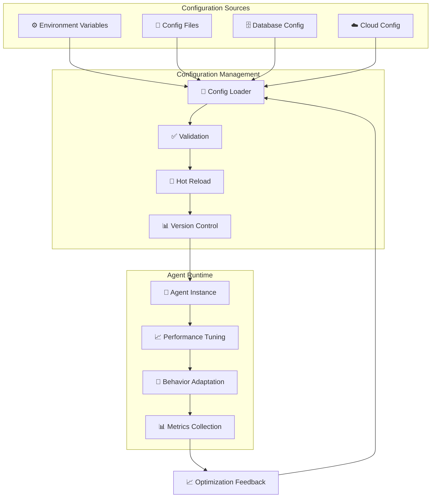

---

## 📊 Performance and Scaling

### ⚡ Horizontal Scaling Pattern

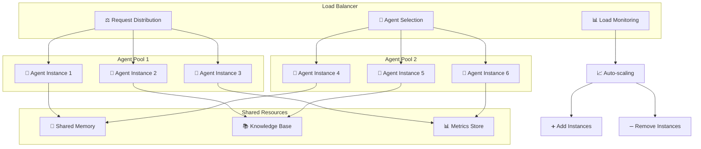

### 🔄 Fault Tolerance and Recovery

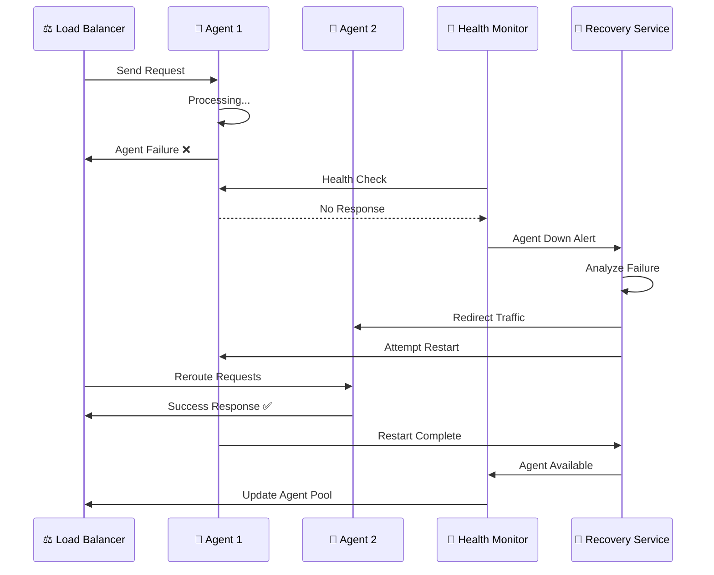

---

## 🧠 Learning and Adaptation

### 📈 Continuous Learning Loop

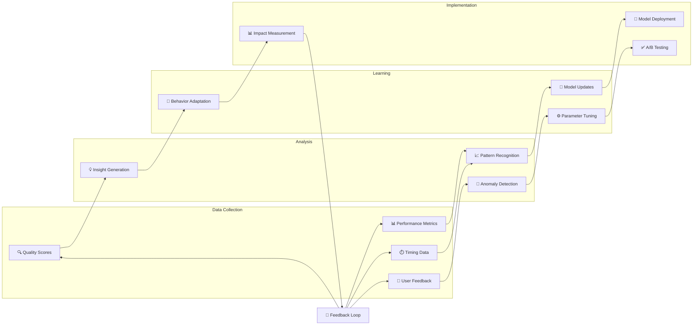

### 🎯 Adaptive Behavior System

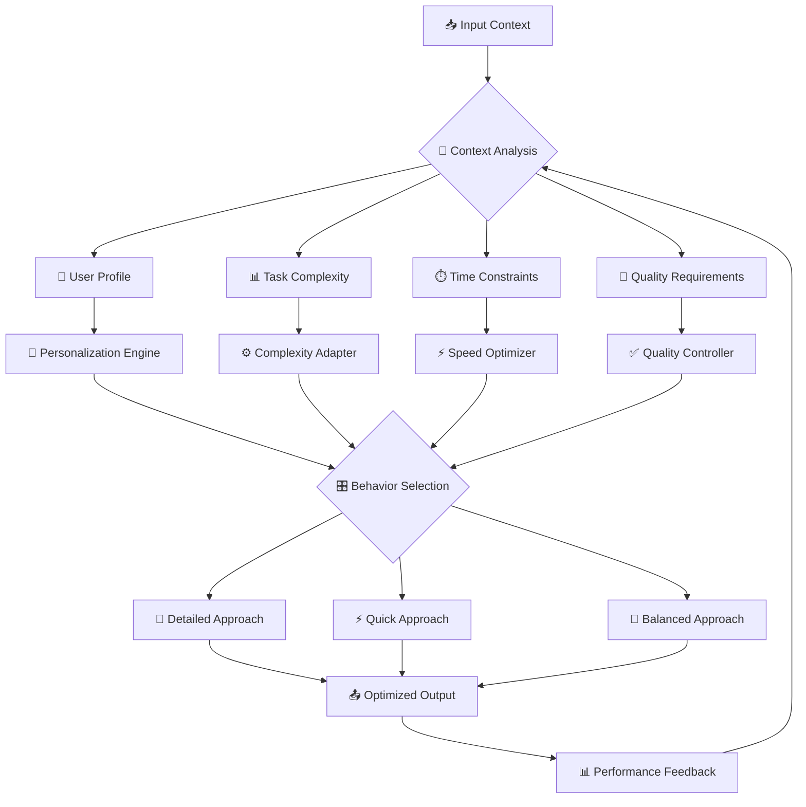

---

## 🚀 Future Evolution

### 🔮 Advanced Agent Capabilities

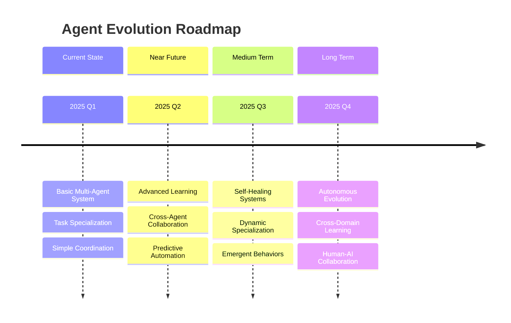

---

## 🔗 Relacionado

- [[🏗️ Componentes Doc 4.0]]
- [[🤖 Agentes IA para Automação]]
- [[🔍 RAG - Retrieval-Augmented Generation]]
- [[📊 Pipeline de Qualidade]]

---

#agentes #arquitetura #multi-agent #automacao #coordenacao #especializacao #campus-party

*Arquitetura de agentes: Orquestrando inteligência distribuída* 🤖
