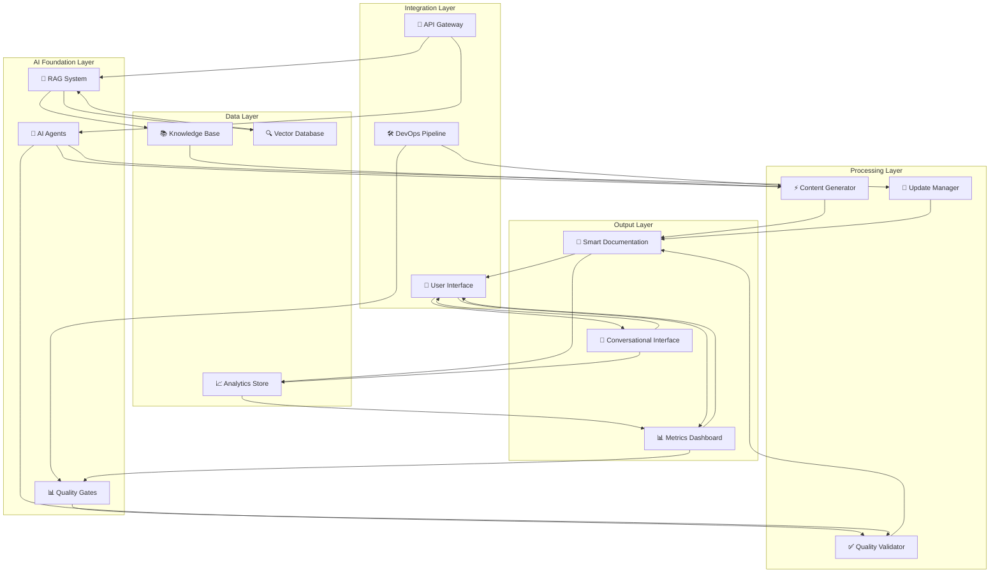
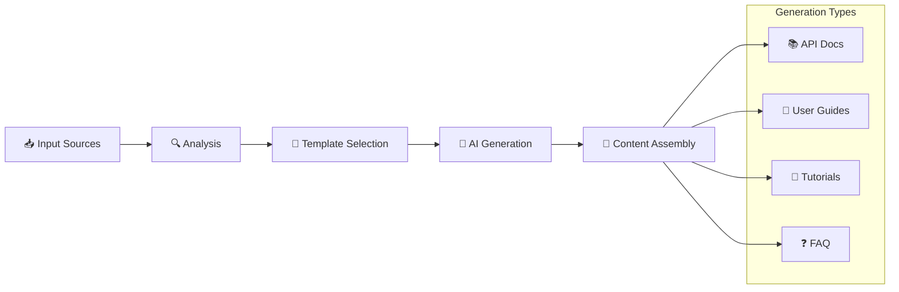
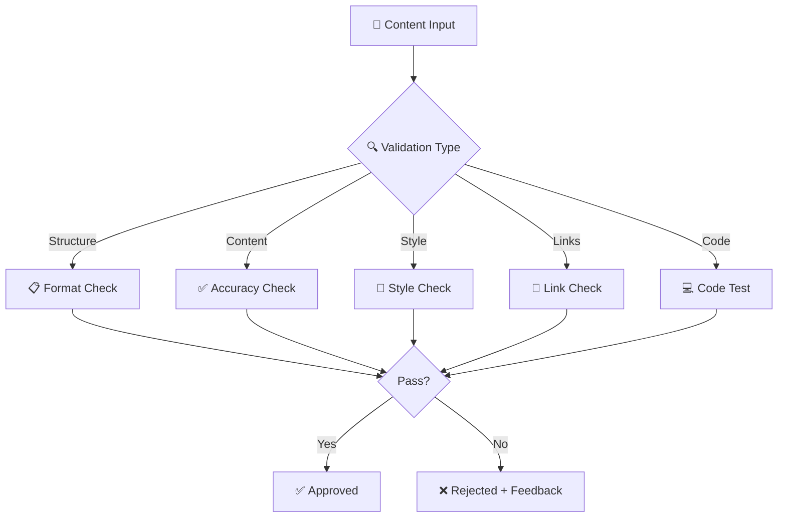
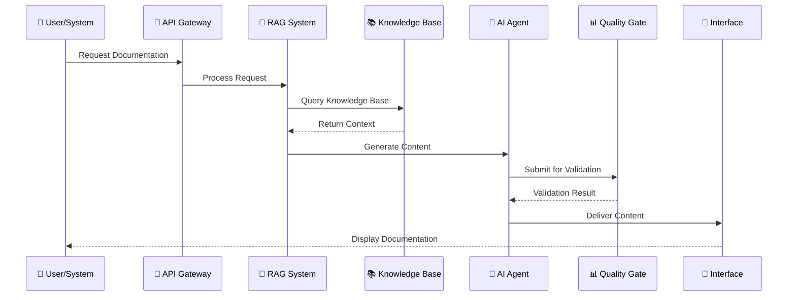
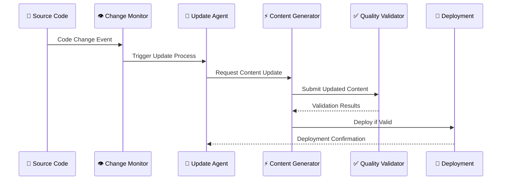
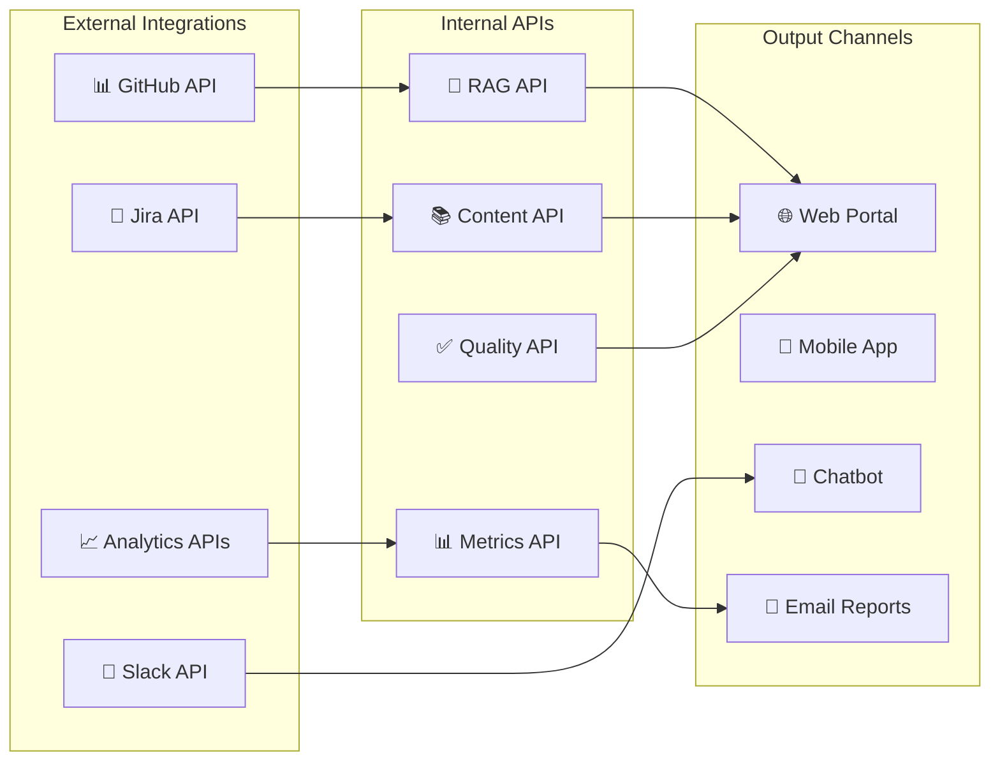

# 🏗️ Componentes Doc 4.0

> Diagrama arquitetural dos componentes fundamentais da Documentação 4.0

---

## 📊 Visão Geral dos Componentes

Este diagrama mostra como os diferentes componentes da Documentação 4.0 se interconectam para formar um sistema inteligente e automatizado.

### 🎯 Componentes Core



---

## 🔧 Detalhamento dos Componentes

### 🤖 AI Foundation Layer

#### RAG System
- **Função**: Recuperação e geração contextual
- **Tecnologias**: LangChain, OpenAI, Pinecone
- **Input**: Queries de usuários
- **Output**: Respostas contextualizadas

#### AI Agents  
- **Função**: Automação especializada
- **Tecnologias**: LangGraph, AutoGen, CrewAI
- **Input**: Tarefas complexas
- **Output**: Execução automatizada

#### Quality Gates
- **Função**: Validação e controle de qualidade
- **Tecnologias**: Vale, Playwright, Custom validators
- **Input**: Conteúdo gerado
- **Output**: Aprovação/Rejeição + Feedback

### 💾 Data Layer

#### Knowledge Base
```yaml
knowledge_base:
  types:
    - documentation_markdown
    - api_specifications
    - code_examples
    - user_feedback
    - analytics_data
  
  structure:
    - hierarchical_taxonomy
    - semantic_relationships
    - temporal_versioning
    - access_controls
```

#### Vector Database
```python
# Configuração típica do Vector DB
vector_config = {
    "dimension": 1536,  # OpenAI ada-002
    "metric": "cosine",
    "replicas": 2,
    "pods": 1,
    "metadata_fields": [
        "source", "type", "last_updated", 
        "complexity", "audience", "tags"
    ]
}
```

#### Analytics Store
- **Métricas de Uso**: Page views, search queries, time on page
- **Métricas de Qualidade**: Accuracy, consistency, completeness
- **Métricas de Performance**: Response time, availability, errors

### ⚙️ Processing Layer

#### Content Generator


#### Quality Validator


#### Update Manager
- **Change Detection**: Monitor source changes
- **Impact Analysis**: Assess documentation impact
- **Automatic Updates**: Trigger content regeneration
- **Version Control**: Manage document versions

---

## 🔄 Fluxos de Dados

### 📊 Fluxo Principal de Geração



### 🔄 Fluxo de Atualização Automática



---

## 🛠️ Tecnologias por Componente

### 🤖 AI/ML Stack
```yaml
ai_technologies:
  llm_providers:
    - openai: "gpt-4, gpt-3.5-turbo"
    - anthropic: "claude-3"
    - open_source: "llama-2, mistral-7b"
  
  frameworks:
    - langchain: "RAG orchestration"
    - llamaindex: "Data indexing"
    - haystack: "NLP pipelines"
  
  vector_databases:
    - pinecone: "Managed vector DB"
    - weaviate: "Open source vector DB"
    - chromadb: "Lightweight vector DB"
```

### 🔧 Infrastructure Stack
```yaml
infrastructure:
  containers:
    - docker: "Application packaging"
    - kubernetes: "Container orchestration"
  
  ci_cd:
    - github_actions: "Automation workflows"
    - gitlab_ci: "Alternative CI/CD"
    - jenkins: "Enterprise CI/CD"
  
  monitoring:
    - prometheus: "Metrics collection"
    - grafana: "Visualization"
    - datadog: "APM and monitoring"
```

### 📊 Data & Analytics
```yaml
data_stack:
  databases:
    - postgresql: "Structured data"
    - mongodb: "Document storage"
    - redis: "Caching layer"
  
  analytics:
    - google_analytics: "User behavior"
    - mixpanel: "Product analytics"
    - custom_telemetry: "System metrics"
```

---

## 📈 Métricas de Performance

### ⚡ Performance Targets
```yaml
performance_metrics:
  response_time:
    rag_query: "< 2 seconds"
    content_generation: "< 30 seconds"
    bulk_update: "< 5 minutes"
  
  throughput:
    concurrent_users: "1000+"
    queries_per_second: "100+"
    documents_processed: "10k+ per hour"
  
  availability:
    uptime: "99.9%"
    error_rate: "< 0.1%"
    recovery_time: "< 5 minutes"
```

### 📊 Quality Metrics
```yaml
quality_metrics:
  accuracy:
    information_correctness: "95%+"
    link_validity: "99%+"
    code_example_success: "90%+"
  
  consistency:
    style_compliance: "98%+"
    terminology_adherence: "95%+"
    format_uniformity: "99%+"
  
  completeness:
    api_coverage: "90%+"
    use_case_coverage: "85%+"
    example_availability: "80%+"
```

---

## 🔄 Integração e Extensibilidade

### 🔌 APIs e Integrações


### 🔧 Pontos de Extensão
- **Custom Agents**: Desenvolver agentes especializados
- **Quality Rules**: Adicionar validadores customizados
- **Data Sources**: Integrar novas fontes de conhecimento
- **Output Formats**: Criar novos formatos de saída
- **Analytics**: Implementar métricas customizadas

---

## 🚀 Evolução da Arquitetura

### 📅 Roadmap Arquitetural

```mermaid
timeline
    title Evolução dos Componentes
    
    section Fase 1: Foundation
        Q1 2024 : Core RAG System
               : Basic AI Agents
               : Quality Gates v1
    
    section Fase 2: Enhancement  
        Q2 2024 : Advanced Analytics
               : Multi-format Output
               : Performance Optimization
    
    section Fase 3: Intelligence
        Q3 2024 : Predictive Updates
               : Personalization Engine
               : Advanced ML Models
    
    section Fase 4: Ecosystem
        Q4 2024 : Multi-tenant Support
               : External Integrations
               : Marketplace Extensions
```

---

## 🔗 Relacionado

- [[🔍 RAG - Retrieval-Augmented Generation]]
- [[🤖 Agentes IA para Automação]]
- [[📊 Pipeline de Qualidade]]
- [[🛠️ Stack Tecnológico]]

---

#arquitetura #componentes #sistema #documentacao-40 #rag #agentes #qualidade #campus-party

*Arquitetura sólida é a base de sistemas inteligentes* 🏗️
