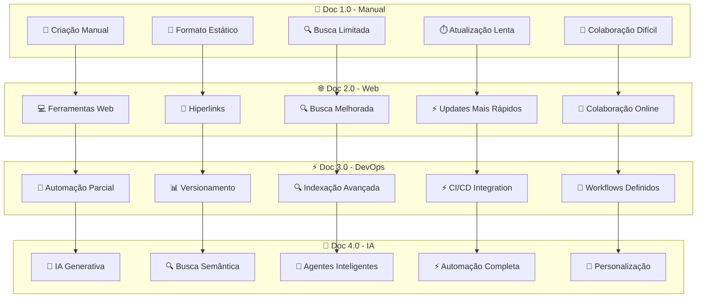
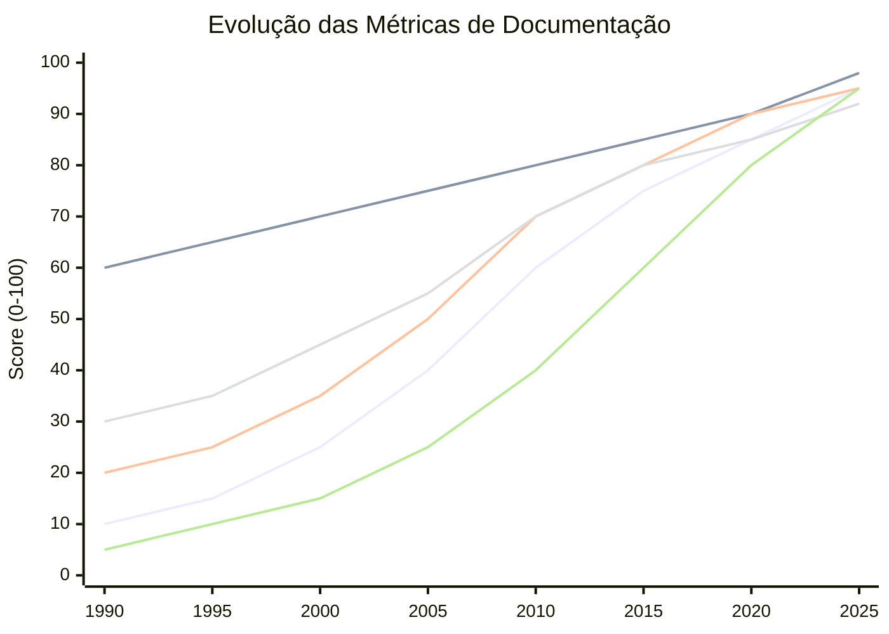
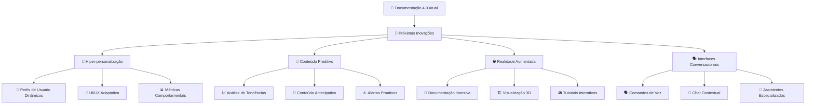

# 📈 Timeline da Evolução da Documentação

> Visualização da evolução histórica da documentação técnica até a era da IA

---

## 🕰️ Linha do Tempo Completa

```mermaid
timeline
    title Evolução da Documentação Técnica
    
    section 📝 Era Manual (1990-2005)
        1990 : Documentação em papel
             : Manuais impressos
             : Typewriters e Word processors
        1995 : Primeiros PDFs
             : Microsoft Word dominante
             : Fax para distribuição
        2000 : HTML básico
             : Primeiros sites corporativos
             : Email para compartilhamento
        2005 : Wikis corporativos
             : MediaWiki e TWiki
             : Colaboração básica
    
    section 🌐 Era Web (2005-2015)
        2005 : Confluence e SharePoint
             : CMS especializados
             : Versionamento básico
        2008 : Google Docs colaborativo
             : Real-time editing
             : Cloud storage
        2010 : Markdown adoption
             : GitHub documentation
             : Static site generators
        2012 : API documentation tools
             : Swagger/OpenAPI
             : Interactive docs
        2015 : Documentation as Code
             : GitBook e GitLab pages
             : CI/CD integration
    
    section ⚡ Era DevOps (2015-2020)
        2015 : Automated generation
             : Docs in version control
             : Pull request workflows
        2017 : Single source of truth
             : Microservices docs
             : Developer portals
        2018 : Design systems
             : Component libraries
             : Style guides automation
        2019 : Headless CMS
             : JAMstack adoption
             : Performance focus
        2020 : Remote-first documentation
             : Video integration
             : Async collaboration
    
    section 🤖 Era IA (2020-presente)
        2020 : AI writing assistants
             : GPT-3 early adoption
             : Grammar/style checking
        2022 : ChatGPT revolution
             : Conversational interfaces
             : Code explanation AI
        2023 : RAG implementations
             : Vector databases
             : Semantic search
        2024 : AI agents
             : Automated testing
             : Quality assurance AI
        2025 : Documentação 4.0
             : Full automation
             : Predictive content
```



---

## 📊 Comparativo de Características por Era



---

## 🎯 Marcos Tecnológicos Principais

```mermaid
gitgraph
    commit id: "1990: Paper Docs"
    commit id: "1995: PDF Format"
    commit id: "2000: HTML Websites"
    
    branch web-era
    commit id: "2005: Wikis & CMS"
    commit id: "2008: Google Docs"
    commit id: "2010: Markdown"
    
    branch devops-era
    commit id: "2015: Docs as Code"
    commit id: "2017: Developer Portals"
    commit id: "2019: JAMstack"
    
    branch ai-era
    commit id: "2020: AI Assistants"
    commit id: "2022: ChatGPT"
    commit id: "2023: RAG Systems"
    commit id: "2024: AI Agents"
    
    checkout main
    merge web-era
    merge devops-era
    merge ai-era
    commit id: "2025: Doc 4.0"
```

---

## 📈 Métricas de Evolução



---

## 🔮 Tendências Futuras



---

## 🏆 Impacto por Era

| Aspecto | Doc 1.0 | Doc 2.0 | Doc 3.0 | Doc 4.0 |
|---------|---------|---------|---------|---------|
| **⏱️ Tempo de Criação** | Semanas | Dias | Horas | Minutos |
| **🎯 Precisão** | 70% | 80% | 90% | 95%+ |
| **🔍 Findabilidade** | Baixa | Média | Alta | Excelente |
| **👥 Colaboração** | Difícil | Possível | Fluida | Inteligente |
| **🔄 Atualização** | Manual | Semi-auto | Automática | Proativa |
| **💰 Custo** | Alto | Médio | Baixo | Muito Baixo |
| **📊 Analytics** | Nenhum | Básico | Avançado | Preditivo |

---

## 🔗 Relacionado

- [[📚 Documentação 4.0 - Definição]]
- [[🤖 Agentes IA para Automação]]
- [[🔍 RAG - Retrieval-Augmented Generation]]
- [[🛠️ Stack Tecnológico]]

---

#evolucao #timeline #historia #documentacao #ia #transformacao #campus-party

*Da máquina de escrever à IA: 35 anos de evolução documentacional* 📈