# 🚀 Diagrama de Implementação e Deployment

> Visualização completa da arquitetura de deployment e implementação em produção

---

## 🏗️ Arquitetura de Deployment Completa

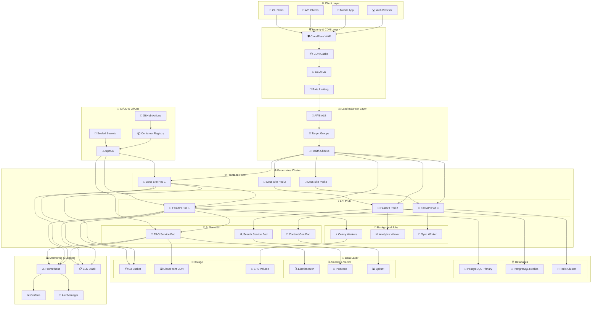

---

## 🏢 Ambientes de Deployment

### 🧪 Development Environment

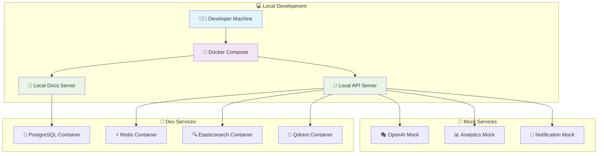

### 🔬 Staging Environment

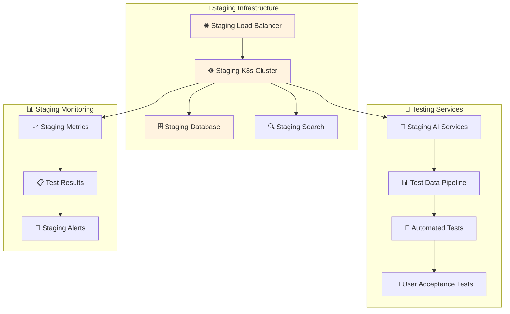

### 🚀 Production Environment

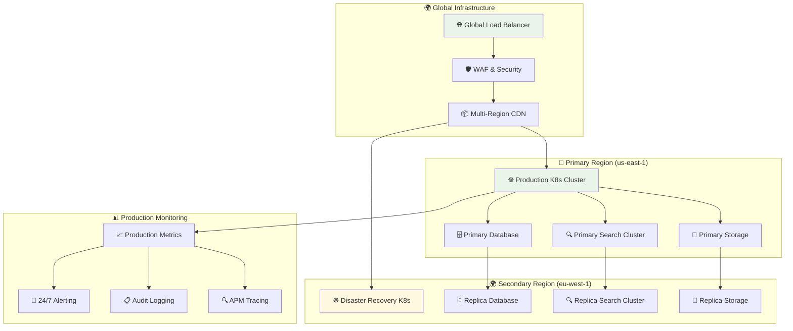

---

## 🔄 Deployment Strategies

### 🟢 Blue-Green Deployment

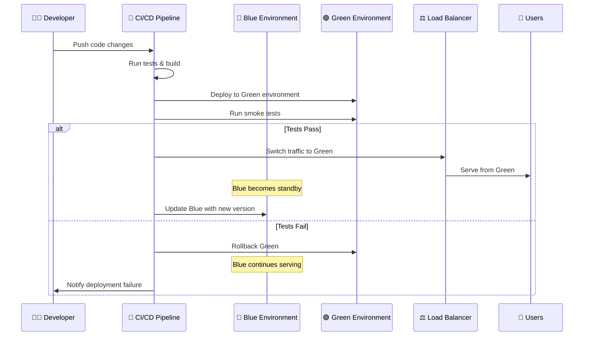

### 🌊 Rolling Deployment

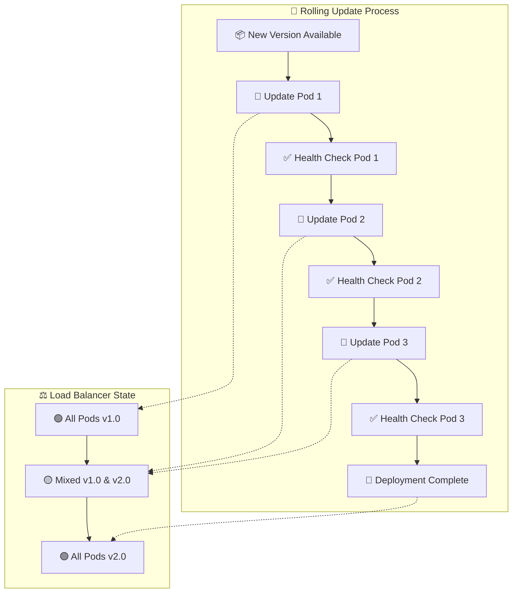

### 🎯 Canary Deployment

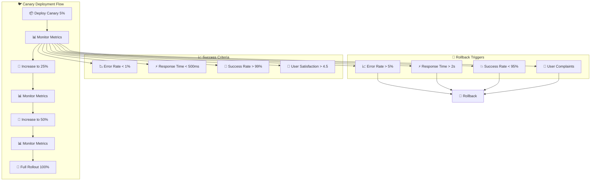

---

## 🛡️ Security Implementation

### 🔐 Security Layers

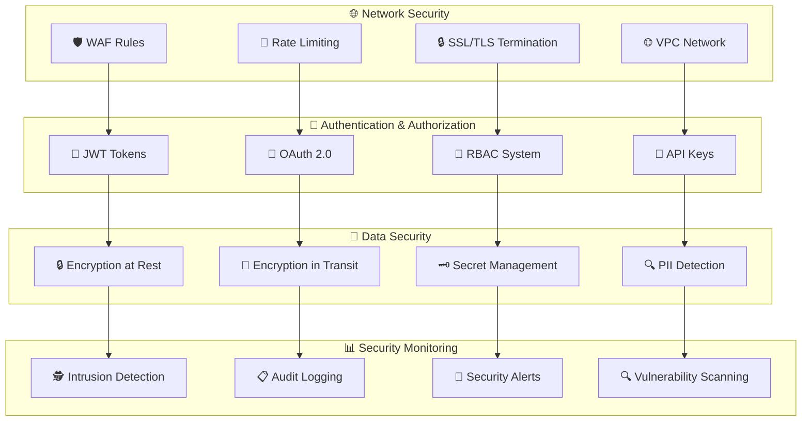

### 🔒 Secrets Management

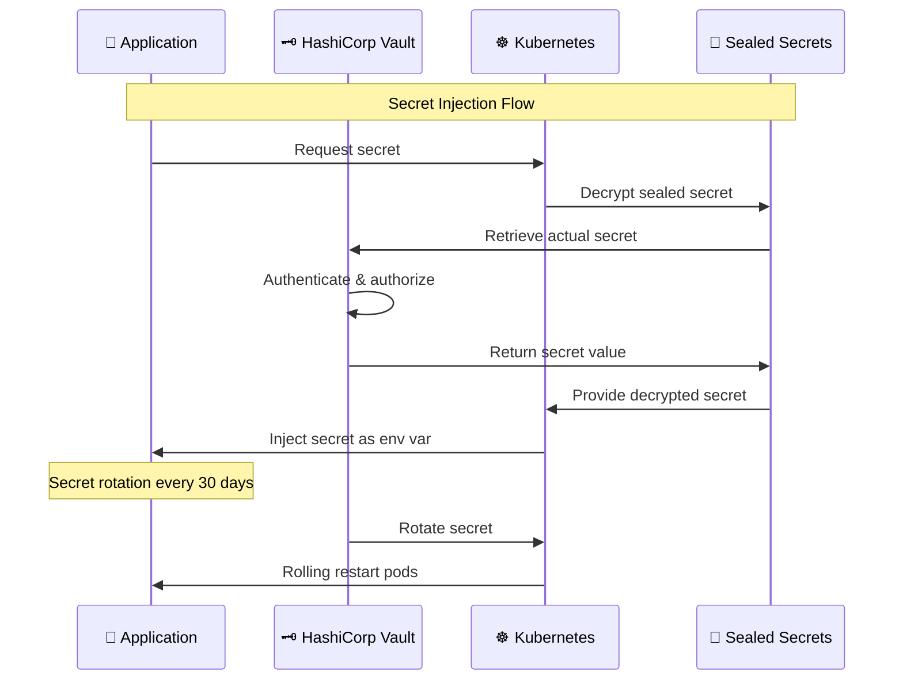

---

## 📊 Monitoring & Observability

### 📈 Monitoring Stack

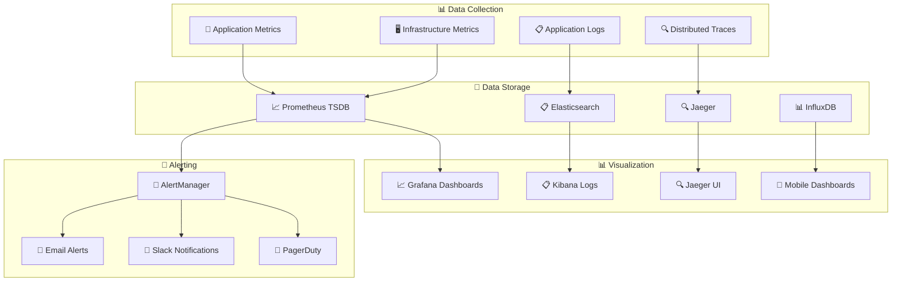

### 🎯 Key Metrics Dashboard

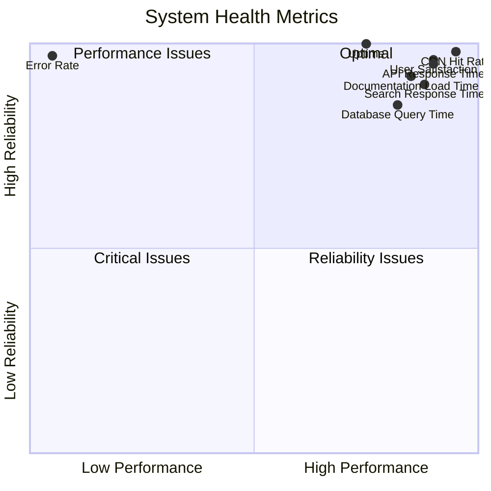

---

## 🚀 Scaling Strategy

### 📊 Auto-Scaling Configuration

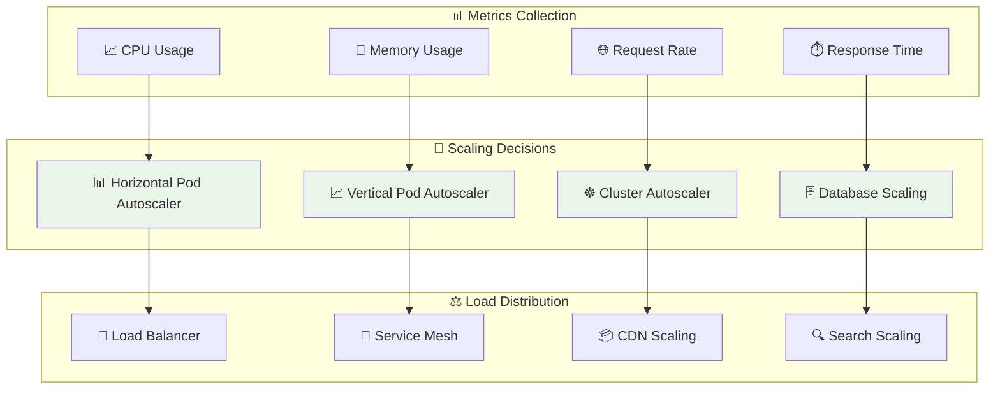

### 📈 Scaling Thresholds

```yaml
scaling_configuration:
  horizontal_pod_autoscaler:
    min_replicas: 3
    max_replicas: 50
    target_cpu_utilization: 70
    target_memory_utilization: 80
    scale_up_stabilization: 60s
    scale_down_stabilization: 300s
    
  vertical_pod_autoscaler:
    update_mode: "Auto"
    resource_policy:
      cpu:
        min: "100m"
        max: "2"
      memory:
        min: "128Mi"
        max: "4Gi"
        
  cluster_autoscaler:
    min_nodes: 3
    max_nodes: 100
    scale_down_delay: "10m"
    scale_down_utilization_threshold: 0.5
    
  database_scaling:
    read_replicas:
      min: 2
      max: 10
      cpu_threshold: 80
    connection_pooling:
      max_connections: 1000
      pool_size: 20
```

---

## 🔄 Disaster Recovery

### 💾 Backup Strategy

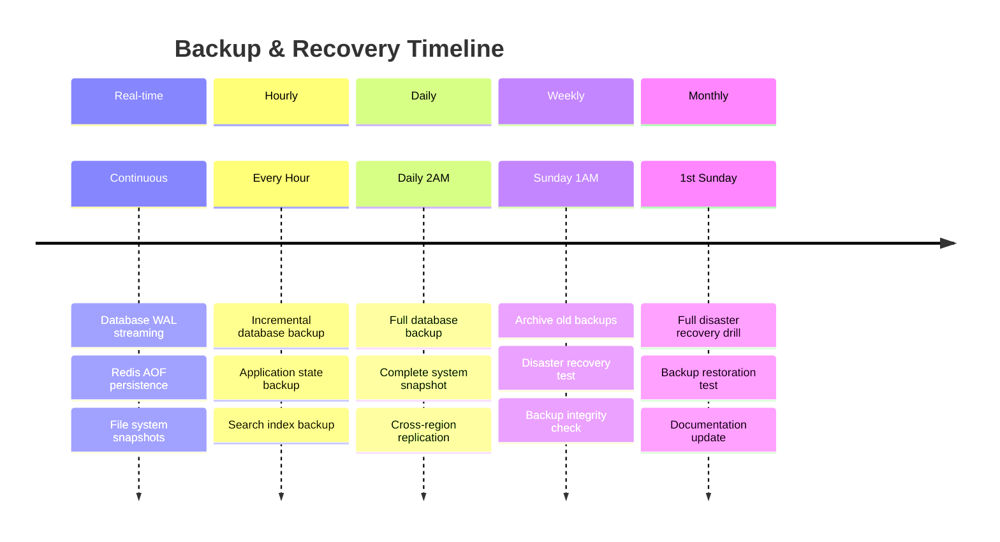

### 🚨 Incident Response

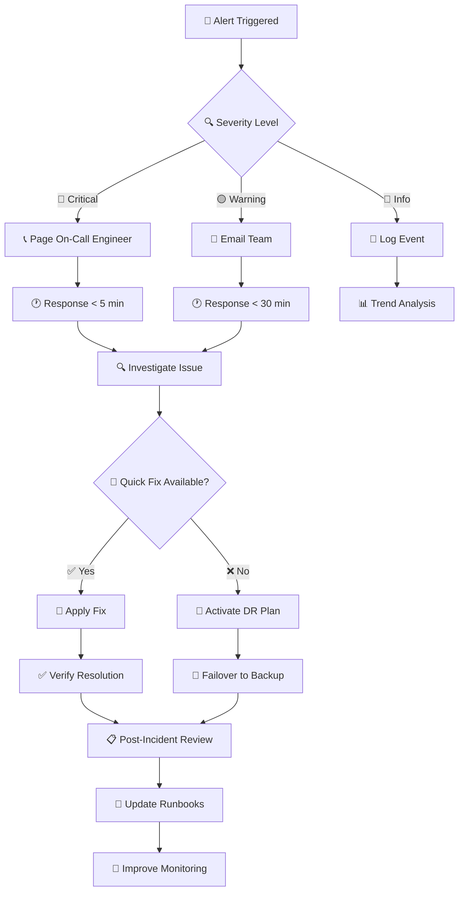

---

## 🔗 Relacionado

- [[🔄 CI/CD Pipeline]]
- [[🛠️ Stack Tecnológico]]
- [[📊 Monitoramento e Analytics]]
- [[🔒 Segurança e Compliance]]

---

#deployment #infrastructure #kubernetes #monitoring #security #scaling #disaster-recovery #campus-party

*Implementação robusta: Da arquitetura à produção com alta disponibilidade* 🚀