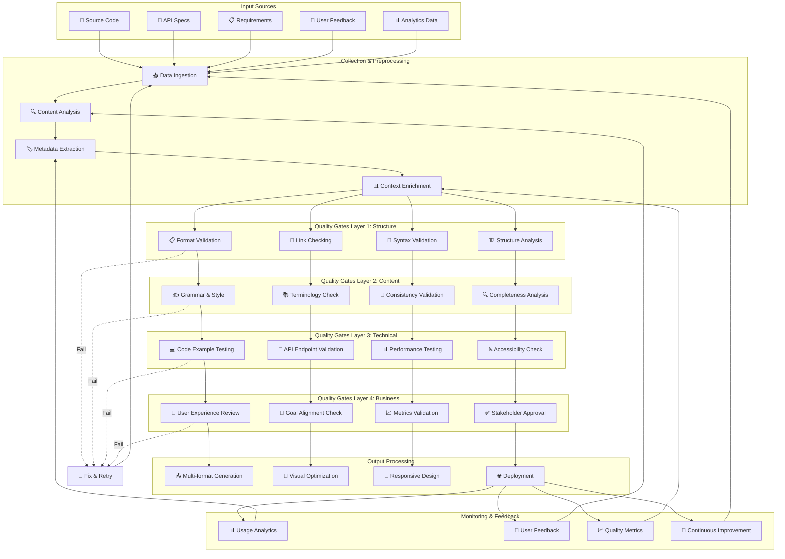
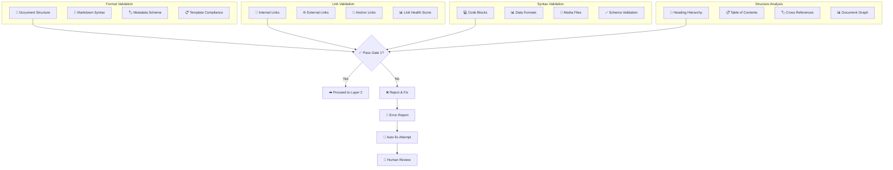
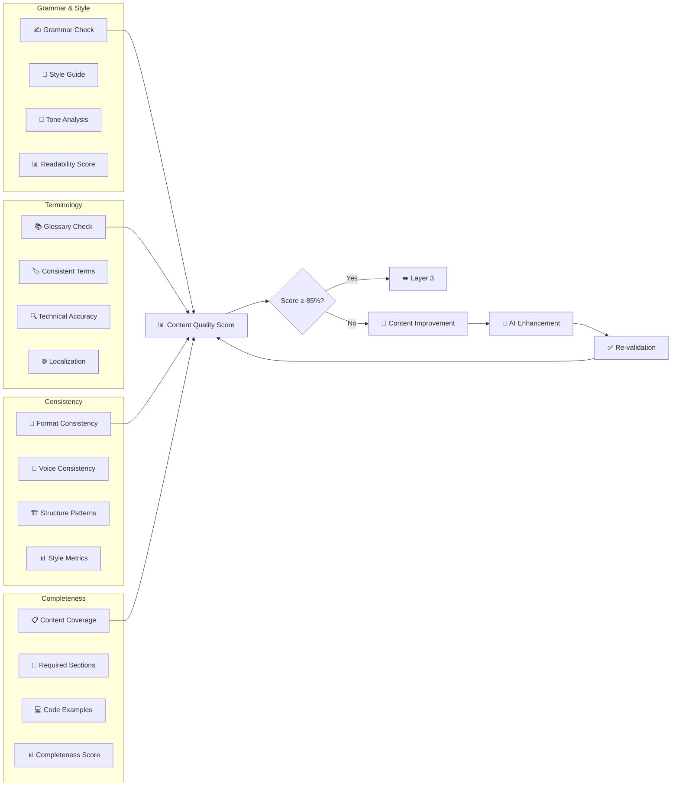
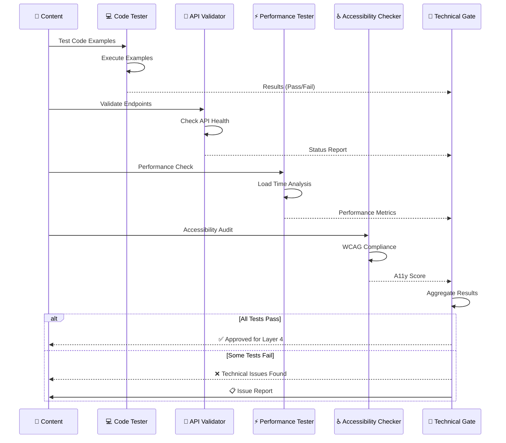
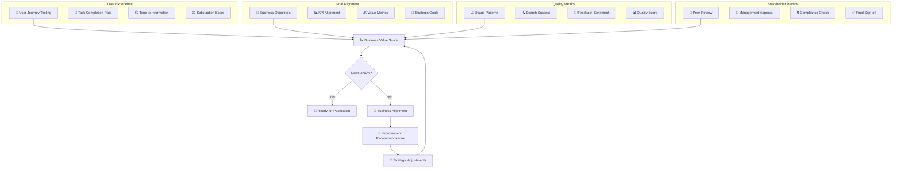
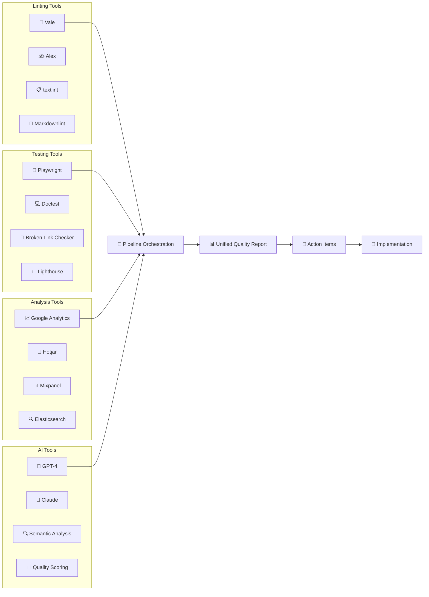
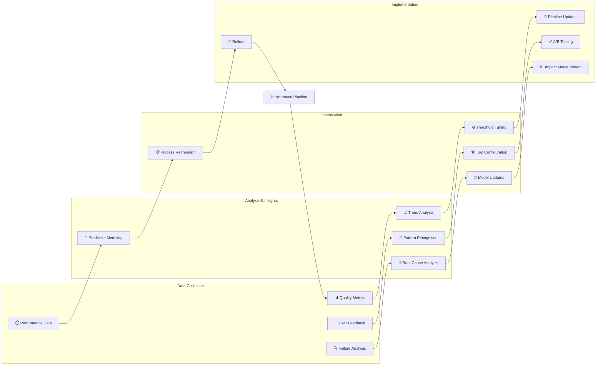
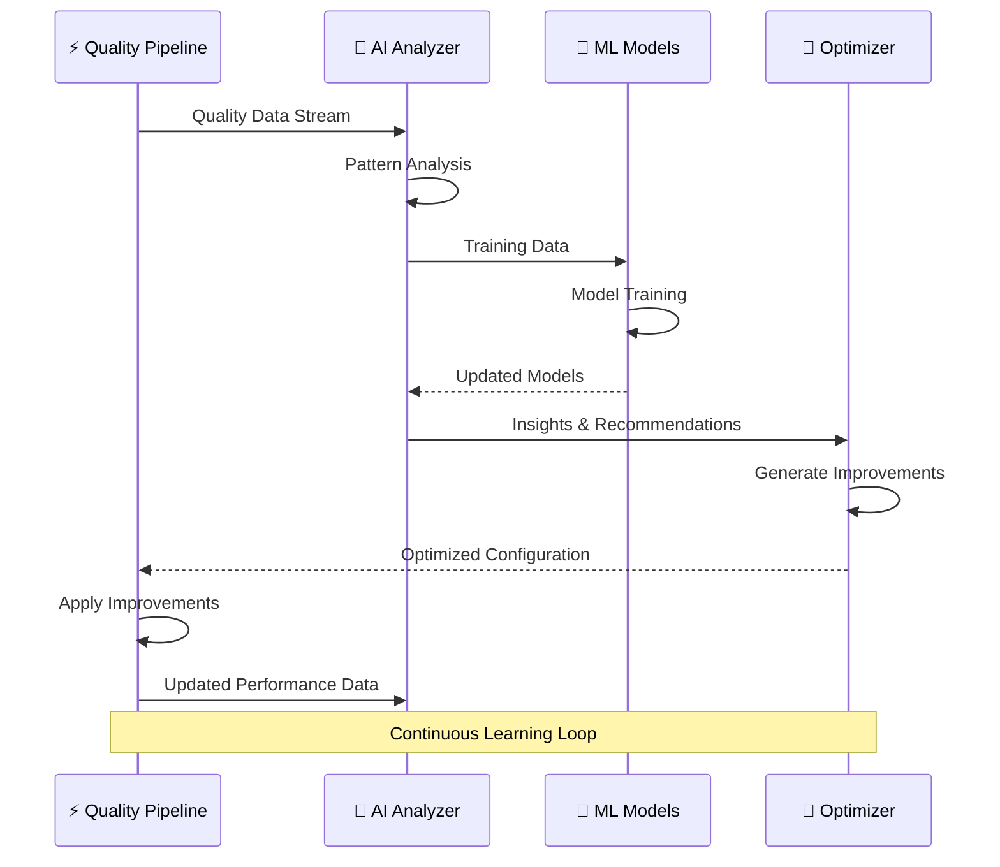

# ⚡ Pipeline de Qualidade

> Diagrama do pipeline automatizado de qualidade para documentação

---

## 📊 Visão Geral do Pipeline

Este diagrama mostra o fluxo completo do pipeline de qualidade, desde a entrada de conteúdo até a publicação final, com todos os gates de validação.

### 🔄 Complete Quality Pipeline



---

## 🎯 Detailed Gate Specifications

### 🏗️ Layer 1: Structure Gates



### 📝 Layer 2: Content Gates



### 🧪 Layer 3: Technical Gates



### 👤 Layer 4: Business Gates



---

## 🔧 Quality Tools Integration

### 🛠️ Tool Stack Pipeline



### ⚙️ Configuration Management

```yaml
# Pipeline Configuration
quality_pipeline:
  gates:
    layer_1_structure:
      weight: 0.20
      threshold: 90
      tools:
        - vale
        - markdownlint
        - link-checker
      
    layer_2_content:
      weight: 0.30
      threshold: 85
      tools:
        - grammar-check
        - terminology-validator
        - consistency-analyzer
        
    layer_3_technical:
      weight: 0.30
      threshold: 95
      tools:
        - code-tester
        - api-validator
        - performance-tester
        
    layer_4_business:
      weight: 0.20
      threshold: 90
      tools:
        - ux-analyzer
        - goal-alignment
        - stakeholder-review

  automation:
    auto_fix: true
    retry_attempts: 3
    escalation_threshold: 2
    
  reporting:
    format: ["json", "html", "pdf"]
    stakeholders: ["dev-team", "content-team", "management"]
    frequency: "per-commit"
```

---

## 📊 Quality Metrics Dashboard

### 📈 Real-time Quality Monitoring

```mermaid
graph TB
    subgraph "Input Metrics"
        A[📥 Documents Processed]
        B[⏱️ Processing Time]
        C[🔄 Retry Rate]
        D[📊 Source Quality]
    end
    
    subgraph "Gate Metrics"
        E[✅ Pass Rate Layer 1]
        F[✅ Pass Rate Layer 2]
        G[✅ Pass Rate Layer 3]
        H[✅ Pass Rate Layer 4]
    end
    
    subgraph "Output Metrics"
        I[📤 Publications]
        J[📊 Quality Score]
        K[👤 User Satisfaction]
        L[🎯 Goal Achievement]
    end
    
    subgraph "Efficiency Metrics"
        M[⚡ Automation Rate]
        N[🔧 Manual Interventions]
        O[💰 Cost per Document]
        P[🚀 Time to Market]
    end
    
    A --> Q[📊 Pipeline Dashboard]
    E --> Q
    I --> Q
    M --> Q
    
    Q --> R[🔔 Alerts & Notifications]
    Q --> S[📈 Trend Analysis]
    Q --> T[💡 Optimization Suggestions]
```



### 🎯 Quality Score Calculation

```python
# Quality Score Algorithm
class QualityScorer:
    def __init__(self):
        self.weights = {
            'structure': 0.20,
            'content': 0.30,
            'technical': 0.30,
            'business': 0.20
        }
    
    def calculate_overall_score(self, gate_results):
        """Calcula score geral de qualidade"""
        
        weighted_scores = []
        
        for gate, weight in self.weights.items():
            gate_score = gate_results[gate]['score']
            weighted_score = gate_score * weight
            weighted_scores.append(weighted_score)
        
        overall_score = sum(weighted_scores)
        
        return {
            'overall_score': round(overall_score, 2),
            'grade': self.score_to_grade(overall_score),
            'breakdown': gate_results,
            'recommendations': self.generate_recommendations(gate_results)
        }
    
    def score_to_grade(self, score):
        """Converte score numérico em grade"""
        if score >= 95: return 'A+'
        elif score >= 90: return 'A'
        elif score >= 85: return 'B+'
        elif score >= 80: return 'B'
        elif score >= 75: return 'C+'
        elif score >= 70: return 'C'
        else: return 'F'
```

---

## 🔄 Continuous Improvement Loop

### 📊 Learning from Quality Data



### 🧠 AI-Powered Quality Enhancement



---

## 🚀 Implementation Roadmap

### 📅 Pipeline Evolution

```mermaid
timeline
    title Quality Pipeline Evolution
    
    section Phase 1: Foundation
        Month 1 : Basic Linting (Vale, Markdownlint)
               : Link Checking
               : Simple CI/CD Integration
    
    section Phase 2: Content Quality
        Month 2 : Grammar & Style Checking
               : Terminology Validation
               : Consistency Analysis
    
    section Phase 3: Technical Validation
        Month 3 : Code Example Testing
               : API Validation
               : Performance Testing
    
    section Phase 4: Business Intelligence
        Month 4 : UX Analysis
               : Goal Alignment
               : Stakeholder Workflows
    
    section Phase 5: AI Enhancement
        Month 5 : ML-powered Quality Scoring
               : Predictive Quality Analytics
               : Automated Optimization
```

---

## 🔗 Relacionado

- [[✅ Processo de Qualidade Automatizado]]
- [[🧪 Automação de Testes]]
- [[🤖 Agentes IA para Automação]]
- [[📊 ROI e Métricas de Sucesso]]

---

#pipeline #qualidade #automacao #testing #validacao #gates #metrics #campus-party

*Pipeline de qualidade: Onde excelência encontra automação* ⚡
