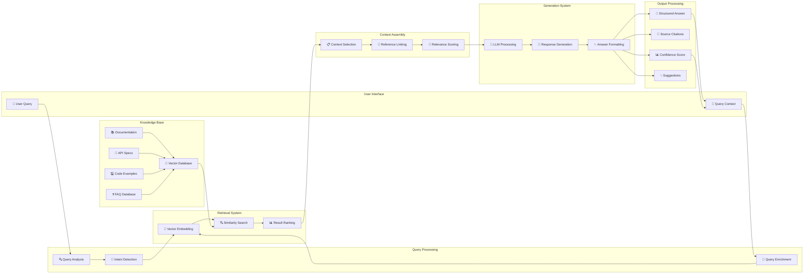
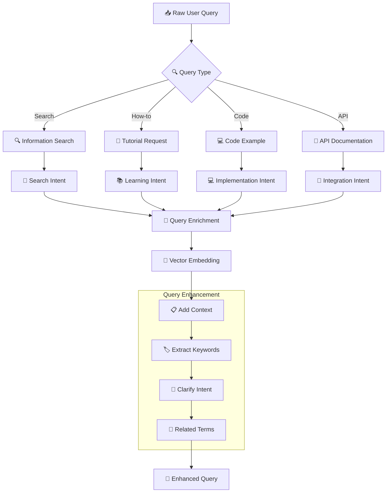
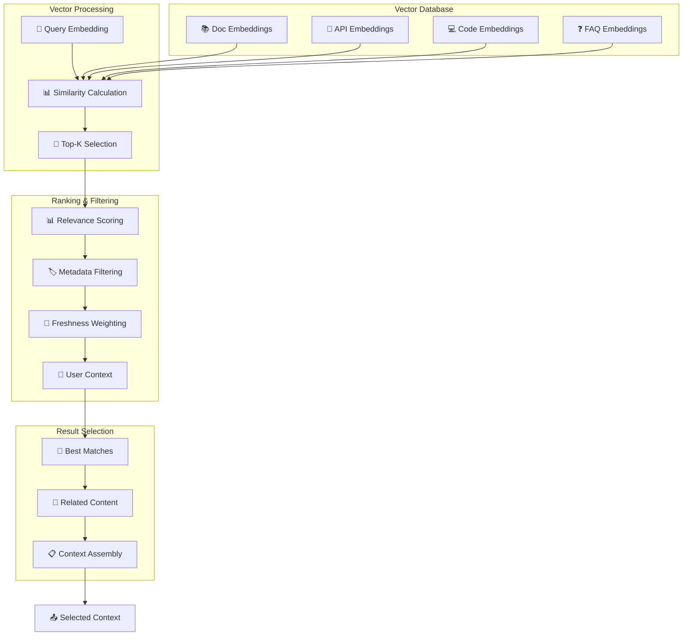
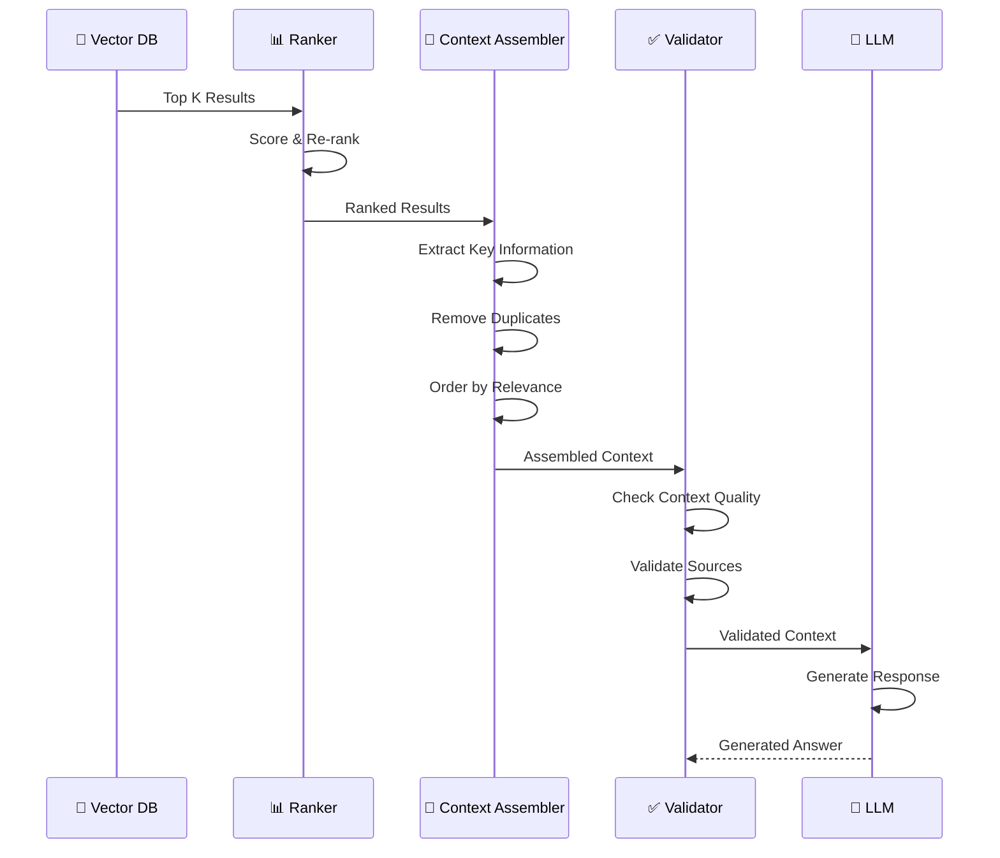
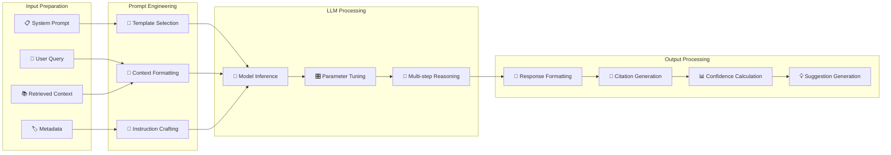
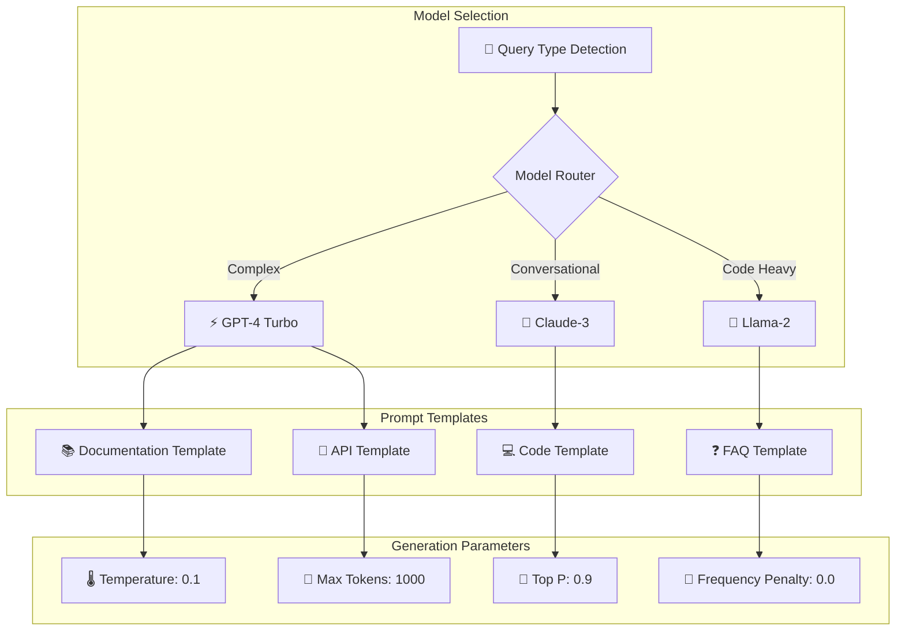
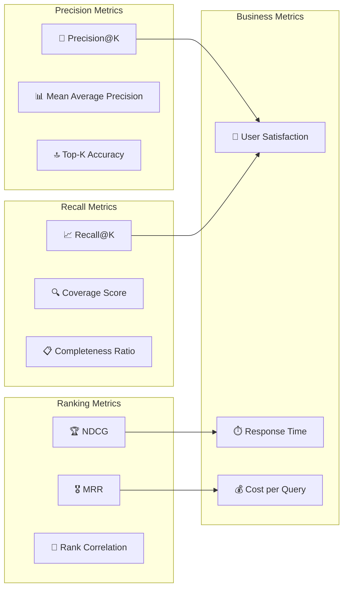
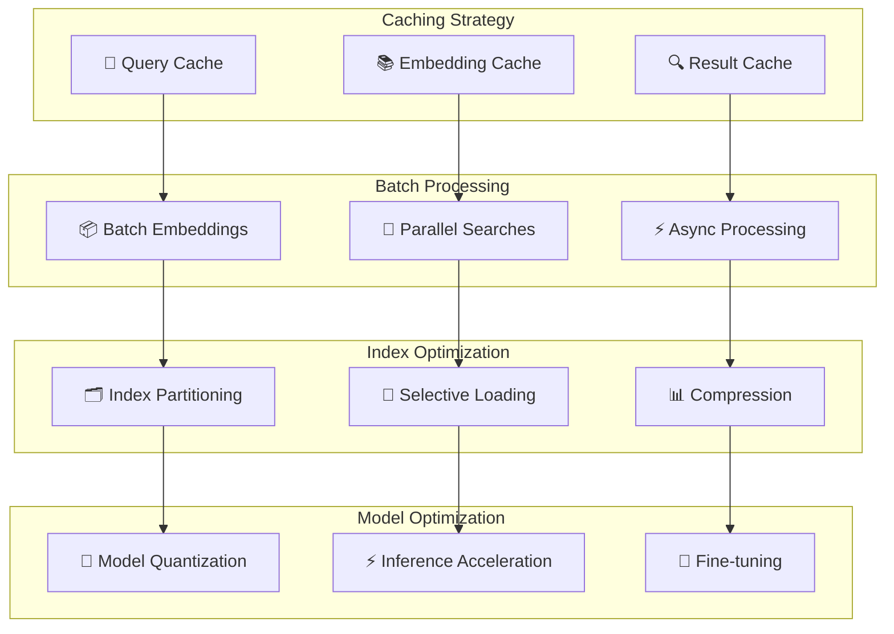
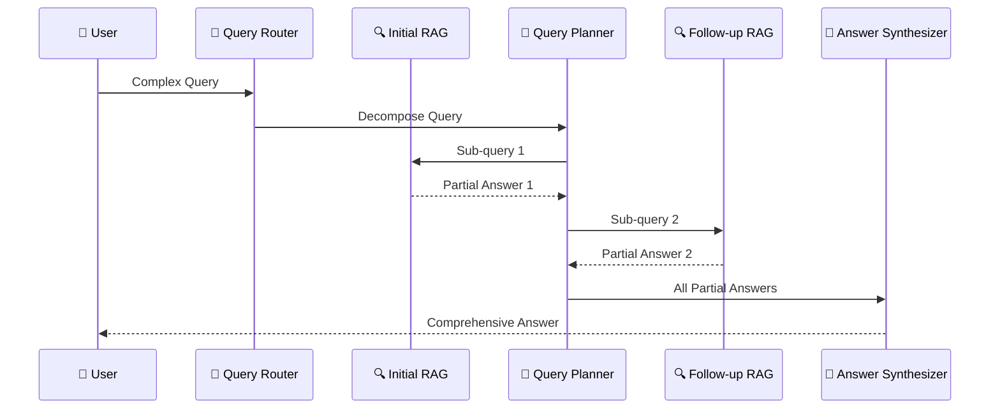
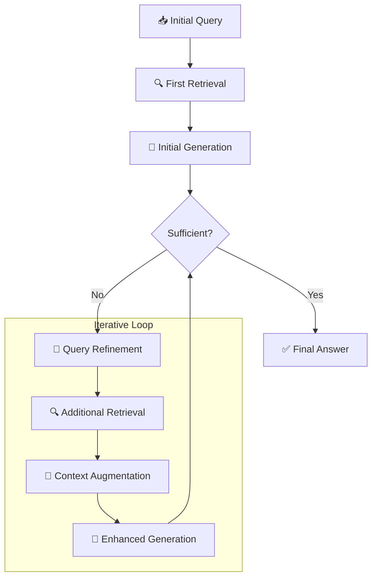

# 🔍 Arquitetura RAG

> Diagrama detalhado do sistema RAG (Retrieval-Augmented Generation) aplicado à documentação

---

## 📊 RAG Architecture Overview

Este diagrama mostra o fluxo completo do sistema RAG, desde a consulta do usuário até a resposta final contextualizada.

### 🔄 Fluxo Principal RAG



---

## 🔄 Processo Detalhado por Etapa

### 1️⃣ Query Processing Pipeline



### 2️⃣ Vector Search & Retrieval



### 3️⃣ Context Assembly & Augmentation



### 4️⃣ LLM Generation with Context



---

## 🛠️ Componentes Técnicos Detalhados

### 🔢 Embedding Strategy

```yaml
embedding_configuration:
  model: "text-embedding-ada-002"
  dimensions: 1536
  chunk_strategy:
    size: 1000
    overlap: 200
    separators: ["\n\n", "\n", ".", "!", "?"]
  
  preprocessing:
    - text_cleaning
    - markdown_parsing
    - code_extraction
    - metadata_enrichment
  
  optimization:
    - batch_processing: true
    - caching: true
    - async_processing: true
```

### 🔍 Search Configuration

```python
# Configuração de busca avançada
search_config = {
    "similarity_threshold": 0.75,
    "max_results": 10,
    "rerank_top_k": 5,
    
    "filters": {
        "document_type": ["api", "guide", "tutorial"],
        "last_updated": "within_6_months",
        "complexity_level": "user_appropriate"
    },
    
    "boosting": {
        "recent_content": 1.2,
        "high_quality": 1.5,
        "user_preferred": 1.3
    }
}
```

### 🤖 LLM Integration



---

## 📊 Métricas e Avaliação

### 🎯 Retrieval Metrics



### 📈 Quality Scoring

```python
# Sistema de scoring de qualidade
class RAGQualityScorer:
    def __init__(self):
        self.weights = {
            'relevance': 0.35,
            'accuracy': 0.30,
            'completeness': 0.20,
            'clarity': 0.15
        }
    
    def score_response(self, query, response, sources):
        scores = {
            'relevance': self.calculate_relevance(query, response),
            'accuracy': self.validate_accuracy(response, sources),
            'completeness': self.assess_completeness(query, response),
            'clarity': self.evaluate_clarity(response)
        }
        
        overall_score = sum(
            scores[metric] * weight 
            for metric, weight in self.weights.items()
        )
        
        return {
            'overall_score': round(overall_score, 2),
            'breakdown': scores,
            'confidence': self.calculate_confidence(scores),
            'recommendations': self.generate_improvements(scores)
        }
```

---

## 🔄 Otimização e Melhorias

### ⚡ Performance Optimization



### 🎯 Accuracy Improvements

```yaml
accuracy_strategies:
  hybrid_search:
    - semantic_similarity
    - keyword_matching
    - metadata_filtering
    - user_context
  
  reranking:
    - cross_encoder_reranking
    - diversity_penalty
    - freshness_boost
    - quality_signals
  
  validation:
    - fact_checking
    - source_verification
    - consistency_check
    - hallucination_detection
```

---

## 🔄 Advanced RAG Patterns

### 🧠 Multi-Step RAG



### 🔄 Iterative RAG



---

## 🚀 Próximos Passos

### 🎯 Implementação RAG Básica
1. **Setup Vector Database** (Pinecone/ChromaDB)
2. **Document Processing Pipeline**
3. **Basic RAG Chain** (LangChain)
4. **Quality Evaluation**

### 📈 Evolução RAG Avançada
1. **Multi-step RAG**
2. **Hybrid Search**
3. **Custom Reranking**
4. **Real-time Updates**

---

## 🔗 Relacionado

- [[🏗️ Componentes Doc 4.0]]
- [[🤖 Agentes IA para Automação]]
- [[🔧 Implementação RAG com Python]]
- [[📊 Pipeline de Qualidade]]

---

#rag #retrieval-augmented-generation #arquitetura #vector-search #llm #embeddings #campus-party

*RAG: A ponte entre conhecimento estruturado e inteligência generativa* 🔍
