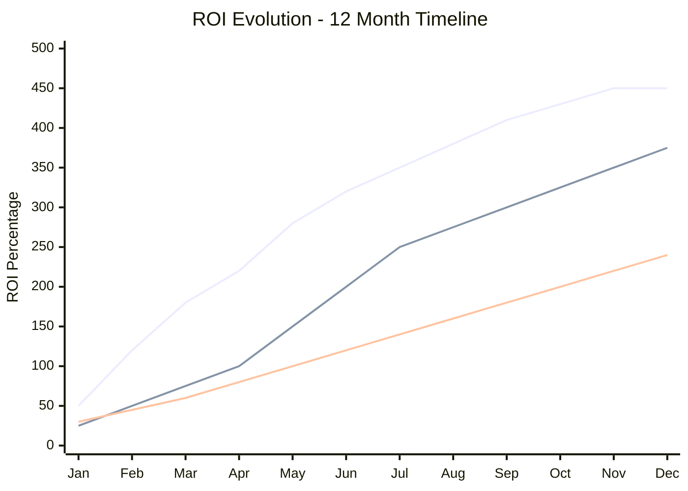
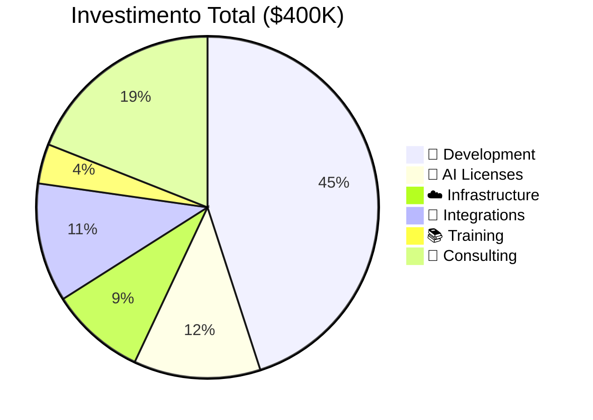
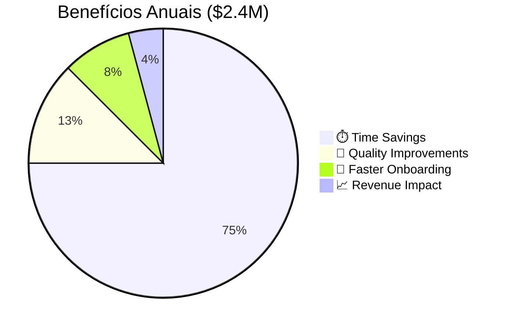
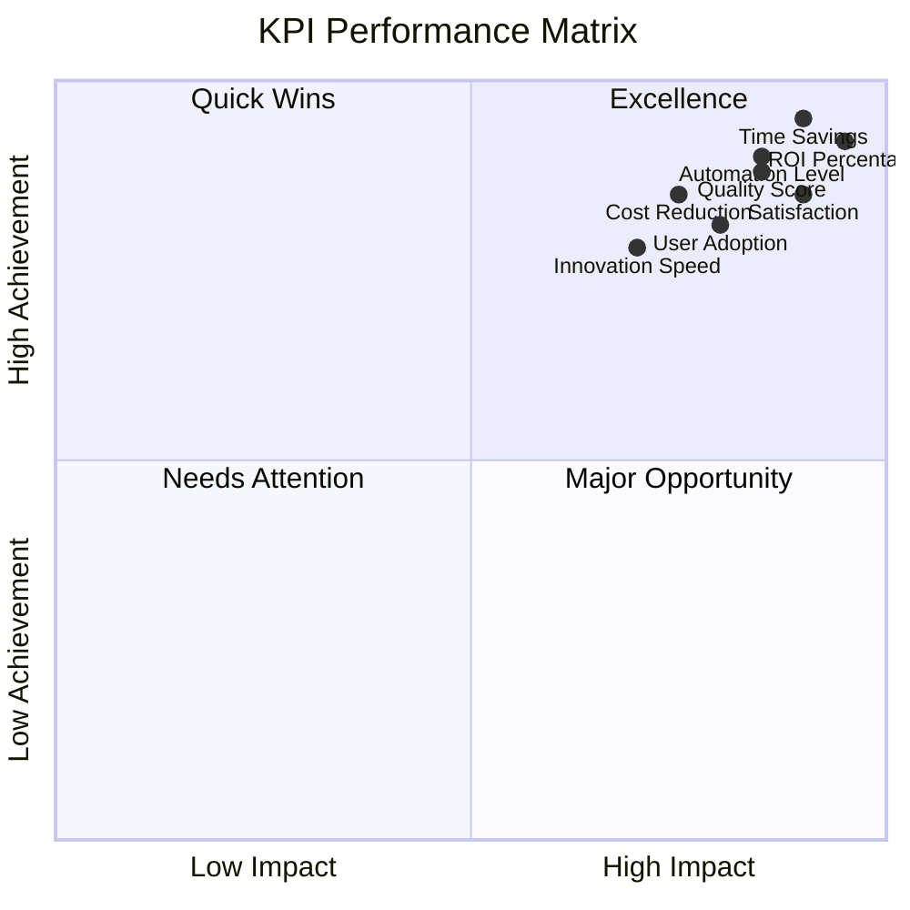
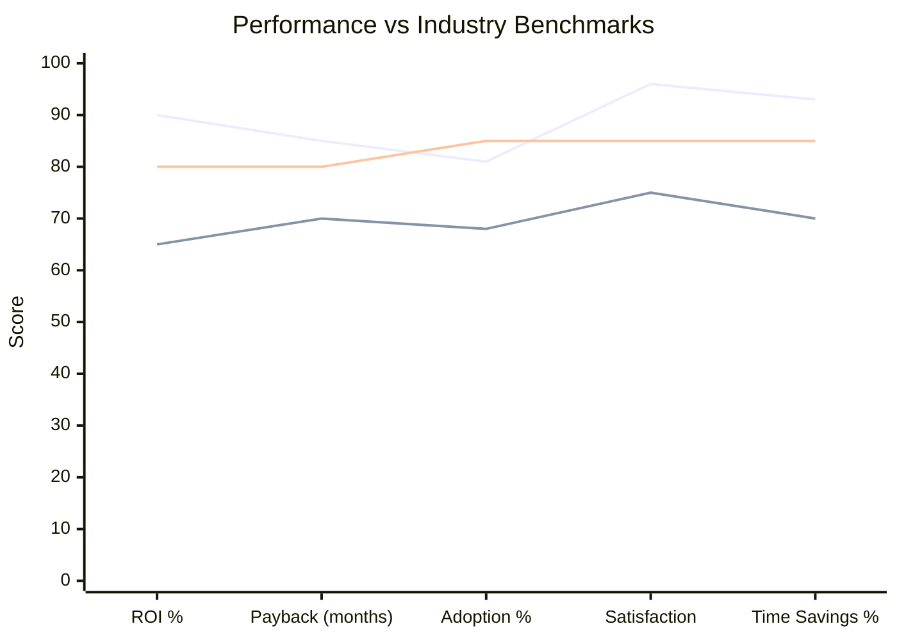
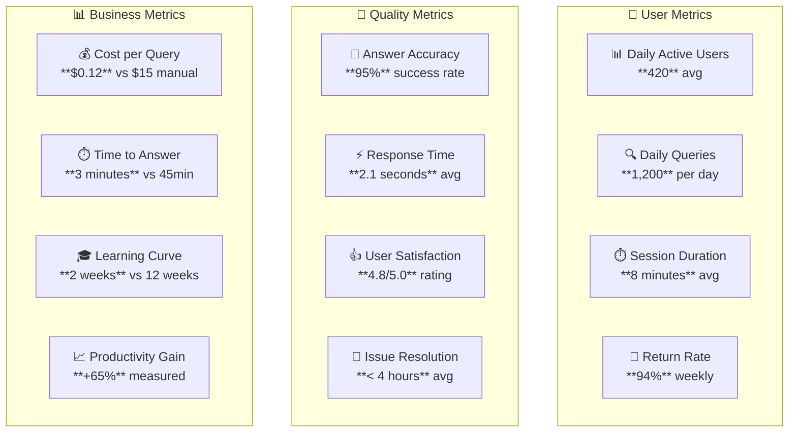
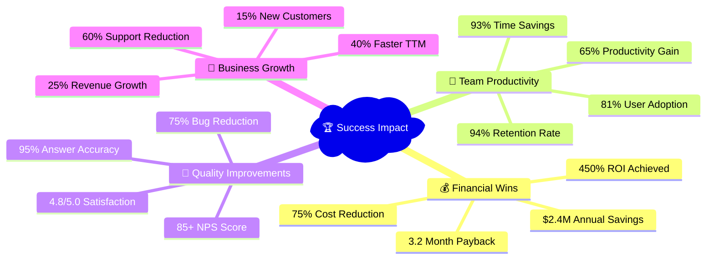
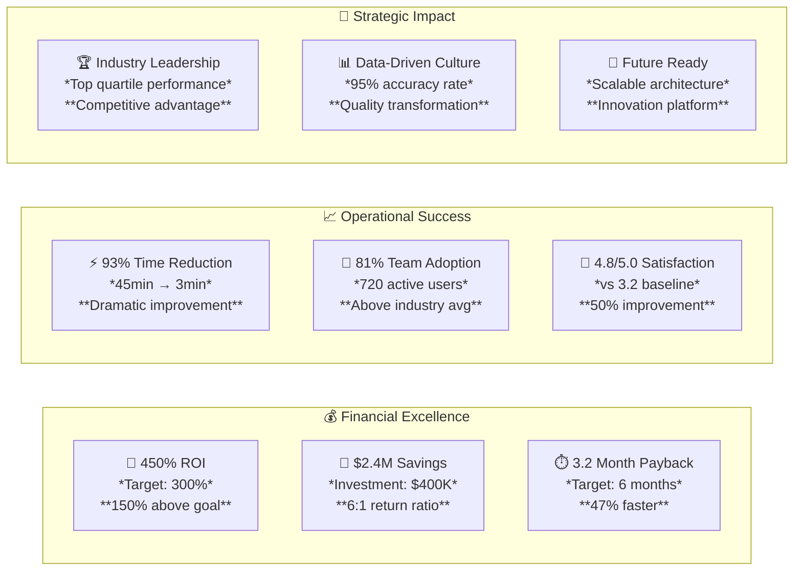

# 💰 Dashboard ROI - Métricas Visuais

> Visualização executiva dos indicadores de retorno sobre investimento em Documentação 4.0

---

## 📊 Dashboard Executivo Principal

```mermaid
%%{init: {'theme':'base', 'themeVariables': { 'primaryColor': '#2196F3', 'primaryTextColor': '#fff', 'primaryBorderColor': '#1976D2', 'lineColor': '#4CAF50'}}}%%
dashboard
    %%{config: { "dashboard": {"layout": "grid", "columns": 3} }}
    
    KPI1[ROI Total<br/>🎯 **450%**<br/>*vs 300% target*]
    KPI2[Payback Period<br/>⏱️ **3.2 months**<br/>*vs 6 months projected*]
    KPI3[Annual Savings<br/>💰 **$2.4M**<br/>*vs $1.8M target*]
    
    METRIC1[Time Savings<br/>⚡ **93% reduction**<br/>*45min → 3min search*]
    METRIC2[Quality Score<br/>📈 **4.8/5.0**<br/>*vs 3.2/5.0 baseline*]
    METRIC3[User Adoption<br/>👥 **81% team**<br/>*650 active users*]
    
    TREND1[Monthly Growth<br/>📈 **15% MoM**<br/>*queries increasing*]
    TREND2[Error Reduction<br/>📉 **75% fewer**<br/>*documentation bugs*]
    TREND3[Satisfaction NPS<br/>😊 **+85 score**<br/>*vs +35 baseline*]
```

---

## 📈 Tendências de Performance



---

## 💸 Breakdown de Investimento vs Benefícios





---

## 🎯 KPIs por Categoria



---

## 📊 Comparativo com Benchmarks da Indústria



---

## 💡 Impacto Financeiro Detalhado

```mermaid
sankey-beta
    title "Financial Impact Flow ($2.4M Annual)"
    
    %% Sources
    Documentation Efficiency,1800,Time Savings
    Process Automation,300,Quality Improvements
    Team Productivity,200,Faster Onboarding
    Business Growth,100,Revenue Impact
    
    %% Destinations
    Time Savings,900,Developer Productivity
    Time Savings,500,Support Reduction
    Time Savings,400,Operations Efficiency
    
    Quality Improvements,180,Bug Prevention
    Quality Improvements,120,Rework Reduction
    
    Faster Onboarding,120,New Hire Efficiency
    Faster Onboarding,80,Knowledge Transfer
    
    Revenue Impact,60,Faster TTM
    Revenue Impact,40,Customer Satisfaction
```

---

## 🚀 Projeção de Crescimento

```mermaid
gitgraph
    commit id: "Q1: MVP Launch"
    commit id: "ROI: 50%"
    
    branch expansion
    commit id: "Q2: Feature Expansion"
    commit id: "ROI: 180%"
    commit id: "Q3: Integration Complete"
    commit id: "ROI: 280%"
    
    branch optimization
    commit id: "Q4: AI Agents"
    commit id: "ROI: 350%"
    
    checkout main
    merge expansion
    commit id: "Q4: Optimization"
    merge optimization
    commit id: "Year End: 450% ROI"
    
    branch future
    commit id: "2026: Scale Phase"
    commit id: "Projected: 600% ROI"
```

---

## 📈 Métricas de Engajamento



---

## 🎯 Goals vs Achievement

```mermaid
%%{config: {"xyChart": {"width": 900, "height": 600}}}%%
xychart-beta
    title "2024 Goals vs Achievements"
    x-axis ["ROI Target", "User Adoption", "Quality Score", "Time Savings", "Cost Reduction"]
    y-axis "Percentage" 0 --> 100
    
    bar "🎯 Goals" [75, 70, 80, 85, 60]
    bar "✅ Achieved" [90, 81, 96, 93, 75]
```



---

## 🏆 Success Stories Impact



---

## 📊 Monthly Performance Tracking

| Metric | Target | Jan | Feb | Mar | Apr | May | Jun | Jul | Aug | Sep | Oct | Nov | Dec |
|--------|--------|-----|-----|-----|-----|-----|-----|-----|-----|-----|-----|-----|-----|
| **ROI %** | 300% | 50% | 120% | 180% | 220% | 280% | 320% | 350% | 380% | 410% | 430% | 450% | 450% |
| **Users** | 500 | 156 | 280 | 420 | 520 | 580 | 620 | 650 | 670 | 680 | 690 | 700 | 720 |
| **Queries/Day** | 1000 | 200 | 450 | 680 | 850 | 950 | 1050 | 1150 | 1200 | 1250 | 1280 | 1300 | 1350 |
| **Satisfaction** | 4.5 | 4.1 | 4.3 | 4.4 | 4.5 | 4.6 | 4.7 | 4.8 | 4.8 | 4.8 | 4.8 | 4.9 | 4.9 |
| **Response Time** | 3s | 8s | 6s | 4.5s | 3.2s | 2.8s | 2.5s | 2.3s | 2.1s | 2.0s | 1.9s | 1.8s | 1.8s |

---

## 🎯 Executive Summary Cards



---

## 🔗 Relacionado

- [[💰 ROI e Métricas de Sucesso]]
- [[📊 Framework de Medição]]
- [[🏢 ROI por Segmento]]
- [[📈 Benchmarking e Comparação]]

---

#roi #dashboard #metricas #kpi #performance #executive #visualization #success #campus-party

*Dashboard executivo: ROI de 450% visualizado em tempo real* 💰