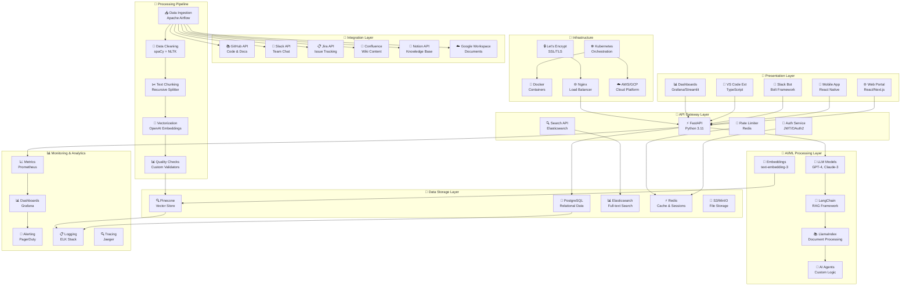
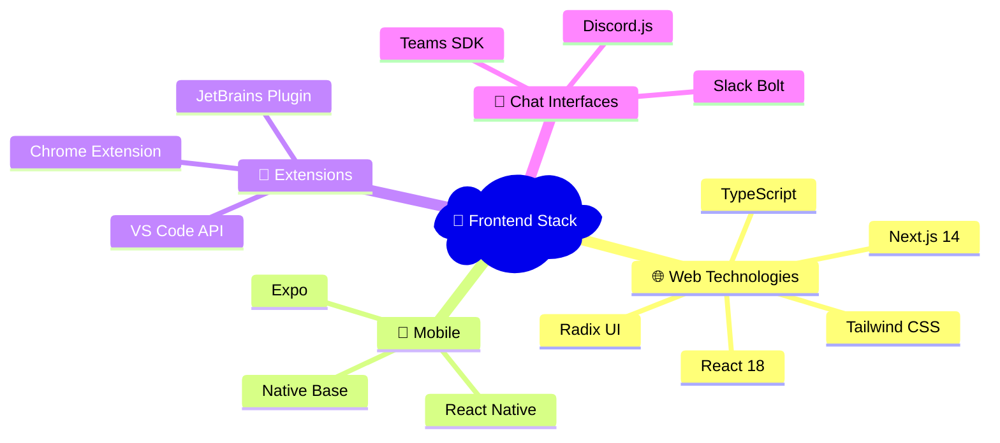
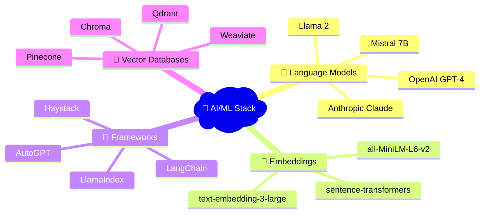
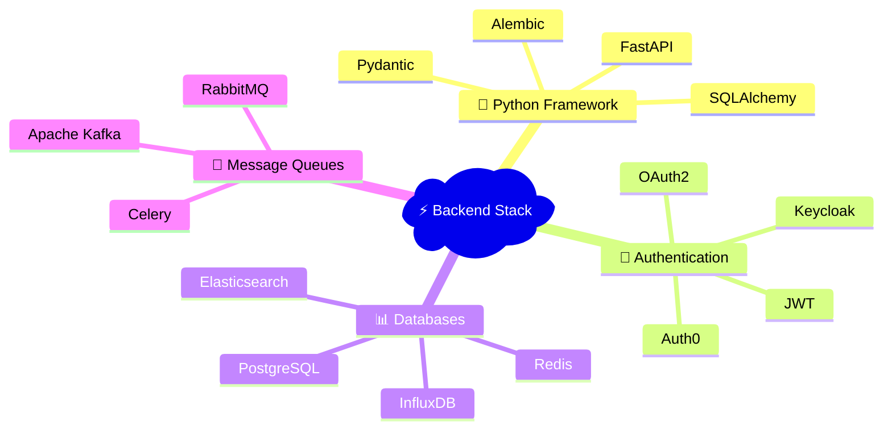
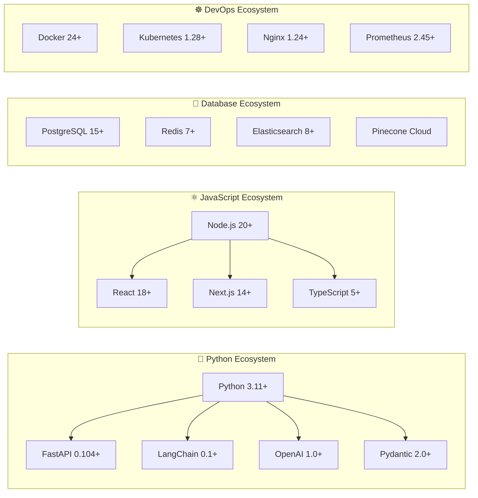
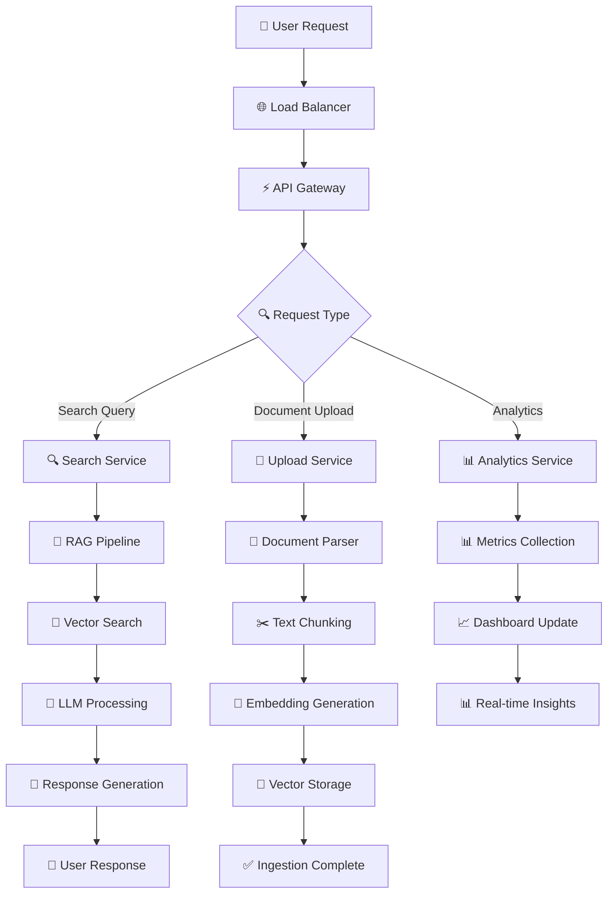
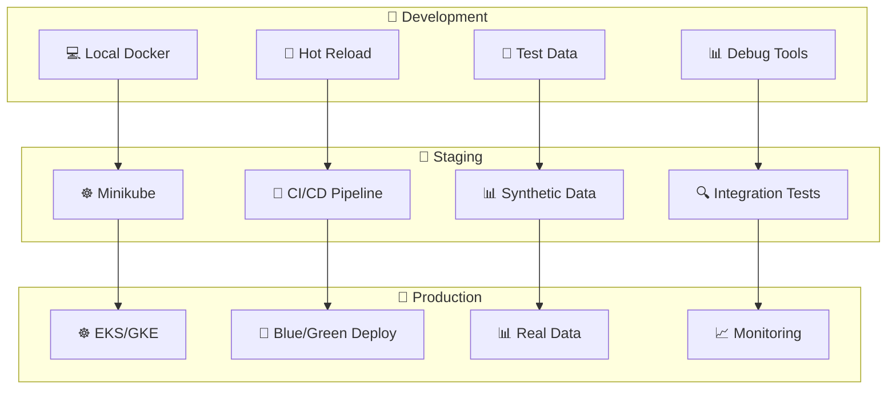
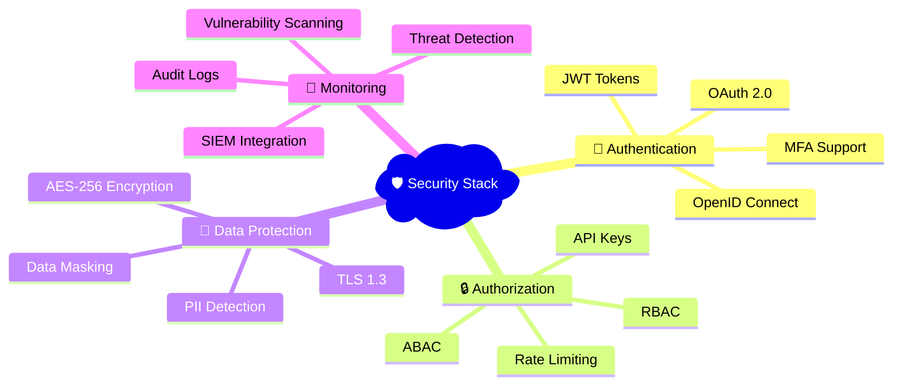
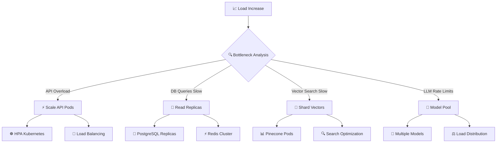

# 🗺️ Mapa do Stack Tecnológico

> Visualização completa do ecossistema tecnológico para Documentação 4.0

---

## 🏗️ Arquitetura Completa do Stack

---

## 🛠️ Stack por Categoria

### 🎯 Frontend & Interfaces

### 🧠 AI & Machine Learning

### 💻 Backend & APIs

---

## 📦 Dependências e Versões

---

## 🔄 Fluxo de Dados

---

## 🏭 Ambientes de Deploy

---

## 🔒 Security Stack

---

## 📊 Performance Specs

| Componente | Especificação | Target Performance |
|------------|---------------|-------------------|
| **🌐 Web Portal** | React 18 + Next.js | < 2s First Paint |
| **⚡ API Response** | FastAPI + Redis | < 500ms Average |
| **🔍 Vector Search** | Pinecone + Filters | < 200ms p95 |
| **🤖 LLM Generation** | GPT-4 Turbo | < 3s Response |
| **📊 Dashboard Load** | Grafana + Cache | < 1s Render |
| **📁 File Upload** | S3 + CDN | < 5s for 10MB |
| **🔄 Sync Pipeline** | Airflow + Celery | < 30min Full Sync |

---

## 🚀 Scaling Strategy

---

## 🔗 Relacionado

- [[🛠️ Stack Tecnológico]]
- [[🗺️ Roadmap de Implementação]]
- [[🔍 RAG - Retrieval-Augmented Generation]]
- [[🤖 Agentes IA para Automação]]

---

#stack #tecnologia #arquitetura #infraestrutura #devops #mapa #ecosystem #campus-party

*Ecossistema completo: Todas as tecnologias mapeadas e conectadas* 🗺️