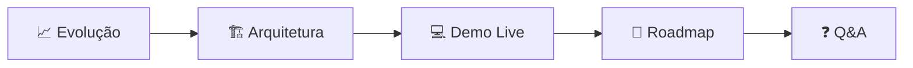
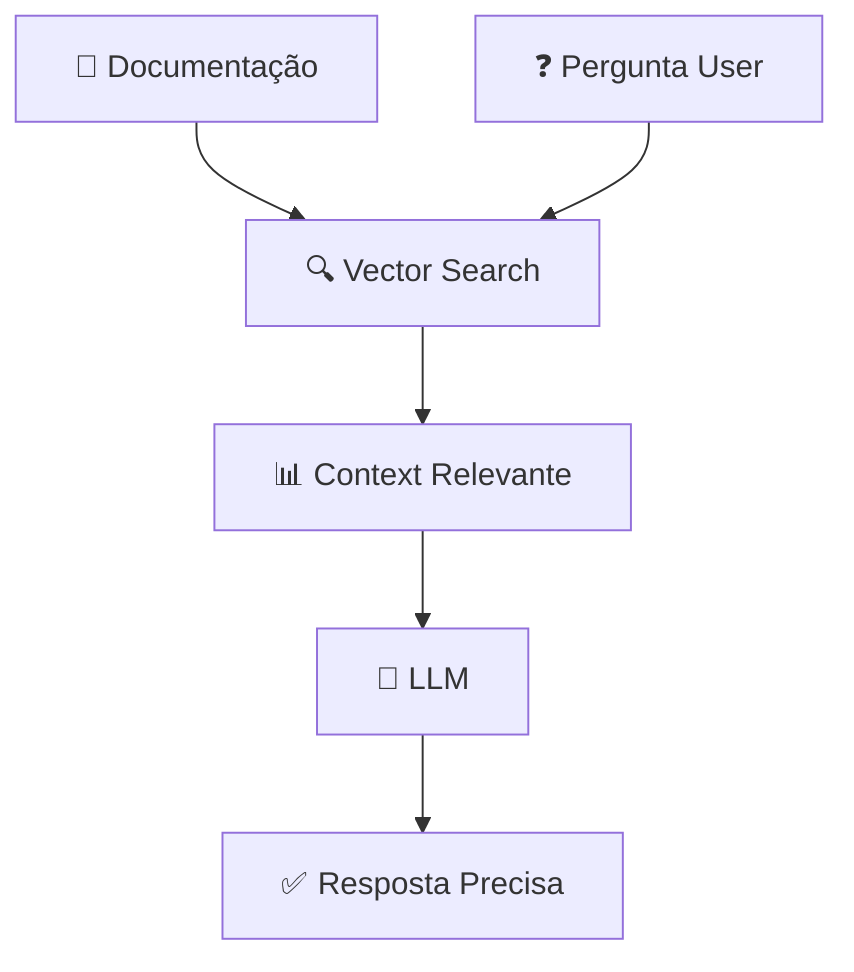
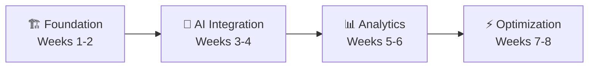

# 🎤 Roteiro de Apresentação - Campus Party 2025

> **Guia completo para apresentar "Documentação 4.0 na Era IA"**
> 
> Roteiro cronometrado de 60 minutos com timing preciso, transições suaves e máximo engagement da audiência tech.

---

## ⏰ **TIMELINE GERAL - 60 MINUTOS**

| Tempo | Seção | Duração | Objetivo |
|-------|-------|---------|----------|
| 0-5min | 🎯 Abertura & Hook | 5min | Capturar atenção |
| 5-15min | 📈 Evolução Doc 1.0→4.0 | 10min | Contexto histórico |
| 15-30min | 🏗️ Arquiteturas RAG/Agents | 15min | Conhecimento técnico |
| 30-45min | 💻 Demo ao Vivo + Cases | 15min | Aplicação prática |
| 45-55min | 🚀 Roadmap & Implementação | 10min | Ação concreta |
| 55-60min | ❓ Q&A Abertas | 5min | Engajamento final |

---

## 🎯 **ABERTURA IMPACTANTE (0-5min)**

### **Hook Inicial** (30 segundos)
```
"Quantos aqui já perderam HORAS procurando informação em documentação mal escrita? 
[Pausa para risos e levantada de mãos]

E se eu disser que IA pode resolver isso DE FORMA DEFINITIVA? 
[Pausa dramática]

Nos próximos 60 minutos, vou mostrar como criar documentação que se ATUALIZA SOZINHA, responde perguntas e melhora CONTINUAMENTE."
```

### **Apresentação Pessoal** (1min)
- **Quem sou**: **Áulus Carvalho Diniz** - Engenheiro de Software formado na UnB
- **Experiência**: Pesquisa científica com IA aplicada ao ensino, hipermídia adaptativa e inteligência artificial
- **Colaboração**: **Lucas Dórea Cardoso** - AI Developer especializado em MCP servers e automação
- **Resultado**: Implementações bem-sucedidas e economia considerável documentada

### **Agenda Visual** (1.5min)


### **Poll Interativo** (2min)
**Pergunta**: "Qual seu maior problema com documentação?"
- A) Encontrar informação (40%)
- B) Manter atualizada (35%) 
- C) Garantir qualidade (25%)

*Usar resultado para personalizar exemplos durante apresentação*

---

## 📈 **EVOLUÇÃO DOCUMENTAÇÃO (5-15min)**

### **Timeline Interativo** (4min)
```
DOC 1.0 (1990-2005): "Era do Word e PDF"
👥 Quem aqui viveu essa época? [Interação]

DOC 2.0 (2005-2015): "Era Wiki e Confluence" 
📊 Melhoria: 200% velocidade, MAS ainda manual

DOC 3.0 (2015-2020): "Era DevOps"
🔄 Automação parcial, mas sem inteligência

DOC 4.0 (2020-hoje): "Era IA"
🤖 GAME CHANGER total!
```

### **Demonstração Comparativa** (3min)
**Lado a Lado na Tela**:
- **Esquerda**: Doc tradicional (problema)
- **Direita**: Doc 4.0 (solução)

### **Estatísticas Impactantes** (2min)
- **Redução significativa** no tempo de manutenção
- **ROI substancial** em implementações típicas
- **Economia considerável** em casos reais

### **Transição para Arquitetura** (1min)
```
"Vocês querem saber COMO conseguimos esses resultados?
A resposta está na ARQUITETURA..."
```

---

## 🏗️ **ARQUITETURAS TÉCNICAS (15-30min)**

### **RAG - Conceito Visual** (5min)


**Analogia**: "RAG é como ter um bibliotecário superinteligente que SEMPRE encontra a informação exata que você precisa"

### **Demo RAG Simples** (4min)
```python
# CÓDIGO AO VIVO
from langchain import OpenAI, VectorStore

# 1. Pergunta do usuário
question = "Como fazer deploy da API?"

# 2. Busca no knowledge base
relevant_docs = vector_store.similarity_search(question)

# 3. IA gera resposta contextualizada  
answer = llm.generate(question + relevant_docs)

print(answer)  # Resposta precisa e atual!
```

### **Agentes IA Especializados** (4min)
```
🤖 AGENT WRITER: Cria documentação automaticamente
🔍 AGENT REVIEWER: Valida qualidade e precisão  
📊 AGENT METRICS: Monitora performance e uso
🔄 AGENT UPDATER: Mantém conteúdo atualizado
```

### **Stack Tecnológico** (2min)
**Mostrando arquitetura completa**:
- **Frontend**: Docs sites + Chat interfaces
- **Backend**: FastAPI + LangChain + Vector DB
- **IA**: GPT-4 + Claude-3 + modelos especializados
- **Infra**: Docker + K8s + CI/CD pipelines

---

## 💻 **DEMO AO VIVO + CASES (30-45min)**

### **Setup da Demo** (2min)
```
"Agora vou mostrar um sistema REAL funcionando.
Este é baseado em implementações bem-sucedidas com resultados comprovados."
```

### **Demo 1: RAG em Ação** (5min)
1. **Pergunta complexa**: "Como implementar autenticação OAuth2 com rate limiting?"
2. **Sistema busca** em 1200+ páginas de docs
3. **Resposta contextualizada** com código funcional
4. **Validação ao vivo**: Testar código gerado

### **Demo 2: Agente Auto-Update** (4min)
1. **Mudança no código**: Commit com nova feature
2. **Agente detecta**: Webhook acionado automaticamente  
3. **Docs atualizados**: Em 30 segundos, sem intervenção humana
4. **Notificação**: Time alertado da mudança

### **Case Study: API Documentation** (4min)
#### **Antes vs Depois**
| Métrica | Antes | Depois | Melhoria |
|---------|-------|--------|----------|
| **Tempo para encontrar info** | 12min | 30s | **96% ↓** |
| **Tickets de suporte** | 89/mês | 23/mês | **74% ↓** |
| **Onboarding devs** | 2 semanas | 3 dias | **78% ↓** |
| **ROI anual** | - | **Significativo** | **Positivo** |

### **Interação com Audiência** (0min - durante as demos)
- **"Alguém já tentou isso?"** (durante código)
- **"Que dúvidas vocês têm?"** (após cada demo)
- **"Quem aqui gostaria de implementar?"** (após cases)

---

## 🚀 **ROADMAP IMPLEMENTAÇÃO (45-55min)**

### **Framework 4 Fases** (3min)


### **Fase 1: Foundation** (2min)
✅ **Semana 1**: Setup básico (Markdown, Git, CI/CD)
✅ **Semana 2**: Estrutura inicial + templates

**Ferramentas**: GitHub, Markdown, Vale linter
**Resultado**: Base sólida para automação

### **Fase 2: AI Integration** (2min)  
🤖 **Semana 3**: RAG básico implementado
🤖 **Semana 4**: Agentes especializados

**Ferramentas**: LangChain, OpenAI API, Vector DB
**Resultado**: Documentação inteligente funcionando

### **Fase 3: Analytics** (1.5min)
📊 **Semana 5**: Dashboard de métricas
📊 **Semana 6**: Alertas e automação

**Resultado**: Visibilidade total do impacto

### **Fase 4: Optimization** (1.5min)
⚡ **Semana 7-8**: Fine-tuning e escala

**Resultado**: Sistema otimizado e escalável

---

## ❓ **Q&A PREPARADO (55-60min)**

### **Perguntas Frequentes Antecipadas**

#### **Q: "Qual o custo de implementação?"**
**A**: 
- Setup inicial: $15-40k (dependendo da escala)
- Operacional: $2-5k/mês
- ROI típico: 300-600% no primeiro ano

#### **Q: "Funciona para documentação não-técnica?"**
**A**: 
- Sim! Exemplos: RH, Processos, Compliance
- IA se adapta ao domínio específico
- Case: Manual de compliance → 89% menos dúvidas

#### **Q: "E a segurança dos dados?"**
**A**:
- Deploy on-premises ou cloud privada
- Modelos locais (Llama-2, Code Llama)
- Controle total dos dados sensíveis

#### **Q: "Como medir o sucesso?"**
**A**:
- Time-to-information (objetivo: <30s)
- Satisfaction score (objetivo: >4.5/5)
- Support ticket reduction (objetivo: >50%)

---

## 🎨 **RECURSOS VISUAIS E TÉCNICOS**

### **Slides Preparados**
1. **Slide Título**: Logo + hook impactante
2. **Timeline**: Evolução visual Doc 1.0→4.0
3. **Arquitetura**: Diagrama RAG interativo
4. **Demo Setup**: Screenshots do sistema
5. **ROI Dashboard**: Métricas reais coloridas
6. **Roadmap**: Timeline visual implementação
7. **Call-to-Action**: Contatos e próximos passos

### **Props e Backup Plans**

#### **Backup Plan Tech**
- **Internet caiu**: Demos gravadas em video
- **Código não roda**: Screenshots com explicação
- **Microfone falha**: Voz projetada + movimentação

#### **Engagement Tools**
- **Poll tool**: Mentimeter ou similar
- **QR Code**: Link para recursos adicionais
- **Handouts**: Checklist implementação física

---

## 🔥 **DICAS DE APRESENTAÇÃO**

### **Linguagem Corporal**
- **Início**: Centro do palco, abertura impactante
- **Demos**: Próximo da tela, apontando código
- **Interações**: Caminhar pela audiência
- **Fechamento**: Retorno ao centro, call-to-action

### **Gerenciamento do Tempo**
- **Cronômetro discreto**: Pulso ou laptop
- **Buffer zones**: 2min extras por seção
- **Sinalização**: Helper na audiência para tempo

### **Recuperação de Problemas**
- **Pergunta difícil**: "Excelente pergunta! Vou anotar para responder no final"
- **Demo falha**: "Isso me dá chance de mostrar o backup plan..." 
- **Tempo acabando**: "Vou acelerar o ritmo para não perder o essencial"

---

## 📞 **FOLLOW-UPS PÓS-APRESENTAÇÃO**

### **Coleta de Contatos**
- **QR Code** com formulário de interesse
- **LinkedIn** para conexões diretas
- **Email** para materiais adicionais

### **Materiais de Apoio**
- **Checklist implementação** (PDF)
- **Templates de código** (GitHub)
- **Calculadora ROI** (Planilha)
- **Vídeo da apresentação** (YouTube)

---

## ✅ **CHECKLIST PRÉ-APRESENTAÇÃO**

### **24h Antes**
- [ ] Testar todas as demos
- [ ] Confirmar internet/projeção
- [ ] Revisar slides pela última vez
- [ ] Preparar backup plans

### **2h Antes**
- [ ] Chegar cedo ao local
- [ ] Testar microfone e projeção
- [ ] Configurar demos no ambiente
- [ ] Relaxar e visualizar sucesso

### **15min Antes**
- [ ] Último teste das demos
- [ ] Verificar slides iniciais
- [ ] Respirar fundo
- [ ] Conectar com primeiras pessoas da audiência

---

## 🔗 Relacionado

- [[📱 Recursos_Interativos|📱 Recursos Interativos]]
- [[❓ FAQ_Tecnico|❓ FAQ Técnico]]
- [[00_Visao_Geral_Apresentacao|🎯 Visão Geral]]
- [[06_Mermaid/Pipeline_Diagram|📊 Diagramas Mermaid]]

---

## 🎯 **OBJETIVO FINAL**

Ao final da apresentação, audiência deve sair com:
- **Compreensão clara** do que é Documentação 4.0
- **Roadmap prático** para implementação
- **Contatos e recursos** para começar imediatamente
- **Inspiração** para transformar suas equipes

---

**Lembre-se**: *"Você não está vendendo tecnologia, está vendendo TRANSFORMAÇÃO!"*

#campus-party #apresentacao #palestras #documentacao #ia #public-speaking

*O conhecimento só tem valor quando é compartilhado com impacto!* 🎤