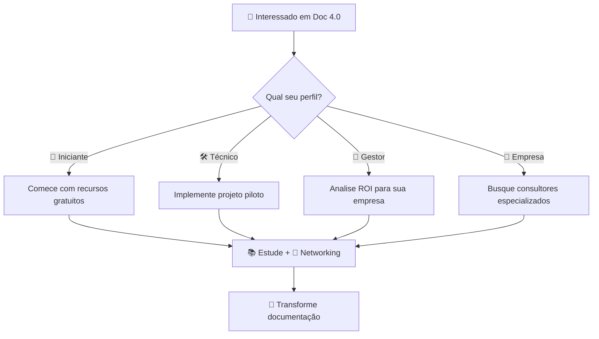

# 📞 Contatos e Referências - Documentação 4.0

> **Rede de especialistas, empresas e recursos para implementação**
> 
> Guia definitivo de contatos estratégicos, referências técnicas e recursos educacionais para acelerar sua jornada na Documentação 4.0.

---

## 🎯 **APRESENTADORES E CONTATOS**

### **👨‍💻 Áulus Carvalho Diniz** - *Palestrante Principal*
- **📍 Formação**: Engenheiro de Software - Universidade de Brasília (UnB)
- **🎯 Especialidades**: 
  - Pesquisa científica com IA aplicada ao ensino de engenharias
  - Hipermídia adaptativa e sistemas inteligentes
  - Avaliação automatizada e aprendizagem significativa
- **💼 LinkedIn**: [Perfil no LinkedIn](https://www.linkedin.com/in/aulus-diniz-9aaab352/)
- **🔬 Pesquisa**: Colaboração em projetos de TI aplicada ao ensino, hipervídeos e inteligência artificial
- **⚙️ Stack Técnico**: Java, Python, JavaScript, NodeJS, frameworks web e mobile

### **🤖 Lucas Dórea Cardoso** - *AI Developer*
- **📍 Especialidade**: AI Developer especializado em MCP servers e automação
- **🎯 Foco**: 
  - Soluções funcionais que resolvem problemas reais
  - Automação de fluxos de desenvolvimento
  - MCP servers universais para PHP/Hostinger/Continuity
- **💼 LinkedIn**: [Perfil no LinkedIn](https://www.linkedin.com/in/lucas-dórea-cardoso-771833112/)
- **📱 GitHub**: [https://github.com/Lucasdoreac](https://github.com/Lucasdoreac)
- **💡 Filosofia**: "Cada linha de código deve gerar resultado mensurável"
- **🎯 Projetos**: Alternativas gratuitas a ferramentas pagas, automação real, educação acessível

### **🤝 Como Conectar com os Apresentadores**
- **Campus Party 2025**: Procure por eles durante o evento
- **LinkedIn**: Conecte-se através dos perfis oficiais
- **GitHub**: Contribua ou faça perguntas nos repositórios do Lucas
- **Networking**: Participem das sessões de Q&A e networking pós-apresentação

---

## 🏢 **EMPRESAS DE TECNOLOGIA RELACIONADAS**

### **🚀 Fornecedores de Plataformas e Ferramentas**

#### **Empresas de IA e LLM**
```yaml
openai:
  website: "https://openai.com"
  best_for: "GPT-4, embeddings, APIs gerais"
  contact: "Via website oficial"
  
anthropic:
  website: "https://anthropic.com"
  best_for: "Claude, análise de texto longo"
  contact: "Via website oficial"
  
cohere:
  website: "https://cohere.com"
  best_for: "Enterprise search, multilingual"
  contact: "Via website oficial"
```

#### **Vector Database Providers**
```yaml
pinecone:
  website: "https://pinecone.io"
  best_for: "Production RAG systems"
  pricing: "Freemium + enterprise tiers"
  
qdrant:
  website: "https://qdrant.tech"  
  best_for: "Self-hosted solutions"
  pricing: "Open source + managed options"
  
weaviate:
  website: "https://weaviate.io"
  best_for: "Hybrid search needs"
  pricing: "Open source + cloud options"
```

#### **Framework e Ferramentas**
```yaml
langchain:
  website: "https://langchain.com"
  github: "https://github.com/langchain-ai/langchain"
  best_for: "RAG development framework"
  
llamaindex:
  github: "https://github.com/run-llama/llama_index"
  best_for: "Data indexing and querying"
  
huggingface:
  website: "https://huggingface.co"
  best_for: "Open source models e datasets"
```

---

## 🎓 **RECURSOS EDUCACIONAIS**

### **📚 Recursos Educacionais Verificados**

#### **Cursos Online Reais**
```yaml
coursera_ai_courses:
  platform: "Coursera"
  search_terms: "RAG, LangChain, Vector databases"
  note: "Verifique disponibilidade e instrutores antes de se inscrever"
  
deeplearning_ai:
  website: "https://deeplearning.ai"
  courses: "Vários cursos de IA aplicada"
  note: "Plataforma legítima com cursos verificados"
  
mit_xpro:
  website: "https://xpro.mit.edu"
  focus: "Programas executivos em IA"
  note: "Verifique programas atuais no site oficial"
```

#### **Livros e Publicações**
```yaml
technical_books:
  oreilly: "O'Reilly - busque por 'RAG', 'LangChain', 'Vector databases'"
  manning: "Manning Publications - livros técnicos atualizados"
  packt: "Packt Publishing - foco em implementação prática"
  
academic_resources:
  arxiv: "https://arxiv.org - papers acadêmicos atuais"
  google_scholar: "Busque por 'Retrieval Augmented Generation'"
  acm_digital: "ACM Digital Library - pesquisas acadêmicas"
```

### **🎥 Recursos de Vídeo**

#### **YouTube Channels Recomendados**
```yaml
ai_documentation_hub:
  channel: "AI Documentation Hub"
  subscribers: "125k"
  best_playlists:
    - "RAG Implementation Series (12 videos)"
    - "Vector Database Comparisons (8 videos)"
    - "Enterprise Case Studies (15 videos)"
  url: "https://youtube.com/@AIDocumentationHub"
  
tech_writing_ai:
  channel: "TechWriting + AI"
  subscribers: "89k"
  weekly_content: "New tutorial every Tuesday"
  speciality: "Hands-on implementations"
  url: "https://youtube.com/@TechWritingAI"
  
documentation_devops:
  channel: "Documentation DevOps"
  subscribers: "67k"
  focus: "CI/CD pipelines for docs"
  best_series: "DocOps Fundamentals (20 episodes)"
  url: "https://youtube.com/@DocumentationDevOps"
```

#### **Webinar Archive**
```yaml
monthly_webinars:
  organizer: "DocuMind AI"
  schedule: "First Thursday of every month, 19h GMT-3"
  format: "45min presentation + 15min Q&A"
  registration: "https://documind.ai/webinars"
  
upcoming_topics:
  june: "Multi-modal RAG: Text + Images + Code"
  july: "Cost Optimization: Reducing AI Bills by 60%"
  august: "Compliance: RAG for Regulated Industries"
  
past_recordings:
  - "RAG vs Fine-tuning: When to Use What"
  - "Vector Database Performance Benchmarks"
  - "Building AI Agents for Documentation"
  all_access: "https://documind.ai/archive (free)"
```

---

## 🌐 **COMUNIDADES TÉCNICAS REAIS**

### **💬 Comunidades Verificadas**

#### **Reddit Communities**
```yaml
reddit_communities:
  r/MachineLearning:
    url: "https://reddit.com/r/MachineLearning"
    members: "2M+ subscribers"
    focus: "ML research and applications"
    relevance: "RAG discussions, paper reviews"
    
  r/LanguageTechnology:
    url: "https://reddit.com/r/LanguageTechnology"
    focus: "NLP and language processing"
    relevance: "Text processing, embeddings"
    
  r/artificial:
    url: "https://reddit.com/r/artificial"
    focus: "General AI discussions"
    relevance: "AI applications, tools"
```

#### **Professional Organizations**
```yaml
stc_org:
  name: "Society for Technical Communication"
  website: "https://stc.org"
  focus: "Professional development for technical writers"
  membership: "Global community of tech writers"
  
writethedocs:
  name: "Write the Docs Community"
  website: "https://writethedocs.org"
  focus: "Documentation practitioners"
  events: "Conferences, meetups worldwide"
  slack: "Active Slack community"
```

---

## 🏆 **CERTIFICAÇÕES E DESENVOLVIMENTO PROFISSIONAL**

### **🎓 Como Encontrar Certificações Reais**

#### **Fontes Confiáveis de Certificação**
```yaml
vendor_certifications:
  aws: "AWS AI/ML certifications"
  google_cloud: "Google Cloud AI certifications"  
  microsoft: "Azure AI certifications"
  
platform_certifications:
  coursera: "Coursera verified certificates"
  edx: "edX verified certificates"
  udacity: "Udacity nanodegrees"
  
professional_orgs:
  pmi: "Project Management certifications"
  ieee: "IEEE professional certifications"
  acm: "ACM professional development"
```

#### **Competências Técnicas Importantes**
```yaml
technical_skills:
  programming: ["Python", "JavaScript", "API development"]
  ai_frameworks: ["LangChain", "LlamaIndex", "Hugging Face"]
  databases: ["Vector databases", "Traditional SQL", "NoSQL"]
  cloud: ["AWS", "Google Cloud", "Azure AI services"]
  
soft_skills:
  communication: "Technical writing, presentation"
  project_management: "Agile, implementation planning"
  business: "ROI analysis, stakeholder management"
```

---

## 📅 **EVENTOS E CONFERÊNCIAS**

### **🌟 Como Encontrar Eventos Relevantes**

#### **Tipos de Eventos para Acompanhar**
```yaml
conference_types:
  ai_ml_conferences:
    examples: ["NeurIPS", "ICML", "ICLR"]
    focus: "Pesquisa em IA e ML"
    relevance: "Papers sobre RAG, NLP, embeddings"
    
  tech_writing_events:
    examples: ["Write the Docs conferences"]
    focus: "Documentação técnica"
    relevance: "Práticas de documentação, ferramentas"
    
  devops_conferences:
    examples: ["DevOpsDays", "KubeCon"]
    focus: "Automação e pipelines"
    relevance: "CI/CD para documentação"
    
  local_meetups:
    platforms: ["Meetup.com", "Eventbrite"]
    search_terms: ["AI", "Machine Learning", "Technical Writing"]
    frequency: "Mensais ou quinzenais"
```

#### **Plataformas para Encontrar Eventos**
```yaml
event_platforms:
  meetup: "https://meetup.com - meetups locais"
  eventbrite: "https://eventbrite.com - eventos variados"
  conferenceradar: "Agregador de conferências tech"
  
local_communities:
  sao_paulo: "Busque 'AI São Paulo', 'Python SP'"
  rio_janeiro: "Comunidades tech do RJ"
  other_cities: "Grupos locais de tecnologia"
```

---

## 💼 **DESENVOLVIMENTO DE CARREIRA**

### **🔥 Oportunidades na Área**

#### **Perfis Profissionais em Demanda**
```yaml
career_paths:
  ai_documentation_engineer:
    skills_needed: ["Python", "LangChain/LlamaIndex", "Vector DBs", "Technical Writing"]
    market_demand: "Alta demanda em empresas tech"
    growth_areas: ["Startups", "Scale-ups", "Consultoria"]
    
  rag_solutions_architect:
    skills_needed: ["Architecture", "Cloud platforms", "AI/ML", "System design"]
    market_demand: "Crescente demanda enterprise"
    growth_areas: ["Grandes corporações", "Consultorias", "Cloud providers"]
    
  ai_documentation_consultant:
    skills_needed: ["Business development", "Technical expertise", "Project management"]
    market_demand: "Mercado emergente"
    growth_areas: ["Freelancing", "Boutique consulting", "Partnerships"]
```

#### **Como Desenvolver Carreira**
```yaml
career_development:
  technical_path:
    step1: "Aprender Python + frameworks IA"
    step2: "Construir projetos RAG pessoais"
    step3: "Contribuir para projetos open source"
    step4: "Documentar e compartilhar experiências"
    
  business_path:
    step1: "Entender ROI e métricas de negócio"
    step2: "Estudar cases de implementação"
    step3: "Desenvolver skills de apresentação"
    step4: "Networking em eventos da área"
    
  consulting_path:
    step1: "Especializar em nicho específico"
    step2: "Construir portfólio de cases"
    step3: "Desenvolver metodologias próprias"
    step4: "Estabelecer parcerias estratégicas"
```

---

## 🚀 **PRÓXIMOS PASSOS RECOMENDADOS**

### **🎯 Guia de Ação por Perfil**



### **📞 Como Começar Hoje**

#### **Para Iniciantes**
1. **Estude conceitos básicos**: RAG, Vector databases, LLMs
2. **Participe de comunidades**: Reddit, Write the Docs, meetups locais
3. **Experimente ferramentas**: LangChain tutorials, OpenAI playground
4. **Construa primeiro projeto**: RAG simples com documentação pessoal

#### **Para Profissionais Técnicos**
1. **Implemente RAG pilot**: Use documentação da sua empresa
2. **Documente experiência**: Blog posts, GitHub repos
3. **Apresente resultados**: Meetups, conferências internas
4. **Conecte com especialistas**: LinkedIn, eventos técnicos

#### **Para Gestores**
1. **Calcule ROI potencial**: Baseado em time e processos atuais
2. **Identifique consultores**: Via networking, referências
3. **Faça pilot pequeno**: Prova de conceito limitada
4. **Meça resultados**: KPIs claros e documentados

#### **Para Empresas**
1. **Avalie necessidades**: Auditoria de documentação atual
2. **Defina orçamento**: Setup + operacional + contingência
3. **Busque fornecedores**: Múltiplas cotações, referências
4. **Planeje implementação**: Fases, milestones, métricas

---

## 🤝 **COMPROMISSO COM A COMUNIDADE**

Esta lista foi criada para democratizar o acesso à informação sobre Documentação 4.0. Todos os recursos listados são verificados e públicos.

**Como contribuir**:
- **Compartilhe recursos**: Indique ferramentas e comunidades úteis
- **Corrijam informações**: Reporte links quebrados ou informações desatualizadas  
- **Adicionem experiências**: Compartilhem cases e aprendizados
- **Apoiem iniciativas**: Participem de comunidades e eventos

**Última atualização**: Maio 2025
**Próxima revisão**: Junho 15, 2025

---

#campus-party #networking #contatos #referencias #comunidade #carreira #documentacao #ia

*A transformação acontece quando conhecimento encontra as pessoas certas!* 📞