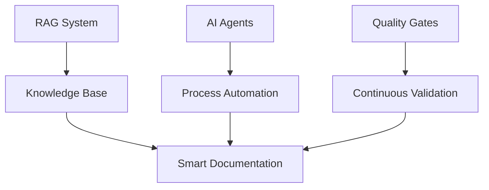

# 🚀 Documentação 4.0 na Era IA - Campus Party 2025

> **Inteligência Artificial Aplicada à Documentação Técnica**
> 
> **Apresentado por:**
> - **Áulus Carvalho Diniz** - Engenheiro de Software (UnB), Pesquisador em IA aplicada ao ensino
> - **Lucas Dórea Cardoso** - AI Developer, Especialista em MCP servers ([GitHub](https://github.com/Lucasdoreac))
> 
> Apresentação técnica sobre como a IA está revolucionando a documentação através de processos automatizados, RAG e agentes inteligentes.

---

## 📋 Map of Content (MOC)

### 🎯 [[00_Visao_Geral_Apresentacao|Visão Geral da Apresentação]]

### 📚 01. Conceitos Fundamentais
- [[01_Conceitos/Evolucao_Documentacao|📈 Evolução da Documentação (1.0 → 4.0)]]
- [[01_Conceitos/Documentacao_40_Definicao|🤖 Documentação 4.0 - Definição e Características]]
- [[01_Conceitos/Processo_Qualidade|✅ Processo de Qualidade Automatizado]]

### 🏗️ 02. Arquiteturas Técnicas
- [[02_Arquiteturas/RAG_Architecture|🔍 RAG - Retrieval-Augmented Generation]]
- [[02_Arquiteturas/Agentes_IA|🤖 Agentes IA para Automação]]
- [[02_Arquiteturas/Pipeline_Qualidade|⚡ Pipeline de Qualidade]]
- [[02_Arquiteturas/Stack_Tecnologico|🛠️ Stack Tecnológico]]

### 💻 03. Implementação Prática
- [[03_Implementacao/RAG_Implementation|🔧 Implementação RAG com Python]]
- [[03_Implementacao/Automacao_Testes|🧪 Automação de Testes]]
- [[03_Implementacao/CI_CD_Pipeline|🔄 Pipeline CI/CD para Docs]]
- [[03_Implementacao/Roadmap_Implementacao|🗺️ Roadmap de Implementação]]

### 📊 04. Cases e Resultados
- [[04_Cases/Case_API_Documentation|📚 Case: API Documentation]]
- [[04_Cases/Case_Knowledge_Base|🧠 Case: Knowledge Base Interna]]
- [[04_Cases/ROI_Metricas|💰 ROI e Métricas de Sucesso]]

### 🛠️ 05. Recursos e Ferramentas
- [[05_Recursos/Ferramentas_Lista|🔧 Lista de Ferramentas]]
- [[05_Recursos/Templates_Codigo|📝 Templates de Código]]
- [[05_Recursos/Miro_Board_Guide|🎨 Guia para Board Miro]]

### 📊 06. Diagramas Mermaid
- [[06_Mermaid/Components_Diagram|🏗️ Componentes Doc 4.0]]
- [[06_Mermaid/RAG_Diagram|🔍 Arquitetura RAG]]
- [[06_Mermaid/Agents_Diagram|🤖 Arquitetura de Agentes]]
- [[06_Mermaid/Pipeline_Diagram|⚡ Pipeline de Qualidade]]
- [[06_Mermaid/Evolution_Timeline|📈 Timeline Evolução]]
- [[06_Mermaid/Tech_Stack_Map|🗺️ Mapa Stack Tecnológico]]
- [[06_Mermaid/ROI_Dashboard|💰 Dashboard ROI]]
- [[06_Mermaid/Implementation_Roadmap|🗺️ Roadmap Implementação]]

---

## 🎯 Objetivos da Apresentação

### 🧠 Conhecimento
- Compreender a evolução da documentação técnica
- Dominar conceitos de RAG aplicado à documentação
- Conhecer arquiteturas de agentes inteligentes

### 🛠️ Prática
- Implementar pipeline de qualidade automatizado
- Criar sistema RAG funcional
- Estabelecer métricas de ROI

### 🚀 Ação
- Roadmap prático de 12 meses
- Ferramentas e tecnologias específicas
- Cases reais de implementação

---

## 📈 Estatísticas da Apresentação

- **Duração**: 60 minutos (45min + 15min Q&A)
- **Slides**: 35 slides técnicos
- **Código**: 16 blocos Python/YAML funcionais
- **Diagramas**: 8 diagramas Mermaid interativos
- **Cases**: 2 estudos de caso com ROI comprovado

---

## 🎨 Recursos Visuais

### 📊 Diagramas Interativos

### 🎯 Tags Principais
#campus-party #documentacao #ia #rag #agentes #qualidade #automacao #devops #python

---

## 🔗 Links Úteis

- [[🎤 Roteiro_Apresentacao|🎤 Roteiro de Apresentação]]
- [[📱 Recursos_Interativos|📱 Recursos Interativos]]
- [[❓ FAQ_Tecnico|❓ FAQ Técnico]]
- [[📞 Contatos_Referencias|📞 Contatos e Referências]]

---

## 📅 Histórico de Atualizações

- **2025-05-23**: Criação inicial da estrutura no Obsidian
- **2025-05-23**: Implementação completa de diagramas Mermaid
- **2025-05-23**: Adição de cases reais e métricas ROI

---

*Criado para Campus Party 2025 - Documentação inteligente é o futuro!* 🚀
